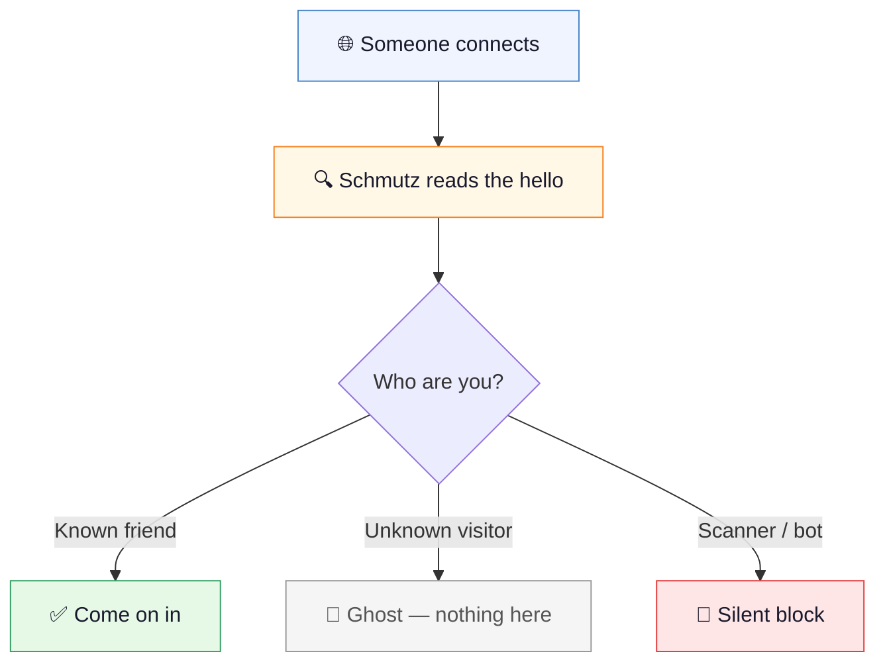
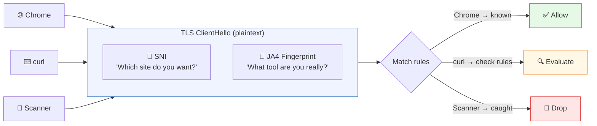
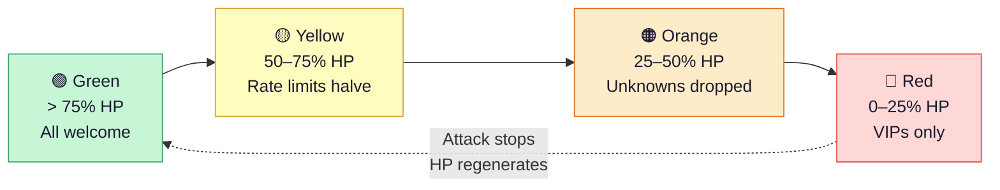
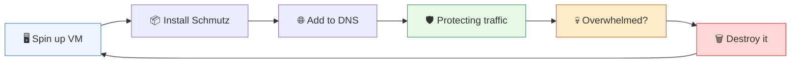
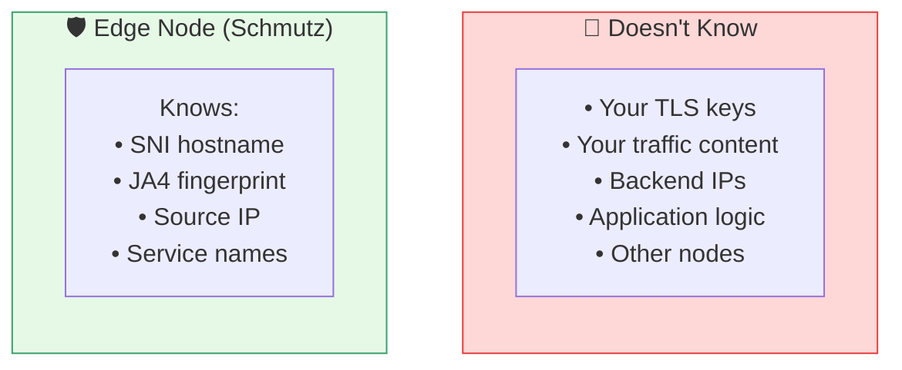
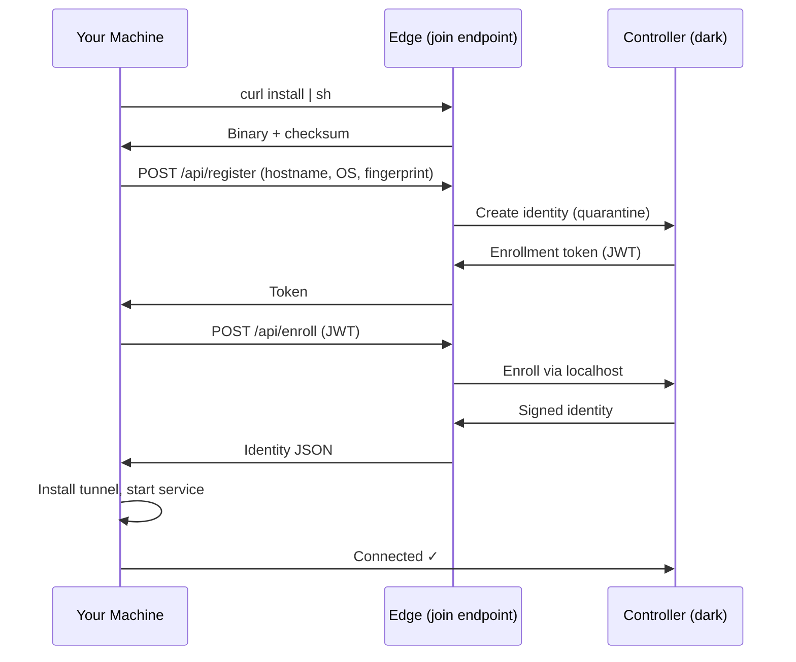
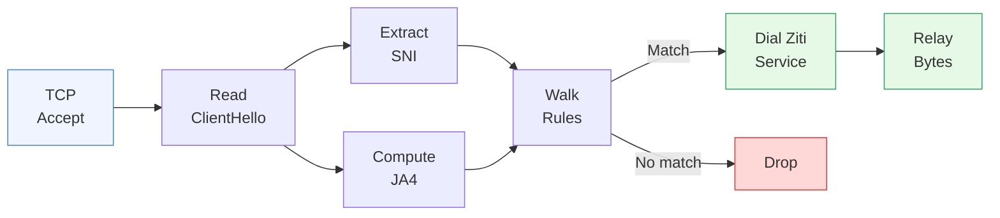
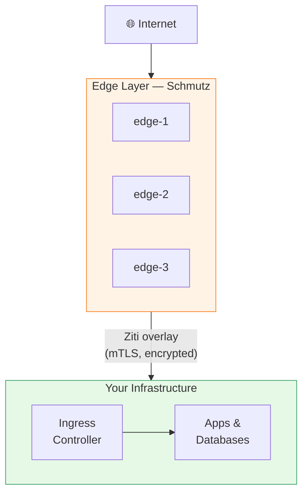
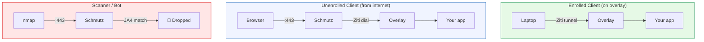

<h1 align="center">
  <br />
  schmutz
  <br />
</h1>

<p align="center">
  <em>/ʃmʊts/</em> — Yiddish for "a little dirt." A smudge.
</p>

<p align="center">
  <strong>The invisible security layer that sits in front of everything you run.</strong>
</p>

<p align="center">
  <a href="https://github.com/KontangoOSS/schmutz/releases"></a>
  &nbsp;
  <a href="https://openziti.io"></a>
  &nbsp;
  <a href="LICENSE"></a>
  &nbsp;
  
  &nbsp;
  <a href="https://github.com/KontangoOSS/schmutz/stargazers"></a>
</p>

<br />

<p align="center">
  <em>It gets on everything. You don't notice it's there.<br />
  But when something bad shows up — it's the reason you're fine.</em>
</p>

<br />

---

### Contents

[What is Schmutz?](#what-is-schmutz) · [How it works](#how-it-works) · [Fingerprinting](#-fingerprinting) · [Self-healing](#-self-healing) · [Features](#-all-features) · [Quick start](#-quick-start) · [Join the network](#-join-the-network) · [What can I protect?](#what-can-i-protect) · [FAQ](#faq) · [Docs](#-documentation) · [Philosophy](#philosophy)

---

<br />

## What is Schmutz?

You put a screen door on your house so bugs can't get in, but the breeze
still flows.

Schmutz is that screen door — for anything you run on the internet.

Your website. Your app. Your home server. Your security cameras. Your database.
Schmutz sits in front of it and decides who gets in.

Everyone else sees **nothing**. Not a login page. Not an error message.
Your stuff simply doesn't exist to them.

<br />

> 💡 **Think of it like an AirTag for your applications.**
>
> You stick it on, forget about it, and it quietly keeps track of who's
> knocking on the door — what tools they're using, whether they're a real
> person or a robot scanning the internet for things to break into.
>
> Except instead of just tracking — it fights back.

<br />

## How it works

Every internet connection starts with a handshake. Before any real conversation
happens, the client says hello. Most security tools wait until *after* the
handshake to check who you are.

Schmutz reads the handshake itself.



**Friends** get through to your app. **Strangers** see an empty building.
**Robots** get the door slammed before they can even peek inside.

But how does Schmutz know the difference?

<br />

## 🧬 Fingerprinting

Every browser, every programming language, every hacking tool says hello
differently. It's not about *what* they ask for — it's *how* they ask.



A robot can fake a User-Agent header. It can't fake its TLS library.

The **JA4 fingerprint** hashes the cipher suites, extensions, and version
negotiation from the hello message. Chrome has one fingerprint. Firefox has
another. Every hacking tool — zgrab2, masscan, nuclei — has its own.
A bot pretending to be Chrome? Caught at the handshake, before it sends
a single HTTP request.

<br />

## 🩹 Self-healing

Under attack, Schmutz gets stricter automatically — like a bouncer who gets
pickier as the bar fills up.



Every Schmutz node has a **Health Points** pool. Good traffic heals it.
Bad traffic drains it. The node tightens automatically under pressure
and relaxes when the attack stops. No human intervention needed.

HP persists across restarts — a node that was under attack comes back
in the same defensive posture.

<br />

## ✨ All features

### 🚪 &nbsp; Invisible by default

Your stuff isn't hidden behind a login page — it's hidden behind *nothing*.
Port scanners, bots, and vulnerability scanners crawling the internet? They
see a locked door with no handle. No keyhole. No door.

### 🗑️ &nbsp; Disposable by design

Edge nodes are paper towels, not fine china. They get dirty so your real stuff
stays clean. One gets overwhelmed? Throw it away, spin up a fresh one. 60
seconds. That's the whole recovery plan.



### 🔒 &nbsp; Zero knowledge

Schmutz never decrypts your traffic. Never holds your certificates. Never
knows where your servers are.



If an edge node is compromised, the attacker gets nothing useful — because
the node has nothing useful.

### ⚡ &nbsp; One binary

15 MB static Go binary. No dependencies. No runtime. No containers required.
Download, config, run. That's the whole install.

<br />

## What can I protect?

| You have... | Schmutz makes it... |
|:---|:---|
| 🌐 &nbsp; A website | Invisible to scanners, visible to real visitors |
| 🔌 &nbsp; An API | Dark to the internet, accessible to your apps |
| 🗄️ &nbsp; A database | Can't even be found, let alone broken into |
| 🏠 &nbsp; A home lab | Accessible from anywhere, exposed to nobody |
| 📷 &nbsp; IoT devices | On your network, off the internet |
| 🏢 &nbsp; Company tools | Zero-trust access for your team, invisible to everyone else |

No open ports. No VPN. No firewall rules to maintain. No certificates to manage.

<br />

## 🚀 Quick start

**1.** Download the binary:

```bash
curl -LO https://github.com/KontangoOSS/schmutz/releases/latest/download/schmutz-linux-amd64
chmod +x schmutz-linux-amd64
```

**2.** Create a config file:

```yaml
# config.yaml — the whole thing
listen: ":443"
identity: /etc/schmutz/identity.json

rules:
  - name: block-scanners
    ja4: ["t13d191000_9dc949149365_e7c285222651"]
    action: drop

  - name: my-website
    sni: "mysite.com"
    service: my-website

  - name: catch-all
    sni: "*"
    service: honeypot
```

**3.** Run it:

```bash
./schmutz-linux-amd64 run --config config.yaml
```

Rules go top to bottom. First match wins. If you can write a grocery list,
you can write Schmutz rules.

<br />

## 🔗 Join the network

Schmutz also includes a one-command enrollment client. Any machine can join
your zero-trust overlay in seconds — no manual config, no key exchange, no
open ports.

```bash
curl -sf https://your-network.example/install | sh
```

That's it. The script downloads the right binary for your platform, verifies
its checksum, and runs it. Your machine is scanned, registered, and connected
to the overlay.

New machines start in **quarantine** — they can be seen, but they can't see
anything. An admin promotes them once they're trusted. Or, if you already know
the machine:

```bash
schmutz-join https://your-network.example --role-id=<id> --secret-id=<secret>
```

Trusted enrollment skips quarantine entirely. The machine gets its full profile
and service access immediately. Great for CI/CD, provisioning scripts, and
infrastructure you control.

### What happens during enrollment



The controller is never exposed to the internet. The join endpoint proxies
enrollment through the overlay. Your machine gets a signed identity, installs
the tunnel, and connects — all in one command.

### Supported platforms

| Platform | Arch | Binary |
|----------|------|--------|
| Linux | amd64, arm64, arm | `schmutz-join-linux-*` |
| macOS | amd64 (Intel), arm64 (Apple Silicon) | `schmutz-join-darwin-*` |
| Windows | amd64 | `schmutz-join-windows-amd64.exe` |

### Build from source

```bash
make build-join    # Build for your platform
make release       # Cross-compile all 6 targets
```

<br />

## FAQ

<details>
<summary><strong>I'm not technical. Can I really use this?</strong></summary>
<br />

Yes. The binary runs itself. The config file is a short list of rules in plain
English. If someone helps you set up the overlay network, the Schmutz part
is the easy part.

</details>

<details>
<summary><strong>How is this different from Cloudflare?</strong></summary>
<br />

Cloudflare decrypts your traffic — they can see everything. Schmutz never
decrypts anything. It reads the handshake, makes a decision, and passes
encrypted data straight through. Your traffic stays your traffic.

</details>

<details>
<summary><strong>What happens if Schmutz goes down?</strong></summary>
<br />

Your stuff becomes invisible — not broken, just invisible. Since Schmutz is
the only way in, no Schmutz means no door at all. Spin up a new one, point
DNS at it, and you're back in about 60 seconds.

</details>

<details>
<summary><strong>Can I run this at home?</strong></summary>
<br />

Schmutz was literally built for this. Protect your home lab, your NAS, your
self-hosted apps — access everything from anywhere, expose nothing to the
internet.

</details>

<details>
<summary><strong>Can I run multiple nodes?</strong></summary>
<br />

Yes. Nodes share nothing — no state, no coordination, no leader election.
Each has its own identity and config. Add nodes to DNS for load distribution.
The overlay handles the rest.

</details>

<br />

## Under the hood

<details>
<summary><strong>Technical architecture</strong> — for engineers, architects, and the curious</summary>

<br />

Schmutz is a Layer 4 edge classifier built on [OpenZiti](https://openziti.io),
an open-source zero-trust networking platform by NetFoundry.

### Classification pipeline



1. Accept TCP connection on `:443`
2. Read TLS ClientHello (plaintext, before encryption starts)
3. Extract SNI (hostname) + compute JA4 fingerprint (TLS library identity)
4. Walk rules top-down — first match wins
5. Dial a Ziti overlay service by name
6. Relay raw TCP bytes bidirectionally until close

### Three-layer architecture



The edge classifies. The overlay routes. The interior runs your apps.
Each layer knows nothing about the others.

### Enrolled vs. unenrolled traffic



Enrolled clients bypass Schmutz entirely — their traffic goes straight through
the overlay. Unenrolled clients go through Schmutz for classification. Bots
never make it past the handshake.

### HP system details

| Level | Threshold | Behavior |
|:---|:---|:---|
| 🟢 Green | > 75% | Normal — all rules evaluated |
| 🟡 Yellow | 50–75% | Rate limits halved |
| 🟠 Orange | 25–50% | Unknown fingerprints dropped |
| 🔴 Red | 0–25% | Named rules only, everything else drops |

| Event | HP effect |
|:---|:---|
| Successful relay | +1 |
| Passive regen | +1 per 10s |
| Rule-matched drop | -1 |
| Failed Ziti dial | -5 |
| Malformed hello | -3 |
| No hello (timeout) | -2 |

### What Schmutz does not do

| | |
|:---|:---|
| Terminate TLS | Your backend does that |
| Hold certificates | No key material on edge nodes |
| Know backend locations | Dials service names, not IPs |
| Inspect HTTP | Layer 4 only — never sees plaintext |
| Share state | Each node is fully independent |

### Built with

| | |
|:---|:---|
| [OpenZiti SDK](https://openziti.io) | Zero-trust overlay networking |
| [JA4+](https://github.com/FoxIO-LLC/ja4) | TLS client fingerprinting |
| [bbolt](https://github.com/etcd-io/bbolt) | Embedded key/value store |
| Go | Static binary, zero dependencies |

</details>

<br />

## 📚 Documentation

| | |
|:---|:---|
| 📐 &nbsp; [Architecture](docs/ARCHITECTURE.md) | How the edge and interior layers work together |
| 🔬 &nbsp; [Design](docs/DESIGN.md) | Classification pipeline, relay, HP system, BoltDB schema |
| 🪪 &nbsp; [Identity Model](docs/IDENTITY.md) | How edge nodes authenticate and what they can access |
| 📖 &nbsp; [Origin Story](docs/ORIGIN.md) | How Schmutz came to be — and why it's named after dirt |

<br />

## Philosophy

Edge nodes are cattle, not pets. They're named after dirt for a reason.

The whole point of Schmutz is that you don't think about it. You set it up
once, and it does its job — quietly, reliably, and without drama. When it
gets overwhelmed, you don't fix it. You throw it away and get a new one.
The dirt catches the filth. The house stays clean.

Security shouldn't be something you worry about. It should be something
that's just *there* — like the lock on your front door. You don't think about
it every morning. You just know it works.

That's Schmutz. A little dirt that protects the good stuff.

<br />

## Star History

<a href="https://star-history.com/#KontangoOSS/schmutz&Date">
  <picture>
    <source media="(prefers-color-scheme: dark)" srcset="https://api.star-history.com/svg?repos=KontangoOSS/schmutz&type=Date&theme=dark" />
    <source media="(prefers-color-scheme: light)" srcset="https://api.star-history.com/svg?repos=KontangoOSS/schmutz&type=Date" />
    
  </picture>
</a>

<br />
<br />

## Contributing

Issues and PRs welcome. This is early-stage software with a solid architecture
and plenty of room to grow.

## License

[MIT](LICENSE) — do whatever you want with it.

<br />

---

<p align="center">
  <br />
  <em>A little dirt never hurt anyone.</em>
  <br />
  <em>It's the stuff behind the dirt you should worry about.</em>
  <br />
  <br />
  <a href="https://kontangooss.github.io/site/">Kontango</a> · <a href="https://openziti.io">OpenZiti</a> · <a href="https://github.com/KontangoOSS">GitHub</a>
  <br />
  <br />
  <strong>Own Your Infrastructure.</strong>
  <br />
  <br />
</p>
