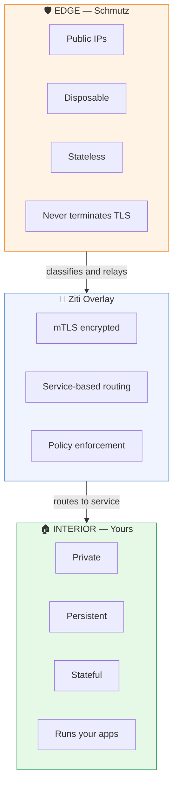
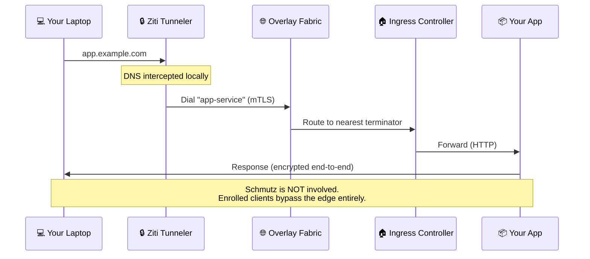
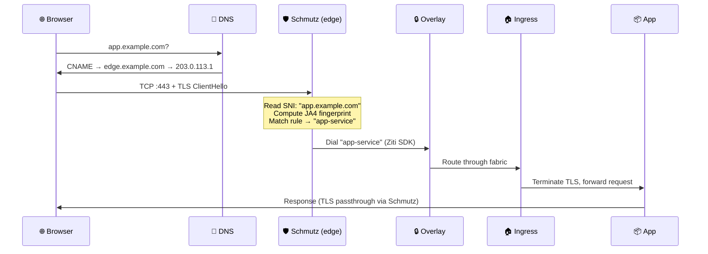
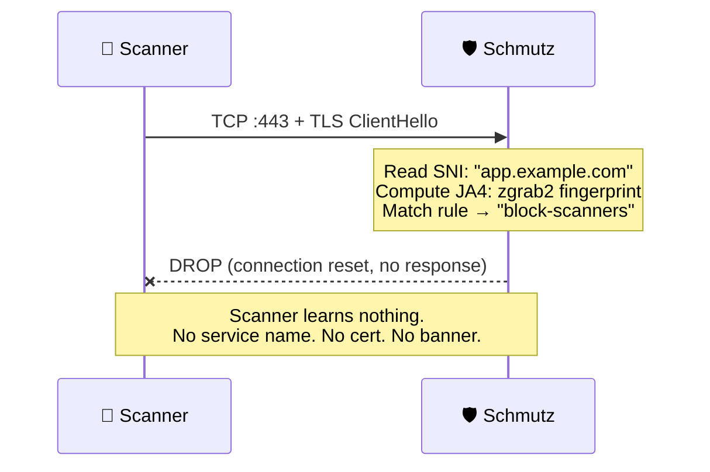
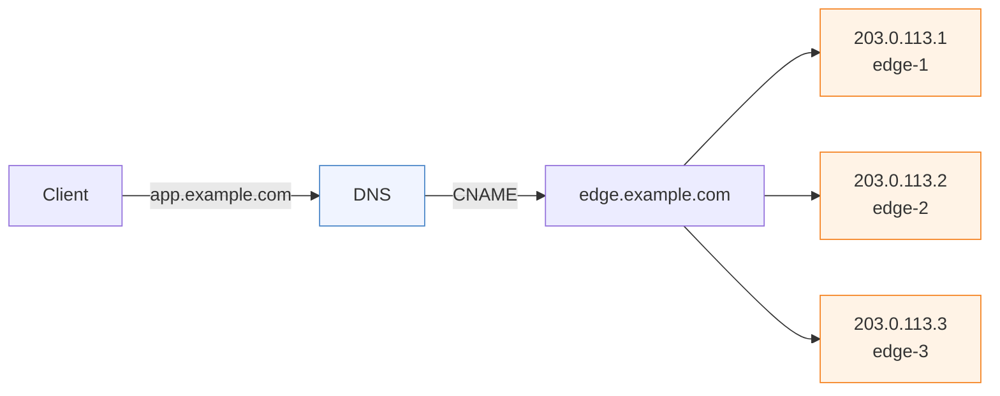
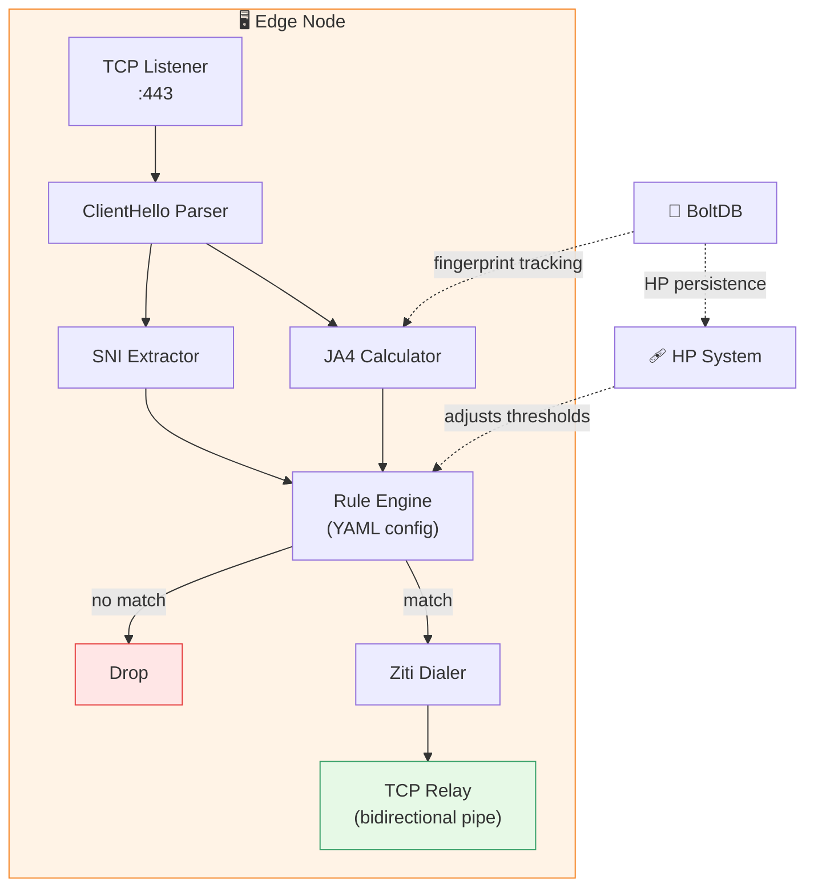
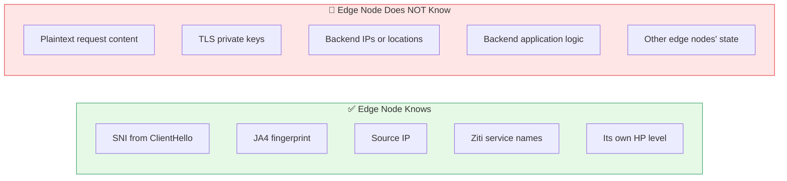
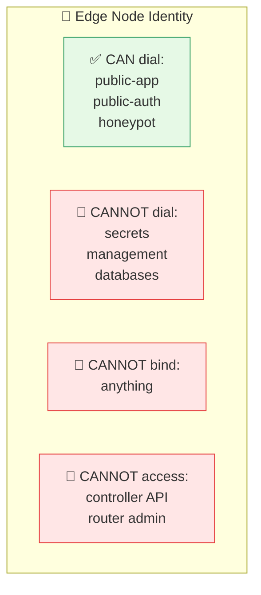
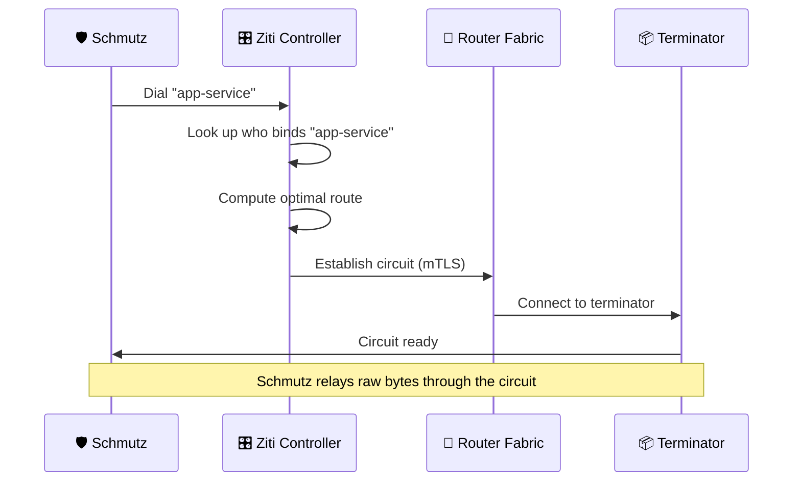
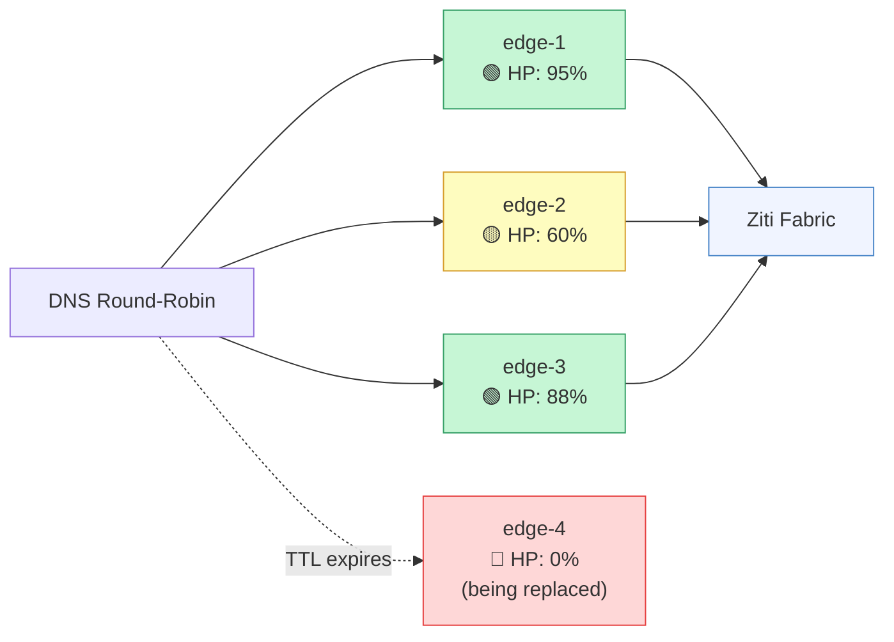

# Architecture

[← Back to README](../README.md)

---

## The Two Layers

Schmutz splits your network into two zones with a hard boundary between them.



The edge exists to take the hits. The interior exists to do the work.

---

## Traffic Flows

Three paths. Three outcomes.

### Enrolled Client (on the overlay)



### Unenrolled Client (from the internet)



### Scanner / Bot



---

## DNS Pattern



```
*.example.com      CNAME   edge.example.com
edge.example.com   A       203.0.113.1
edge.example.com   A       203.0.113.2
edge.example.com   A       203.0.113.3
```

One wildcard CNAME. A-records for each edge node. DNS round-robin distributes
load. All intelligence is at the edge — the DNS layer is deliberately dumb.

Adding a new domain requires zero DNS changes. The wildcard already covers it.
Just add a rule to your Schmutz config.

---

## Edge Node Anatomy



No reverse proxy. No certificate store. No backend registry. No application
logic. ~15MB static binary, no dependencies, no runtime.

---

## The Security Boundary



The edge node can't leak what it doesn't have. If compromised, the attacker
gets: a list of Ziti service names and a BoltDB of JA4 fingerprints. They
don't get certificates, backend access, or any way to impersonate a
legitimate client.

---

## Ziti Integration

Schmutz is a Ziti SDK application. Each edge node has a Ziti identity with
**dial-only** permissions.



When Schmutz dials a service:



The overlay is the routing table, the policy engine, and the encryption
layer. Schmutz just decides which door to knock on.

---

## Scaling



Edge nodes share nothing. No distributed state. No consensus. No leader.

- **Adding capacity:** spin up a VM, install Schmutz, add the IP to DNS
- **Removing capacity:** remove the IP from DNS, destroy the VM
- **Replacing a node:** DNS TTL expires, clients move to the next one

The Ziti fabric picks the best path to the backend regardless of which
edge node the client lands on.
