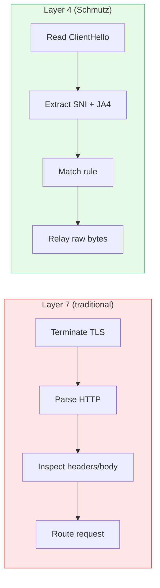
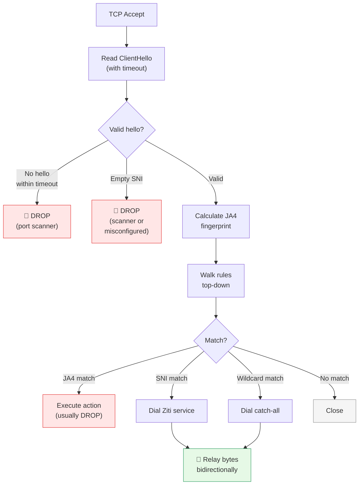
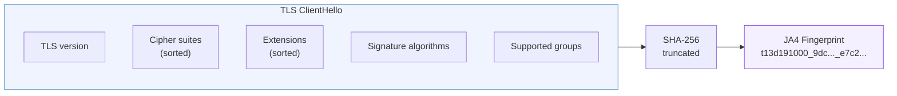
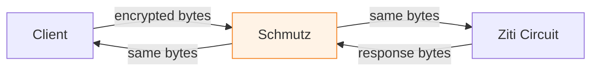
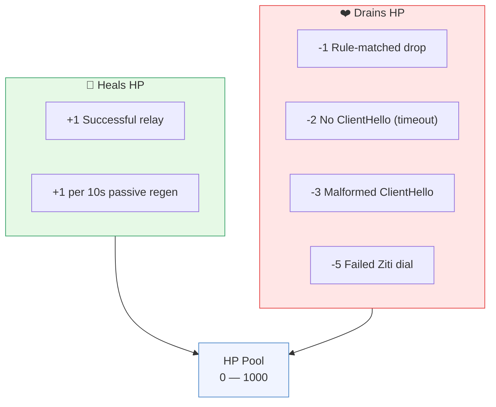
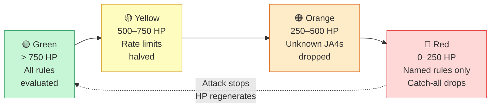
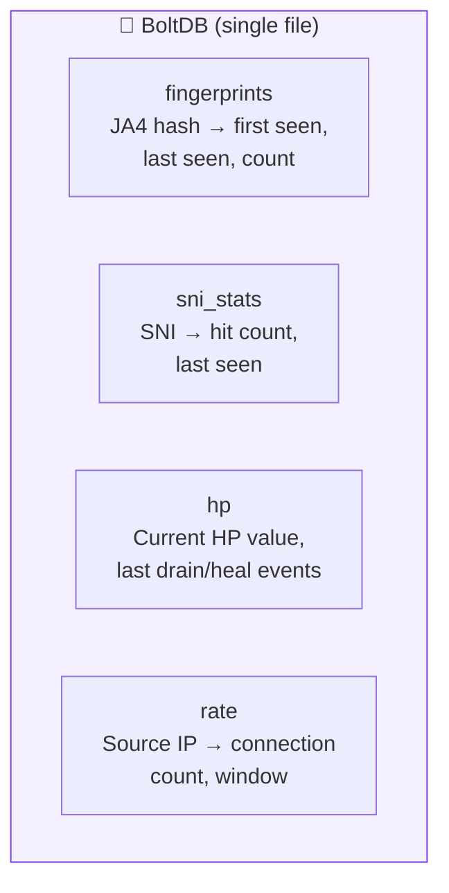
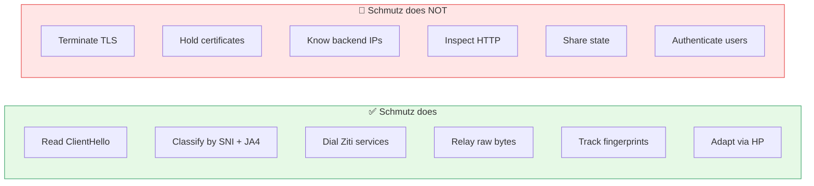

# Design

[← Back to README](../README.md)

---

Layer 4 edge classifier that reads TLS ClientHello metadata (SNI, JA4
fingerprint, source IP) and routes raw TCP streams into the Ziti overlay —
without terminating TLS.

## Why Layer 4?

Most edge security tools work at Layer 7 — they terminate TLS, inspect HTTP,
and make decisions based on headers and body content. This requires holding
certificates, parsing protocols, and maintaining significant state.

Schmutz works at Layer 4. It reads exactly one thing: the **TLS ClientHello**.



| | Layer 7 | Layer 4 (Schmutz) |
|:---|:---|:---|
| Sees plaintext? | Yes | No |
| Holds certificates? | Yes | No |
| Knows backends? | Yes | No |
| Protocol-specific? | Yes (HTTP, gRPC, etc.) | No (any TLS) |
| State per connection? | High | Minimal |

---

## The Classification Pipeline



---

## JA4 Fingerprinting

JA4 is a method for fingerprinting TLS client implementations. It hashes:



The resulting fingerprint identifies the **TLS library**, not the user's claim.

| Client | JA4 Fingerprint | Notes |
|:---|:---|:---|
| Chrome 124 | `t13d1517h2_...` | Unique to Chrome's BoringSSL |
| Firefox 125 | `t13d1516h2_...` | Unique to Firefox's NSS |
| curl | `t13d191000_...` | OpenSSL-based |
| Python requests | `t13d201100_...` | urllib3 / OpenSSL |
| zgrab2 | `t13d191000_9dc...` | Scanner — caught |
| masscan | `t13d301000_4bf...` | Scanner — caught |

A bot can fake a User-Agent header. It can't fake its TLS library.

Reference: [JA4+ by FoxIO](https://github.com/FoxIO-LLC/ja4)

---

## SNI Routing

After passing the JA4 check, the SNI determines the destination:

```yaml
rules:
  - name: auth
    sni: "auth.example.com"
    service: auth-provider

  - name: shares
    sni: "*.share.example.com"
    service: share-frontend

  - name: catch-all
    sni: "*"
    service: default-ingress
```

Each service name maps to a Ziti service. The Ziti controller handles
routing — finding who binds the service, computing the path through the
router mesh, and establishing the circuit.

---

## The Relay

Once classification succeeds and a Ziti connection is established, Schmutz
becomes a dumb pipe:



```go
// Simplified — actual code handles errors, timeouts, HP accounting
go io.Copy(zitiConn, clientConn)
go io.Copy(clientConn, zitiConn)
```

Raw bytes in, raw bytes out. Schmutz never decrypts, inspects, or modifies
the TLS stream.

---

## The HP System

HP (Health Points) is an adaptive defense mechanism. Every Schmutz node
maintains an HP pool (0–1000, persisted in BoltDB).

### How HP changes



### How HP affects behavior



The effect is organic: under normal load, the node is permissive. Under
attack, it progressively tightens. At zero, it's a wall. The operator
doesn't need to intervene — the node defends itself.

HP persists across restarts in BoltDB.

---

## State Management

Schmutz uses [bbolt](https://github.com/etcd-io/bbolt) for local state:



| Bucket | Contents | Purpose |
|:---|:---|:---|
| `fingerprints` | JA4 hash → first seen, last seen, count | Track client diversity |
| `sni_stats` | SNI → hit count, last seen | Monitor domain popularity |
| `hp` | Current HP value, last events | Adaptive defense |
| `rate` | Source IP → count, window | Per-source rate limiting |

BoltDB is a single-file embedded database. No server process. No network.
Each edge node has its own, independent state file.

---

## What Schmutz Doesn't Do



These are features, not limitations. Every thing Schmutz doesn't do is
a thing that can't be compromised on the edge.
