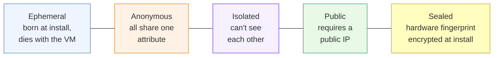
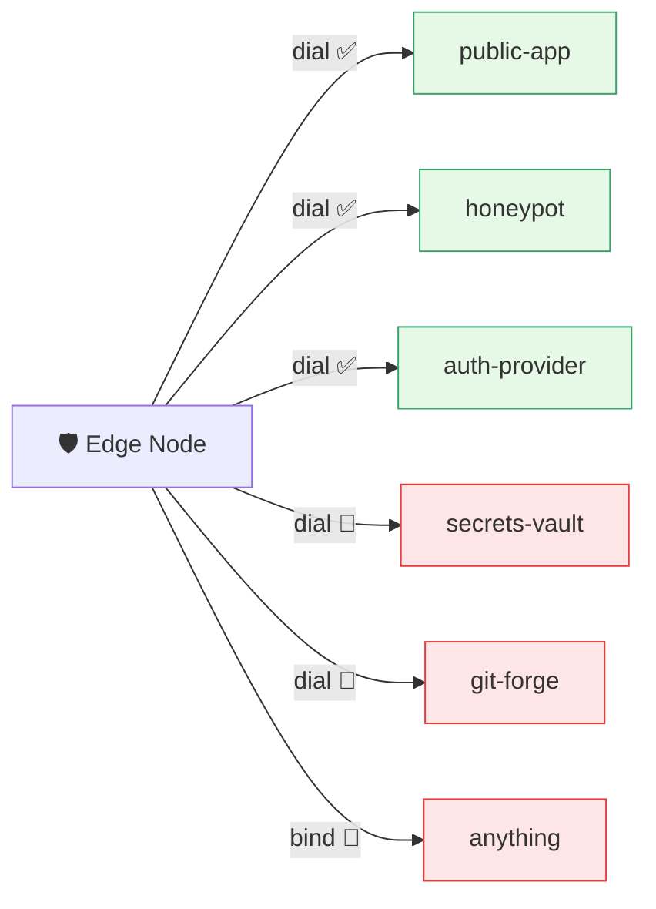
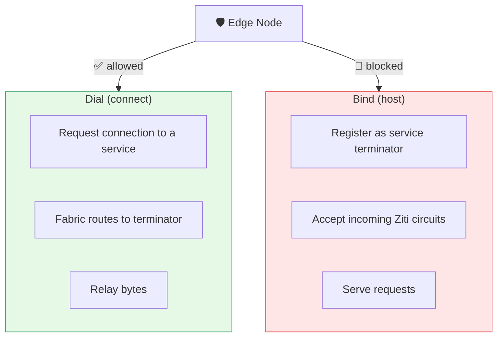
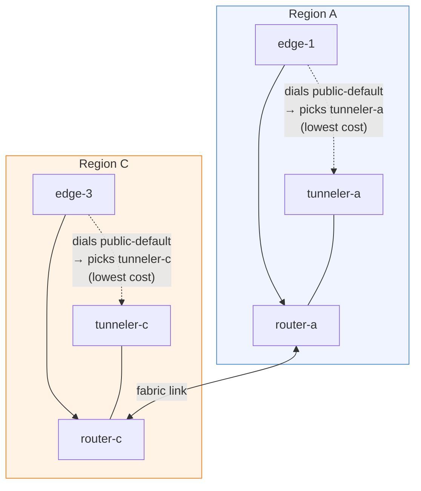
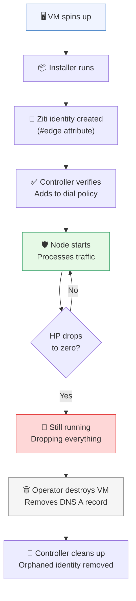
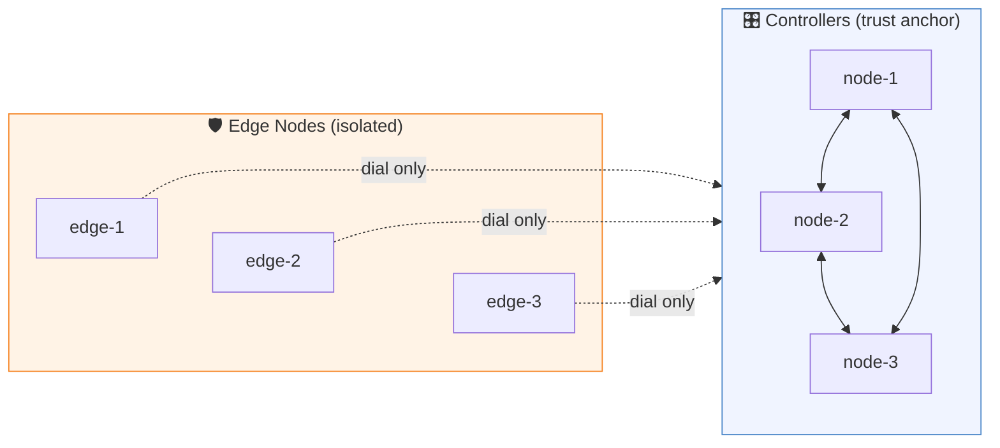

# Edge Node Identity Model

[← Back to README](../README.md)

---

## Principles

Edge nodes are **ephemeral, anonymous, and isolated**. They are disposable
infrastructure — the networking equivalent of a paper towel.

1. **Ephemeral** — identity created at install time, dies with the node
2. **Anonymous** — all edge nodes share one attribute, identical permissions
3. **Isolated** — nodes cannot reach each other, no peer awareness
4. **Public** — edge nodes require a public IP (installer refuses private addresses)
5. **Sealed** — the node encrypts a hardware fingerprint at install time; only
   the controller can verify the claim

---

## What an Edge Node Can Do

Edge nodes can only **dial** public-facing services. They cannot bind services,
access management APIs, or reach internal infrastructure.

If an edge node is compromised, the attacker can only do what a random
internet client could do: talk to public services.

---

## Why Dial-Only?

A Ziti identity can **bind** (host a service) or **dial** (connect to a
service). Edge nodes only dial. They never host anything.

This means:
- An attacker on an edge node **can't create fake services**
- An attacker **can't intercept traffic** meant for real services
- An attacker **can't register** as a service terminator
- The blast radius of a compromised edge node is: **one node's Ziti identity**

---

## Geo-Routing

Edge nodes don't need to know where services run. The Ziti fabric handles it:

If a region's tunneler is down, the fabric routes to the next best option.
No edge node configuration changes needed.

---

## Identity Lifecycle

No SSH access to edge nodes after install. No configuration changes.
No updates. No maintenance. If something goes wrong, destroy and replace.

---

## The Exception

The Ziti controller Raft cluster is the **only** component where controllers
communicate directly with each other. Controllers are not edge nodes —
they are the trust anchor. They run in a separate security domain with
different identities, different permissions, and different operational
procedures.

Controllers talk to each other. Edge nodes never talk to other edge nodes.
Period.
