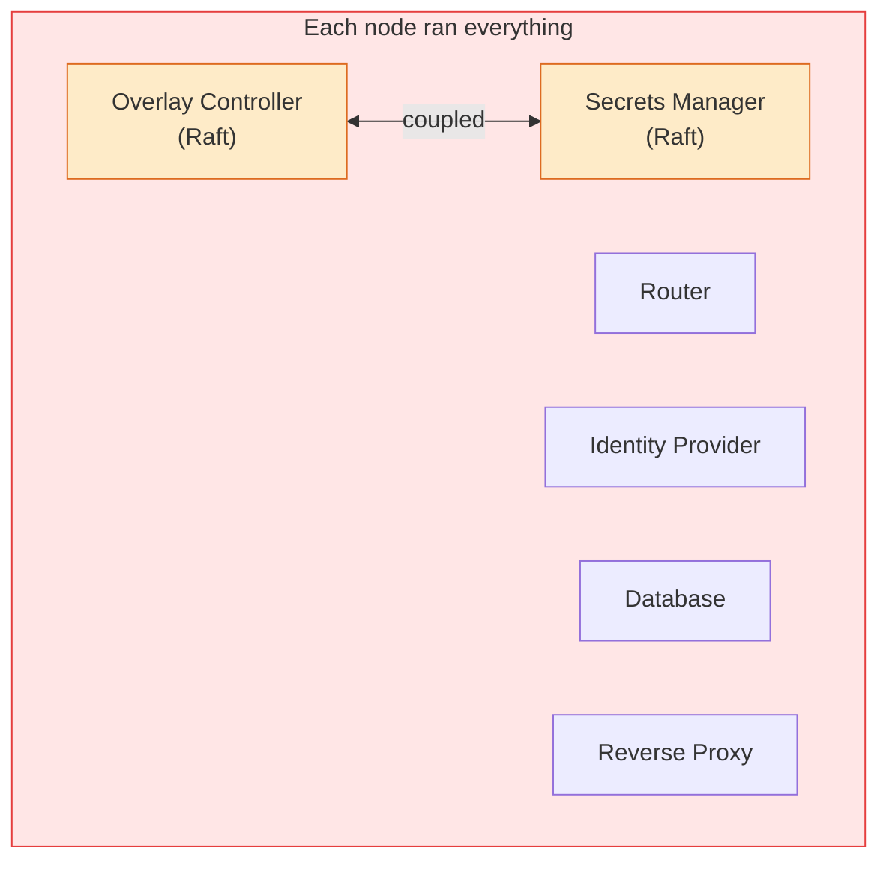
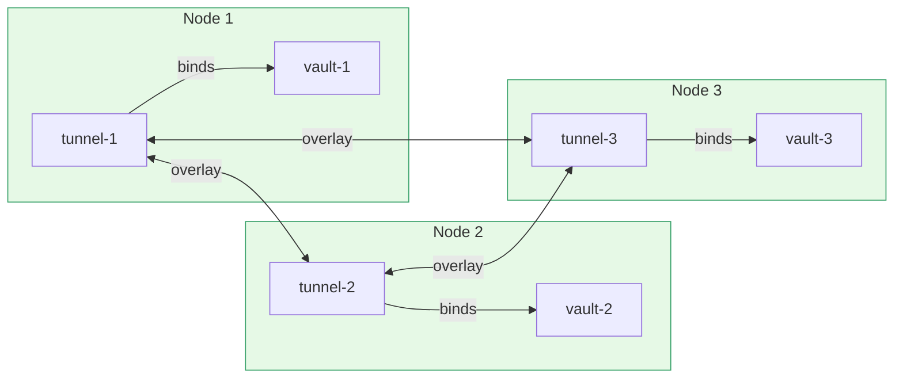
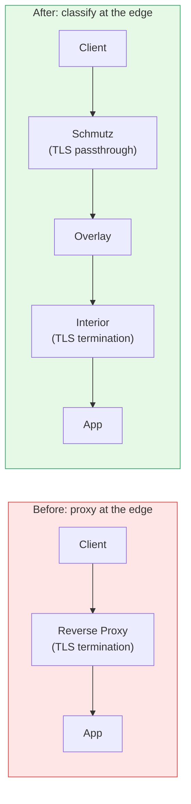
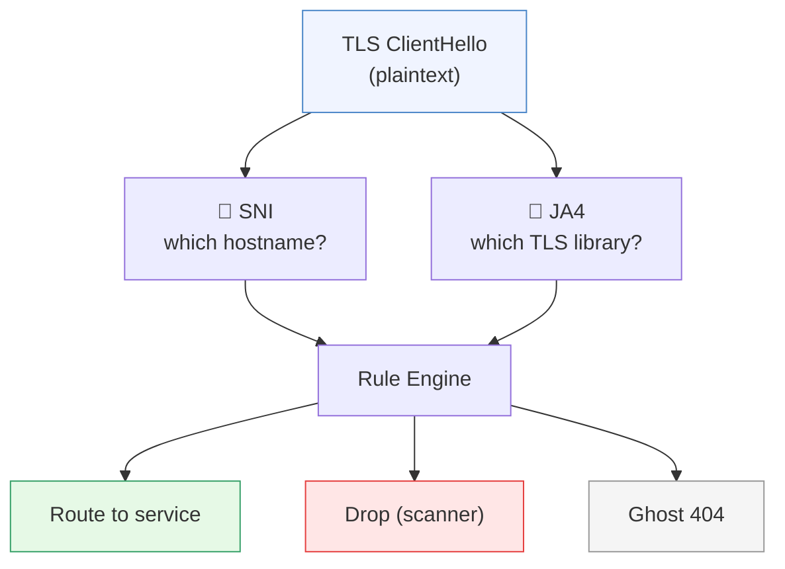
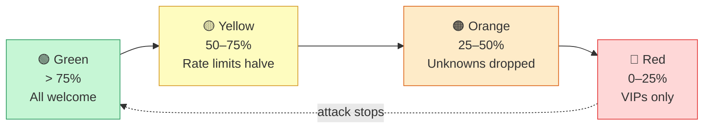
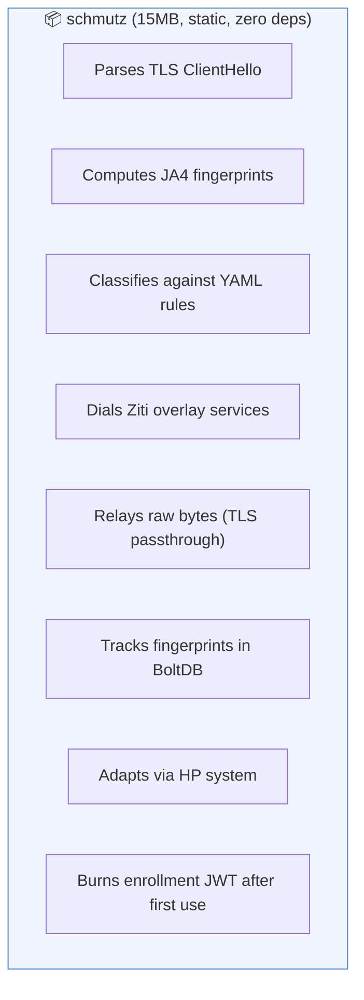
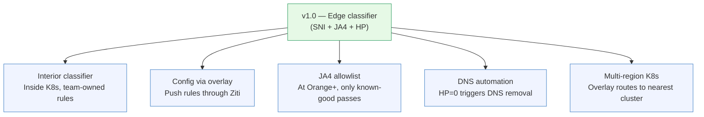

# Origin Story

[← Back to README](../README.md)

---

How Schmutz came to be — from a broken cluster to a zero-trust edge firewall.

## The Problem

We had a 3-node cluster running a zero-trust overlay network. Each node ran
everything: overlay controllers (Raft HA), routers, a secrets manager (also
Raft), an identity provider, a database, a reverse proxy, and a tunnel sharing
service. Six processes, two Raft clusters, all on the same three machines.

The immediate problem: we needed to take down the overlay Raft cluster for
maintenance, but the secrets manager's Raft cluster ran on the same three
nodes. Taking down the overlay could take down secrets. **The two systems
were coupled by infrastructure, not by design.**

The planned fix was to add secrets manager replicas in Kubernetes. But the
K8s cluster didn't exist yet. Dead end.

## The First Fix: Tunnelers

Instead of waiting for K8s, we set up overlay tunnelers on each node. Each
tunneler binds its own node's secrets manager as a service, and can dial the
other nodes' instances through the overlay.

**This decoupled secrets peering from direct IP connectivity.** Cross-node
communication verified through the overlay, not through bare IP.

## The Architecture Conversation

With the tunnelers working, we started questioning the entire architecture:

> **"Is the reverse proxy even needed at the edge?"**

The reverse proxy on each node terminates TLS, routes to local services, and
serves a dark 404 for everything else. But enrolled clients bypass the proxy
entirely — the tunneler intercepts DNS and routes through the overlay.
**The proxy only exists for unenrolled clients.**

> **"Could you terminate TLS inside the cluster instead?"**

Yes. If the ingress runs inside K8s, the edge nodes don't need a reverse
proxy at all. Traffic enters on :443, gets forwarded through the overlay,
and the interior handles TLS termination and routing.

> **"So what does the edge node actually do?"**

**Classify.** That's it. Read the TLS ClientHello, decide what to do with
the connection, dial the right service. The edge node becomes a classifier,
not a proxy.

> **"And the overlay handles all the routing?"**

Yes. When the classifier calls `zitiCtx.Dial("service-name")`, the
controller looks up who binds that service, computes the optimal route
through the router fabric, and establishes a circuit. No DNS inside the
overlay. No IP routing. **Service-name-based routing with policy enforcement.**

## SNI + JA4: Classification at Layer 4

The key insight: you can read the TLS ClientHello without terminating the
handshake. The ClientHello is sent in plaintext — encryption hasn't started
yet.

JA4 identifies the TLS library, not the client's claim. Chrome, Firefox,
curl, Python requests, Go net/http, scanners — they all have different
fingerprints. A bot claiming to be a browser but using a scanner's TLS
library? Caught at the handshake.

## The HP System

An edge node has finite capacity. Under attack, it should become more
selective — like a bouncer who gets pickier as the venue fills up.

Legitimate traffic heals the node. Bad traffic drains it. HP regenerates
passively over time. The node becomes self-regulating — it sheds load
before it falls over.

## The Name

**Schmutz** is Yiddish for "a little dirt." It's the thing that catches all
the filth before it gets inside your house.

The edge nodes are disposable — they get dirty so the interior stays clean.
When one gets too filthy (HP at zero, overwhelmed), you throw it away and
get a new one.

A smudge on every application that you don't notice. But the smudge can save
your ass in a bad situation.

## What We Built

A 15MB static Go binary that:

## What's Next

1. **Interior classifier** — a second Schmutz inside K8s where teams define their own routing rules
2. **Config via overlay** — push rule updates through the controller, all edge nodes get them simultaneously
3. **JA4 allowlist** — BoltDB tracks seen fingerprints; at Orange+, only known-good passes
4. **DNS automation** — HP at zero triggers automatic DNS record removal
5. **Multi-region K8s** — the overlay routes to the nearest cluster; edge nodes don't need to know
