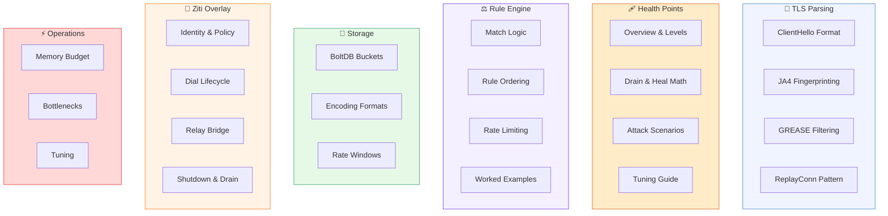

<h1 align="center">
   
  🔬
   
  Advanced Technical Reference
   
</h1>

  <em>Enter if you dare.</em>

  This is where the friendly metaphors end and the byte offsets begin. 
  If you're looking for "what does Schmutz do?" — go <a href="../../README.md">back to the README</a>. 
  If you're looking for "how does Schmutz do it, exactly?" — you're in the right place.

 

---

### Navigation

[TLS Parsing](#-tls-parsing) · [Health Points](#-health-points) · [Rule Engine](#%EF%B8%8F-rule-engine) · [Storage](#-storage) · [Ziti Overlay](#-ziti-overlay) · [Operations](#-operations)

---

 

 

## 🧬 TLS Parsing

How Schmutz reads a TLS ClientHello without terminating the handshake,
and what it extracts.

| Doc | What's inside |
|:---|:---|
| 📄 &nbsp; [ClientHello Format](tls/clienthello-format.md) | The 5-byte record header, handshake structure, field-by-field byte layout with offsets |
| 🧬 &nbsp; [JA4 Fingerprinting](tls/ja4-fingerprinting.md) | Section A/B/C computation, SHA-256 hashing, TLS version mapping, worked Chrome example |
| 🚫 &nbsp; [GREASE Filtering](tls/grease-filtering.md) | What GREASE values are, the `0x0a0a` bitmask, why they're excluded from fingerprints |
| 🔄 &nbsp; [ReplayConn Pattern](tls/replay-conn.md) | How Schmutz peeks at the ClientHello without consuming bytes from the TCP stream |

 

## 🩹 Health Points

The adaptive defense system that makes Schmutz self-regulating under attack.

| Doc | What's inside |
|:---|:---|
| 📊 &nbsp; [Overview & Levels](hp/overview.md) | The four HP levels (Green/Yellow/Orange/Red), thresholds, behavioral changes |
| 📐 &nbsp; [Drain & Heal Math](hp/drain-heal.md) | Event costs, regeneration rate, connection cost multipliers, net HP per route |
| 💥 &nbsp; [Attack Scenarios](hp/attack-scenarios.md) | Simulated 100-scanner attack, HP drain timeline, recovery curve |
| 🎛️ &nbsp; [Tuning Guide](hp/tuning.md) | Config knobs, traffic pattern recommendations, when to adjust defaults |

 

## ⚖️ Rule Engine

How Schmutz matches traffic against rules and decides what to do with it.

| Doc | What's inside |
|:---|:---|
| 🔍 &nbsp; [Match Logic](rules/matching.md) | SNI wildcards, JA4 allow/deny lists, CIDR ranges, AND short-circuit |
| 📋 &nbsp; [Rule Ordering](rules/ordering.md) | Why order matters, the drop-first pattern, catch-all placement |
| ⏱️ &nbsp; [Rate Limiting](rules/rate-limiting.md) | Rate string format, window epochs, HP multiplier, effective rate math |
| 🧪 &nbsp; [Worked Examples](rules/examples.md) | 5 different connections walk through a complete ruleset step by step |

 

## 💾 Storage

How Schmutz persists state locally using BoltDB.

| Doc | What's inside |
|:---|:---|
| 🗄️ &nbsp; [BoltDB Buckets](storage/boltdb-buckets.md) | The 6 buckets, their purposes, key/value formats |
| 🔢 &nbsp; [Encoding Formats](storage/encoding.md) | JSON for records, big-endian uint64 for counters, float64 for HP |
| ⏳ &nbsp; [Rate Windows](storage/rate-windows.md) | Window epoch calculation, key format, old window cleanup |

 

## 🔌 Ziti Overlay

How Schmutz integrates with the OpenZiti SDK to dial services through
the encrypted overlay.

| Doc | What's inside |
|:---|:---|
| 🪪 &nbsp; [Identity & Policy](ziti/identity.md) | Identity loading, dial-only permissions, why no bind, policy enforcement |
| 📞 &nbsp; [Dial Lifecycle](ziti/dial-lifecycle.md) | Controller lookup, route computation, circuit establishment, error handling |
| 🔄 &nbsp; [Relay Bridge](ziti/relay-bridge.md) | ReplayConn → Ziti circuit, half-close semantics, bidirectional io.Copy |
| 🛑 &nbsp; [Shutdown & Drain](ziti/shutdown.md) | SIGINT/SIGTERM handling, 30-second drain, graceful connection close |

 

## ⚡ Operations

Performance characteristics, resource budgets, and tuning guidance.

| Doc | What's inside |
|:---|:---|
| 🧠 &nbsp; [Memory Budget](ops/memory-budget.md) | Per-connection breakdown, goroutine model, scaling math |
| 🚧 &nbsp; [Bottlenecks](ops/bottlenecks.md) | BoltDB single-writer, Ziti dial latency, file descriptor limits |
| 🎛️ &nbsp; [Tuning](ops/tuning.md) | MaxConnections vs ulimit, ReadTimeout, HP thresholds, storage |

 

---

  <em>You made it this far. You're one of us now.</em>
   
   
  <a href="../../README.md">← Back to the friendly README</a>

