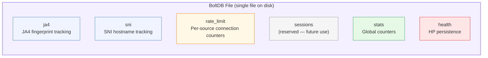
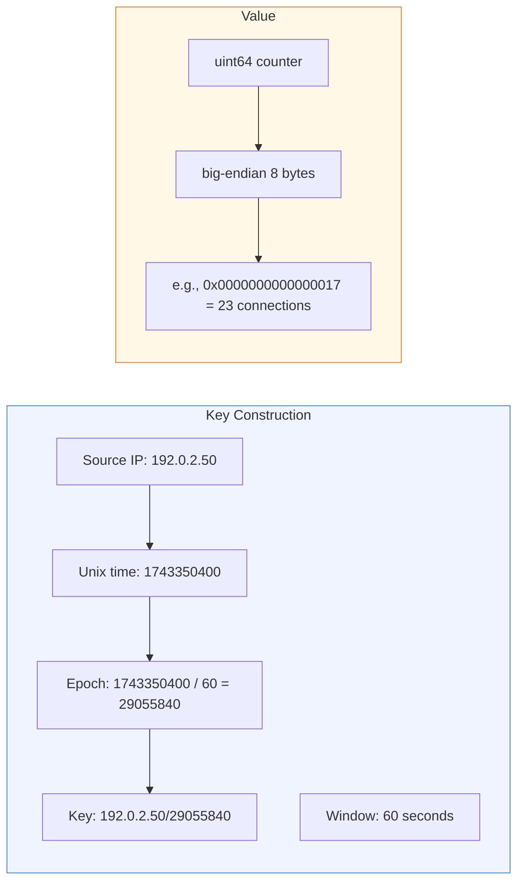
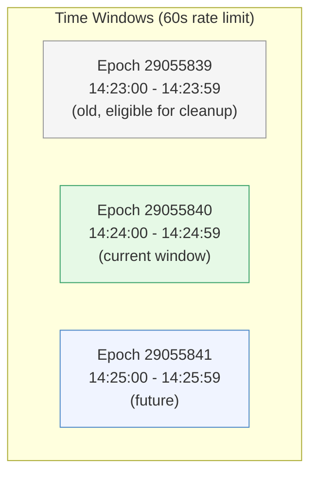
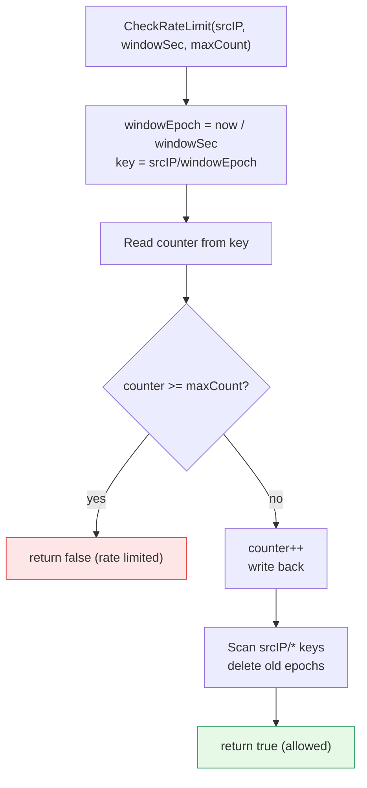
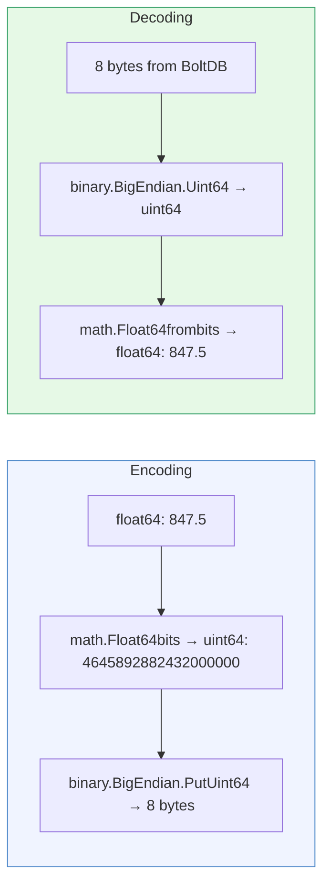
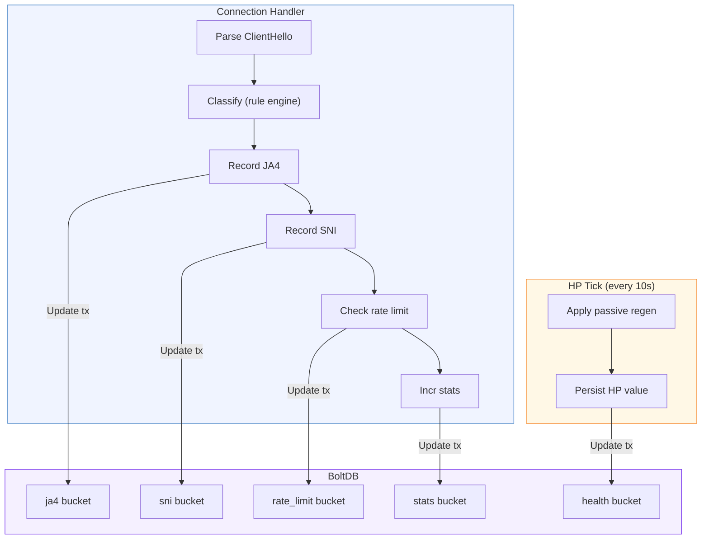
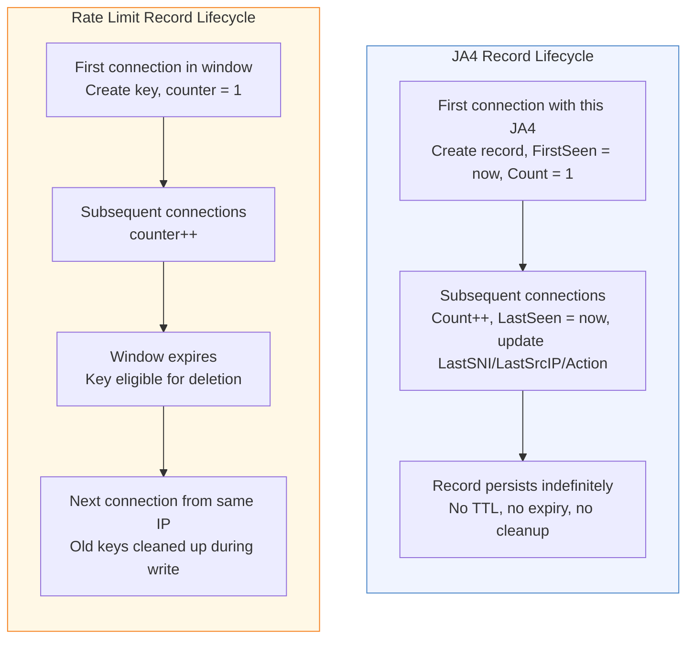

# BoltDB Schema --- Local State Persistence

[← Back to README](../../README.md) | [Architecture](../ARCHITECTURE.md) | [Design](../DESIGN.md)

---

Schmutz uses [bbolt](https://github.com/etcd-io/bbolt) (the etcd fork of
BoltDB) as its local state store. Each edge node has its own independent
database file. There is no cross-node replication --- the Ziti controller
handles distributed state. BoltDB is strictly for local observability,
rate limiting, and HP persistence.

---

## Bucket Layout



All six buckets are created on startup via `CreateBucketIfNotExists`. If the
database file does not exist, BoltDB creates it.

---

## Bucket Details

### 1. `ja4` --- JA4 Fingerprint Tracking

Tracks every unique TLS fingerprint seen by this node.

**Key**: JA4 fingerprint string (e.g., `t13d1517h2_8daaf6152771_e5627efa2ab1`)

**Value**: JSON-encoded `JA4Record`

```go
type JA4Record struct {
    Fingerprint string    `json:"fingerprint"`   // The JA4 hash (redundant with key)
    Count       uint64    `json:"count"`          // Total connections with this JA4
    FirstSeen   time.Time `json:"first_seen"`     // UTC timestamp of first occurrence
    LastSeen    time.Time `json:"last_seen"`      // UTC timestamp of most recent
    LastSNI     string    `json:"last_sni"`       // SNI from the most recent connection
    LastSrcIP   string    `json:"last_src_ip"`    // Source address (IP:port) of most recent
    Action      string    `json:"action"`         // Last action taken: "route" or "drop"
}
```

**Example stored value**:

```json
{
  "fingerprint": "t13d1517h2_8daaf6152771_e5627efa2ab1",
  "count": 14823,
  "first_seen": "2026-03-15T08:12:44Z",
  "last_seen": "2026-03-30T14:22:01Z",
  "last_sni": "app.example.com",
  "last_src_ip": "192.0.2.50:49821",
  "action": "route"
}
```

**Update logic**: on every connection, `RecordJA4()` opens a read-write
transaction, fetches the existing record (or initializes a new one with
`FirstSeen = now`), increments `Count`, updates `LastSeen`, `LastSNI`,
`LastSrcIP`, and `Action`, then marshals back to JSON and writes.

---

### 2. `sni` --- SNI Hostname Tracking

Tracks every unique SNI hostname requested.

**Key**: SNI hostname string (e.g., `app.example.com`)

**Value**: JSON-encoded `SNIRecord`

```go
type SNIRecord struct {
    Hostname  string    `json:"hostname"`    // The SNI value (redundant with key)
    Count     uint64    `json:"count"`       // Total connections requesting this SNI
    FirstSeen time.Time `json:"first_seen"`  // UTC timestamp of first request
    LastSeen  time.Time `json:"last_seen"`   // UTC timestamp of most recent
    LastJA4   string    `json:"last_ja4"`    // JA4 fingerprint of most recent connection
    LastSrcIP string    `json:"last_src_ip"` // Source address of most recent connection
}
```

**Update logic**: identical pattern to JA4 --- upsert on every connection
via `RecordSNI()`.

---

### 3. `rate_limit` --- Per-Source Connection Counters

Implements sliding-window rate limiting per source IP.

**Key format**: `{srcIP}/{windowEpoch}`

Where `windowEpoch = unix_timestamp / window_seconds` (integer division).

**Value**: `uint64` counter, stored as **big-endian 8 bytes**.



**Window calculation**:



**Check-and-increment** (`CheckRateLimit`):

1. Compute `windowEpoch = now / windowSec`
2. Build key `"{srcIP}/{windowEpoch}"`
3. Read current counter (0 if absent)
4. If counter >= maxCount, return `allowed = false`
5. Increment counter, write back
6. Clean up old windows for this srcIP (best effort)

**Old window cleanup**: after incrementing, the function scans all keys
with the same srcIP prefix. Any key whose epoch, multiplied by `windowSec`,
falls before the current window start (`now - windowSec`) is deleted. This
runs inside the same write transaction.



**Important**: `CheckRateLimit` uses a **write transaction** (`db.Update`),
not a read transaction. This is because it atomically reads, increments, and
cleans up in a single transaction. BoltDB's single-writer lock means rate
limit checks are serialized.

---

### 4. `sessions` --- Reserved

This bucket is created on startup but currently unused. Reserved for future
caching of Ziti session metadata to reduce controller round-trips on
repeated dials to the same service.

---

### 5. `stats` --- Global Counters

Simple named counters for operational metrics.

**Key**: stat name as a string (e.g., `conn_total`)

**Value**: `uint64` counter, stored as **big-endian 8 bytes**

Known stat names:

| Stat Name | Incremented When |
|:----------|:-----------------|
| `conn_total` | Every accepted TCP connection |
| `conn_bad_clienthello` | ClientHello parse fails or times out |
| `conn_dropped` | Rule engine returns `action: drop` |
| `conn_routed` | Ziti dial succeeds, relay begins |
| `conn_dial_failed` | Ziti dial returns an error |
| `conn_rate_limited` | Source IP exceeds rate limit |
| `conn_rejected_limit` | MaxConnections limit reached |

**Read**: `GetStat(name)` uses a **read-only transaction** (`db.View`) ---
no lock contention with writes.

**Write**: `IncrStat(name)` uses a write transaction. The pattern is:
read current value (or 0), increment, write back as 8 big-endian bytes.

---

### 6. `health` --- HP Persistence

Stores the HP pool's current value so it survives restarts.

**Key**: `"hp"` (literal string)

**Value**: `float64` encoded as `math.Float64bits()` --- a `uint64` stored
as **big-endian 8 bytes**



**Persistence frequency**: the HP pool's `tick()` goroutine fires every
`PersistSec` seconds (default: 10). Each tick:

1. Applies passive HP regeneration (`regenRate * elapsed_seconds`)
2. Clamps HP to `[0, maxHP]`
3. Writes current HP to the `health` bucket

**Restore on startup**: `NewPool()` reads the `"hp"` key. If present and
the value is between 0 and `maxHP`, it replaces the default (full HP) with
the restored value. This means a node that was under attack retains its
reduced HP across restarts.

**Shutdown**: `Stop()` calls `persist()` one final time to save the
current HP value before the process exits.

---

## BoltDB Configuration

```go
db, err := bolt.Open(path, 0600, &bolt.Options{
    Timeout:      5 * time.Second,
    NoGrowSync:   false,
    FreelistType: bolt.FreelistMapType,
})
```

| Option | Value | Rationale |
|:-------|:------|:----------|
| File mode | `0600` | Owner read/write only. No group or other access |
| Timeout | `5s` | Max wait to acquire file lock. Prevents deadlock if another process holds the file |
| NoGrowSync | `false` | Sync to disk on file growth (safety over speed) |
| FreelistType | `FreelistMapType` | Map-based freelist for better performance with frequent deletes (rate limit cleanup) |

**Default file location**: configured via `store.path` in the YAML config.
The default is `/opt/schmutz/edge-gateway/edge-gateway.db`.

---

## Data Flow



Every connection triggers 4 write transactions (JA4, SNI, rate limit, stats)
plus reads. The HP tick adds 1 write every 10 seconds regardless of traffic.

---

## Record Lifecycle



Key difference: JA4 and SNI records are **append-only** (never deleted).
Rate limit records are **ephemeral** (cleaned up after their window expires).

---

## Querying State

Three read functions are available for operational inspection:

### ListJA4()

Returns all JA4 records. Uses a read-only transaction and iterates the
entire `ja4` bucket with `ForEach`. Corrupt entries (JSON unmarshal failure)
are silently skipped.

### ListSNI()

Returns all SNI records. Same pattern as `ListJA4()`.

### GetStat(name)

Returns a single stat counter by name. Uses a read-only transaction. Returns
0 if the key does not exist.

All three use `db.View()` (read-only transactions), so they do not block
writes and can run concurrently with each other.

---

## Compaction and File Size

BoltDB uses a B+ tree with copy-on-write pages. Deleted data is added to
the freelist, not reclaimed on disk.

### When to worry

| Scenario | Impact | Mitigation |
|:---------|:-------|:-----------|
| Many unique JA4 fingerprints | Linear growth, ~200 bytes per record | Acceptable --- thousands of JA4s = ~200 KB |
| Many unique SNI hostnames | Linear growth, ~150 bytes per record | Same --- rarely exceeds thousands |
| High rate limit churn | Frequent creates + deletes | `FreelistMapType` handles this well |
| Long uptime, no restarts | Freelist grows, file size creeps | Periodic restart reclaims space |
| Disk full | BoltDB write fails, connections dropped | Monitor disk space, alert on low |

### Practical file sizes

For a typical edge node seeing 10,000 unique JA4 fingerprints, 500 unique
SNIs, and active rate limiting for 1,000 concurrent source IPs:

- JA4 bucket: ~2 MB
- SNI bucket: ~75 KB
- Rate limit bucket: ~50 KB (ephemeral, stays small)
- Stats bucket: < 1 KB (handful of counters)
- Health bucket: 8 bytes
- **Total**: ~2-3 MB on disk

BoltDB files can grow larger than the actual data due to freelist
fragmentation. If the file grows beyond 100 MB (unlikely in normal
operation), a restart will compact it. For programmatic compaction, use
`bbolt`'s `Compact()` function or the `bbolt` CLI tool:

```bash
bbolt compact -o new.db old.db
mv new.db old.db
```

### Backup

The database is a single file. Copy it while Schmutz is stopped, or use
BoltDB's `Tx.WriteTo()` for a consistent online snapshot. Since edge nodes
are disposable and share no state, backup is optional --- the data is
reconstructed from live traffic within minutes of a fresh start.
