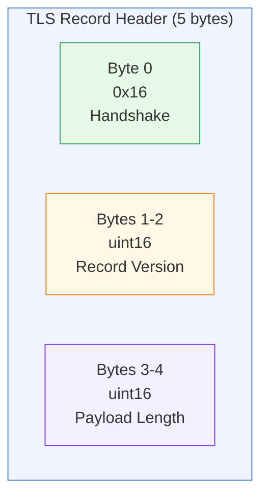
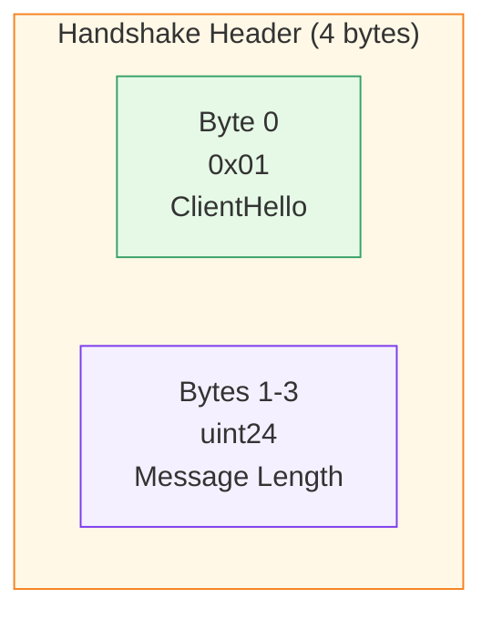
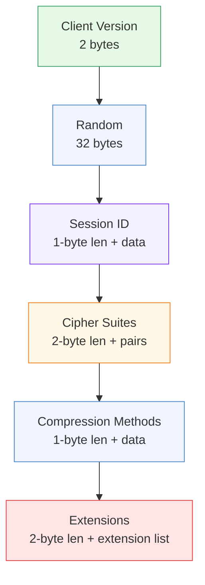
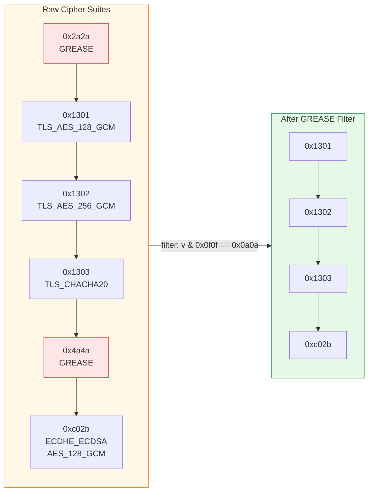
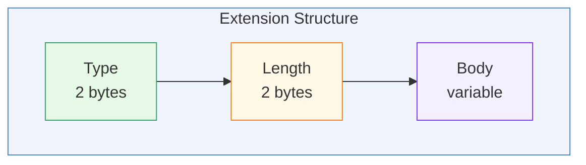
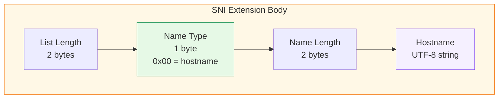
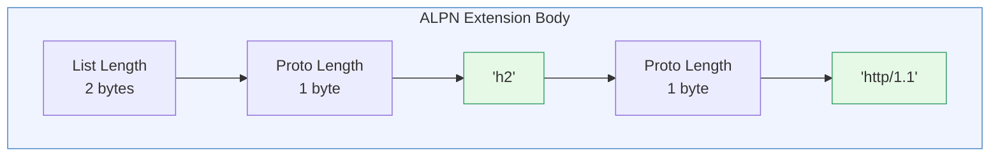
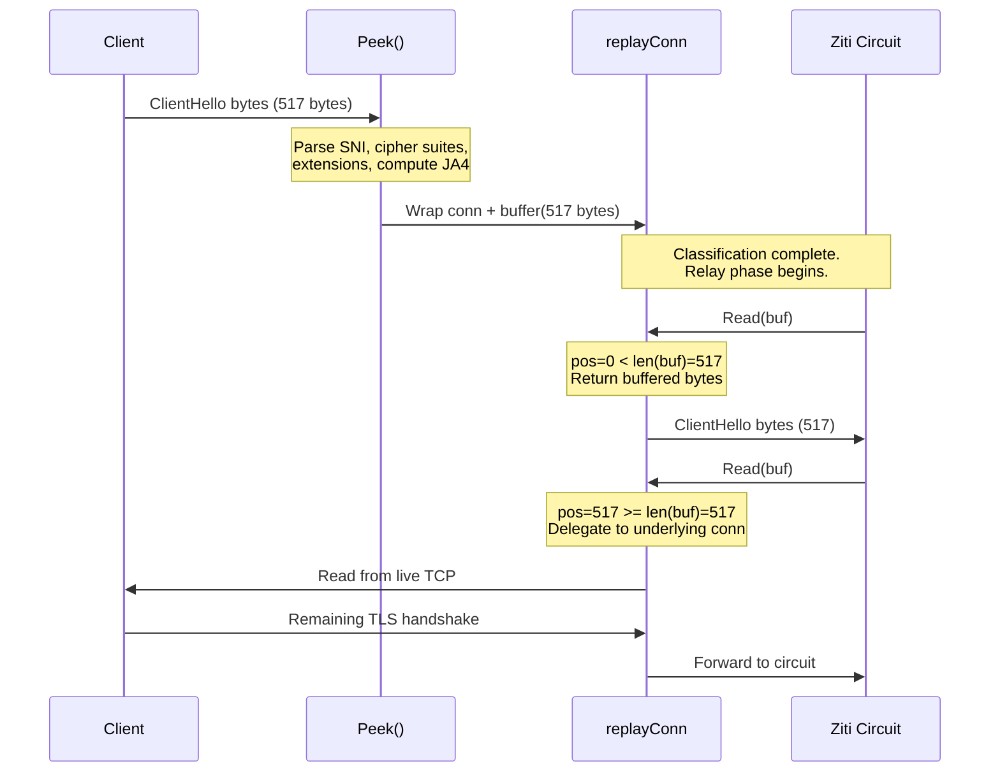
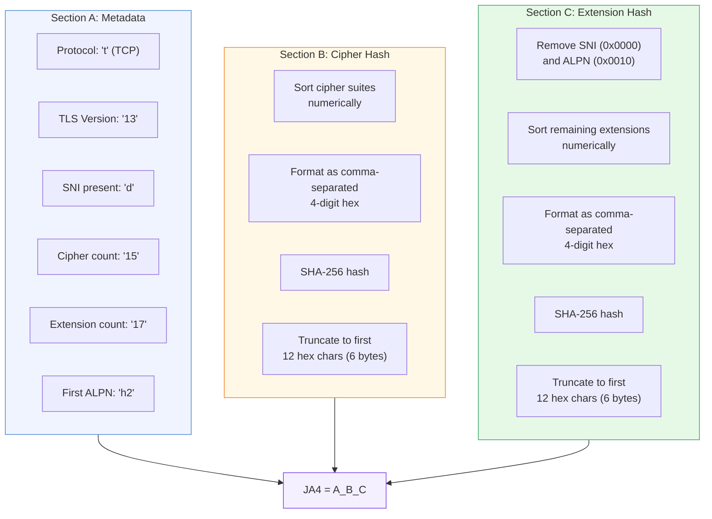

# ClientHello Parsing -- Byte by Byte

[<- Back to README](../../README.md) | [Architecture](../ARCHITECTURE.md) | [Design](../DESIGN.md)

---

Every TLS connection begins with the client sending a ClientHello message.
Schmutz reads this message -- and only this message -- to classify the
connection. It never terminates TLS, never sees plaintext, and never modifies
a single byte. This document walks through the exact binary layout that
Schmutz parses, byte by byte.

---

## The TLS Record Layer

Every TLS message is wrapped in a record. The record header is always
exactly 5 bytes.



| Offset | Size | Field | Expected Value |
|:-------|:-----|:------|:---------------|
| 0 | 1 byte | Content type | `0x16` = Handshake |
| 1 | 2 bytes | Record version | Usually `0x0301` (TLS 1.0) regardless of actual version |
| 3 | 2 bytes | Payload length | Up to 16384 (enforced by Schmutz) |

The record version at bytes 1-2 is a legacy field. Modern clients always
write `0x0301` here even when negotiating TLS 1.3. The actual version is
inside the ClientHello or the `supported_versions` extension.

```go
// From parse.go — first 5 bytes
header := make([]byte, 5)
io.ReadFull(conn, header)

if header[0] != 0x16 {
    return nil, errors.New("not a TLS handshake")
}

length := int(header[3])<<8 | int(header[4])
if length > 16384 {
    return nil, errors.New("record too large")
}
```

---

## The Handshake Header

Inside the record payload, the handshake message has its own 4-byte header.



| Offset | Size | Field | Expected Value |
|:-------|:-----|:------|:---------------|
| 0 | 1 byte | Handshake type | `0x01` = ClientHello |
| 1 | 3 bytes | Message length | Remaining bytes in the handshake message |

Schmutz validates `payload[0] == 0x01` and then skips the 4-byte header
to enter the ClientHello body.

---

## The ClientHello Body

The body is a sequence of fields, each with explicit lengths. The parser
walks forward through the byte slice, consuming fields in order.



### Field-by-Field Layout

| Field | Size | Description |
|:------|:-----|:------------|
| Client Version | 2 bytes | `0x0303` for TLS 1.2, `0x0303` for TLS 1.3 (yes, same -- version moved to extensions) |
| Random | 32 bytes | Cryptographic nonce. Skipped entirely by Schmutz |
| Session ID Length | 1 byte | Length of the session ID that follows |
| Session ID | 0-32 bytes | Legacy session resumption. Skipped |
| Cipher Suites Length | 2 bytes | Total byte length of cipher suites list |
| Cipher Suites | N x 2 bytes | Each cipher suite is a 2-byte identifier |
| Compression Length | 1 byte | Length of compression methods |
| Compression Methods | N bytes | Always `[0x00]` (null) in modern TLS |
| Extensions Length | 2 bytes | Total byte length of all extensions |
| Extensions | variable | The payload Schmutz actually cares about |

```go
// Version
info.TLSVersion = uint16(msg[0])<<8 | uint16(msg[1])
msg = msg[2:]

// Random — skip 32 bytes
msg = msg[32:]

// Session ID — read length, skip data
sessLen := int(msg[0])
msg = msg[1+sessLen:]
```

---

## Cipher Suite Parsing and GREASE Filtering

Cipher suites are a flat array of 2-byte values. The length prefix gives the
total byte count, not the element count (so divide by 2).



### What is GREASE?

GREASE (Generate Random Extensions And Sustain Extensibility) values are
dummy values injected by TLS implementations to prevent servers from
ossifying around specific extension/cipher sets. They follow a fixed pattern:

```
GREASE pattern: value & 0x0f0f == 0x0a0a
```

This matches: `0x0a0a`, `0x1a1a`, `0x2a2a`, `0x3a3a`, `0x4a4a`, `0x5a5a`,
`0x6a6a`, `0x7a7a`, `0x8a8a`, `0x9a9a`, `0xaaaa`, `0xbaba`, `0xcaca`,
`0xdada`, `0xeaea`, `0xfafa`.

Schmutz strips these from both cipher suites and extensions before computing
the JA4 fingerprint. If you don't strip GREASE, the same browser generates
different fingerprints on every connection.

```go
// Filter GREASE cipher suites
for i := 0; i < csLen; i += 2 {
    cs := uint16(msg[i])<<8 | uint16(msg[i+1])
    if cs&0x0f0f == 0x0a0a {
        continue  // GREASE — skip
    }
    info.CipherSuites = append(info.CipherSuites, cs)
}
```

---

## Extension Parsing

Extensions follow the compression methods. Each extension has a 4-byte
header (2-byte type + 2-byte length) followed by a variable-length body.



Schmutz walks the extension list sequentially, recording each extension
type and extracting data from two specific extensions:

| Extension | Type Code | Extracted Data |
|:----------|:----------|:---------------|
| **SNI** (Server Name Indication) | `0x0000` | The hostname the client is trying to reach |
| **ALPN** (Application-Layer Protocol Negotiation) | `0x0010` | Protocol list (e.g., `h2`, `http/1.1`) |

All other extensions are recorded by type code only (for the JA4
fingerprint) but their bodies are ignored.

### SNI Extraction (Extension 0x0000)

The SNI extension contains a list of server names. In practice, there is
always exactly one, with type `0x00` (hostname).



```go
func parseSNI(data []byte) string {
    if len(data) < 5 {
        return ""
    }
    data = data[2:]          // skip list length
    if data[0] != 0x00 {    // must be hostname type
        return ""
    }
    nameLen := int(data[1])<<8 | int(data[2])
    data = data[3:]
    return string(data[:nameLen])
}
```

### ALPN Extraction (Extension 0x0010)

The ALPN extension contains a length-prefixed list of protocol strings.



```go
func parseALPN(data []byte) []string {
    data = data[2:]  // skip list length
    var protos []string
    for len(data) > 0 {
        pLen := int(data[0])
        data = data[1:]
        protos = append(protos, string(data[:pLen]))
        data = data[pLen:]
    }
    return protos
}
```

---

## The replayConn Pattern

Schmutz needs to read the ClientHello to classify the connection, but it
cannot consume those bytes -- they must also reach the backend, which
expects a complete TLS handshake starting from byte zero.

The solution is `replayConn`: a wrapper around `net.Conn` that prepends a
buffer of already-read bytes before delegating to the underlying connection.



```go
type replayConn struct {
    net.Conn
    buf []byte
    pos int
}

func (c *replayConn) Read(p []byte) (int, error) {
    if c.pos < len(c.buf) {
        n := copy(p, c.buf[c.pos:])
        c.pos += n
        return n, nil
    }
    return c.Conn.Read(p)
}
```

From the Ziti circuit's perspective, it receives a complete, unmodified
byte stream starting with the ClientHello. The peek is invisible.

---

## JA4 Fingerprint Computation

JA4 produces a string with three sections separated by underscores:

```
t13d1517h2_a2b1c3d4e5f6_7a8b9c0d1e2f
|________| |____________| |____________|
 Section A    Section B     Section C
```



### Section A: Protocol Metadata (plaintext)

Six fields concatenated without separators:

| Position | Field | Values | Example |
|:---------|:------|:-------|:--------|
| 1 | Protocol | `t` (TCP), `q` (QUIC) | `t` |
| 2-3 | TLS version | `13`, `12`, `11`, `10`, `00` | `13` |
| 4 | SNI indicator | `d` (domain present), `i` (IP or absent) | `d` |
| 5-6 | Cipher suite count | 2-digit, zero-padded, capped at 99 | `15` |
| 7-8 | Extension count | 2-digit, zero-padded, capped at 99 | `17` |
| 9-10 | First ALPN | First 2 chars of first ALPN proto, `00` if absent | `h2` |

### TLS Version Mapping

```go
switch clientVersion {
case 0x0304: return "13"  // TLS 1.3
case 0x0303: return "12"  // TLS 1.2
case 0x0302: return "11"  // TLS 1.1
case 0x0301: return "10"  // TLS 1.0
default:     return "00"  // Unknown
}
```

Note: TLS 1.3 clients typically send `0x0303` in the ClientHello version
field (for backward compatibility) and advertise `0x0304` in the
`supported_versions` extension. Schmutz currently uses the ClientHello
version field directly.

### Section B: Sorted Cipher Suite Hash

1. Take the GREASE-filtered cipher suite list
2. Sort numerically (ascending)
3. Format each as 4-digit lowercase hex
4. Join with commas: `"1301,1302,1303,c02b,c02c,c02f,..."`
5. SHA-256 the resulting string
6. Take the first 6 bytes (12 hex characters)

### Section C: Sorted Extension Hash (minus SNI and ALPN)

1. Take the GREASE-filtered extension type list
2. Remove `0x0000` (SNI) and `0x0010` (ALPN)
3. Sort numerically (ascending)
4. Format each as 4-digit lowercase hex
5. Join with commas: `"0005,000a,000b,000d,0017,..."`
6. SHA-256 the resulting string
7. Take the first 6 bytes (12 hex characters)

SNI and ALPN are excluded because they vary per request (different hostnames
and protocols) while the rest of the extension set is determined by the TLS
library.

```go
func hashSorted(values []uint16) string {
    if len(values) == 0 {
        return "000000000000"
    }
    sorted := make([]uint16, len(values))
    copy(sorted, values)
    sort.Slice(sorted, func(i, j int) bool {
        return sorted[i] < sorted[j]
    })

    var parts []string
    for _, v := range sorted {
        parts = append(parts, fmt.Sprintf("%04x", v))
    }
    h := sha256.Sum256([]byte(strings.Join(parts, ",")))
    return fmt.Sprintf("%x", h[:6])
}
```

---

## Worked Example: Chrome 124 ClientHello

Let's walk through a realistic Chrome 124 ClientHello connecting to
`app.example.com` and compute the JA4 fingerprint.

### Raw ClientHello (hex, annotated)

```
TLS Record Header:
  16                          Content type: Handshake
  03 01                       Record version: TLS 1.0 (legacy)
  02 00                       Payload length: 512 bytes

Handshake Header:
  01                          Type: ClientHello
  00 01 fc                    Length: 508 bytes

ClientHello Body:
  03 03                       Client version: TLS 1.2 (0x0303)
  [32 bytes random]           Random nonce (omitted)
  20 [32 bytes session ID]    Session ID: 32 bytes

Cipher Suites (30 bytes = 15 suites):
  00 1c                       Length: 28 bytes
  2a 2a                       GREASE (0x2a2a) — filtered out
  13 01                       TLS_AES_128_GCM_SHA256
  13 02                       TLS_AES_256_GCM_SHA384
  13 03                       TLS_CHACHA20_POLY1305_SHA256
  c0 2b                       TLS_ECDHE_ECDSA_WITH_AES_128_GCM_SHA256
  c0 2f                       TLS_ECDHE_RSA_WITH_AES_128_GCM_SHA256
  c0 2c                       TLS_ECDHE_ECDSA_WITH_AES_256_GCM_SHA384
  c0 30                       TLS_ECDHE_RSA_WITH_AES_256_GCM_SHA384
  cc a9                       TLS_ECDHE_ECDSA_WITH_CHACHA20_POLY1305
  cc a8                       TLS_ECDHE_RSA_WITH_CHACHA20_POLY1305
  c0 13                       TLS_ECDHE_ECDSA_WITH_AES_128_CBC_SHA
  c0 14                       TLS_ECDHE_RSA_WITH_AES_128_CBC_SHA
  00 9c                       TLS_RSA_WITH_AES_128_GCM_SHA256
  00 9d                       TLS_RSA_WITH_AES_256_GCM_SHA384

Compression Methods:
  01 00                       1 method: null

Extensions (many, abbreviated):
  0000  SNI: "app.example.com"
  0017  Extended Master Secret
  ff01  Renegotiation Info
  000a  Supported Groups
  000b  EC Point Formats
  0023  Session Ticket
  0010  ALPN: ["h2", "http/1.1"]
  0005  Status Request
  000d  Signature Algorithms
  002b  Supported Versions (0x0304 = TLS 1.3)
  002d  PSK Key Exchange Modes
  0033  Key Share
  001b  Compress Certificate
  0045  Encrypted Client Hello (outer)
  4a4a  GREASE — filtered out
```

### Step-by-Step JA4 Computation

**Section A:**

| Field | Value | Reason |
|:------|:------|:-------|
| Protocol | `t` | TCP connection |
| Version | `12` | ClientHello says `0x0303` = TLS 1.2 |
| SNI | `d` | Domain "app.example.com" is present |
| Cipher count | `13` | 14 raw suites minus 1 GREASE = 13 |
| Extension count | `14` | 15 raw extensions minus 1 GREASE = 14 |
| ALPN | `h2` | First 2 chars of "h2" |

Section A = `t12d1314h2`

**Section B:** sorted cipher suites (GREASE removed):

```
009c,009d,1301,1302,1303,c013,c014,c02b,c02c,c02f,c030,cca8,cca9
```

SHA-256 of that string, first 6 bytes as hex = (e.g.) `8daaf6152771`

Section B = `8daaf6152771`

**Section C:** extensions minus SNI and ALPN, sorted (GREASE removed):

```
0005,000a,000b,000d,0017,001b,0023,002b,002d,0033,0045,ff01
```

SHA-256 of that string, first 6 bytes as hex = (e.g.) `e5627efa2ab1`

Section C = `e5627efa2ab1`

**Final JA4:** `t12d1314h2_8daaf6152771_e5627efa2ab1`

This fingerprint is stable across requests from the same Chrome version,
regardless of which site the user visits, which IP they connect from, or
what HTTP headers they send. A bot using Python's `requests` library will
produce a completely different fingerprint even if it copies Chrome's
User-Agent header perfectly.

---

## The Complete Parsing Pipeline

```mermaid
flowchart TD
    TCP["TCP Accept"] --> DL["Set read deadline\n(10s timeout)"]
    DL --> RH["Read 5-byte\nrecord header"]
    RH --> VH{Type == 0x16?}
    VH -->|No| ERR1["Error:\nnot a TLS handshake"]
    VH -->|Yes| RL["Read payload\n(length from header)"]
    RL --> VS{Size <= 16384?}
    VS -->|No| ERR2["Error:\nrecord too large"]
    VS -->|Yes| VT{payload[0] == 0x01?}
    VT -->|No| ERR3["Error:\nnot a ClientHello"]
    VT -->|Yes| PV["Parse version\n(2 bytes)"]
    PV --> PR["Skip random\n(32 bytes)"]
    PR --> PS["Skip session ID\n(1-byte len + data)"]
    PS --> PC["Parse cipher suites\n(2-byte len + pairs)\nFilter GREASE"]
    PC --> PM["Skip compression\n(1-byte len + data)"]
    PM --> PE["Parse extensions\n(2-byte len + list)\nFilter GREASE\nExtract SNI + ALPN"]
    PE --> RC["Wrap in replayConn\n(header + payload)"]
    RC --> JA["Compute JA4\nfrom parsed Info"]
    JA --> CL["Classify:\nSNI + JA4 + srcIP\nagainst rules"]

    style ERR1 fill:#ffe6e6,stroke:#e53e3e
    style ERR2 fill:#ffe6e6,stroke:#e53e3e
    style ERR3 fill:#ffe6e6,stroke:#e53e3e
    style RC fill:#f0f4ff,stroke:#4a86c8
    style JA fill:#f5f0ff,stroke:#7c3aed
    style CL fill:#e6f9e6,stroke:#38a169
```

Every error path results in the connection being dropped and HP being
charged via `RecordBadHello()`. The client receives no error message,
no certificate, no banner -- just a closed socket.

---

## Key Design Decisions

**Why parse by hand instead of using `crypto/tls`?**
Go's `crypto/tls` package terminates TLS. Schmutz needs to read the
ClientHello without consuming the bytes and without completing the
handshake. Manual parsing lets us peek at exactly what we need and
replay the bytes downstream.

**Why filter GREASE?**
Without GREASE filtering, the same browser generates a different
fingerprint on every connection. GREASE values are intentionally random,
so including them destroys fingerprint stability.

**Why truncate the SHA-256 to 6 bytes?**
The JA4 spec uses truncated hashes for readability. 6 bytes (12 hex chars)
gives 2^48 possible values -- more than enough to distinguish TLS
libraries while keeping the fingerprint human-readable in logs.

**Why exclude SNI and ALPN from Section C?**
These vary per request (different hostnames, different protocols). The
extension hash should capture the TLS library's behavior, not the
user's destination.
