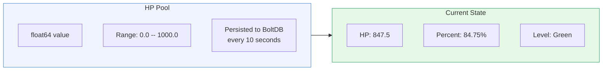
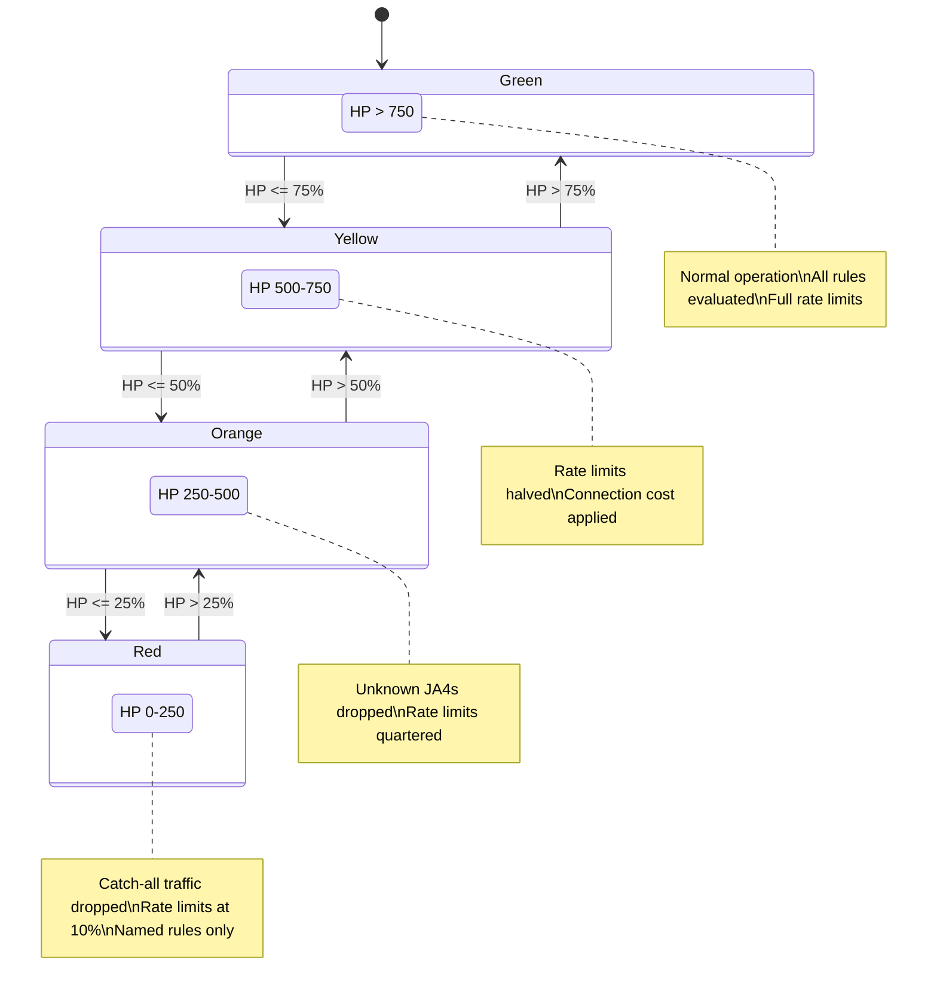
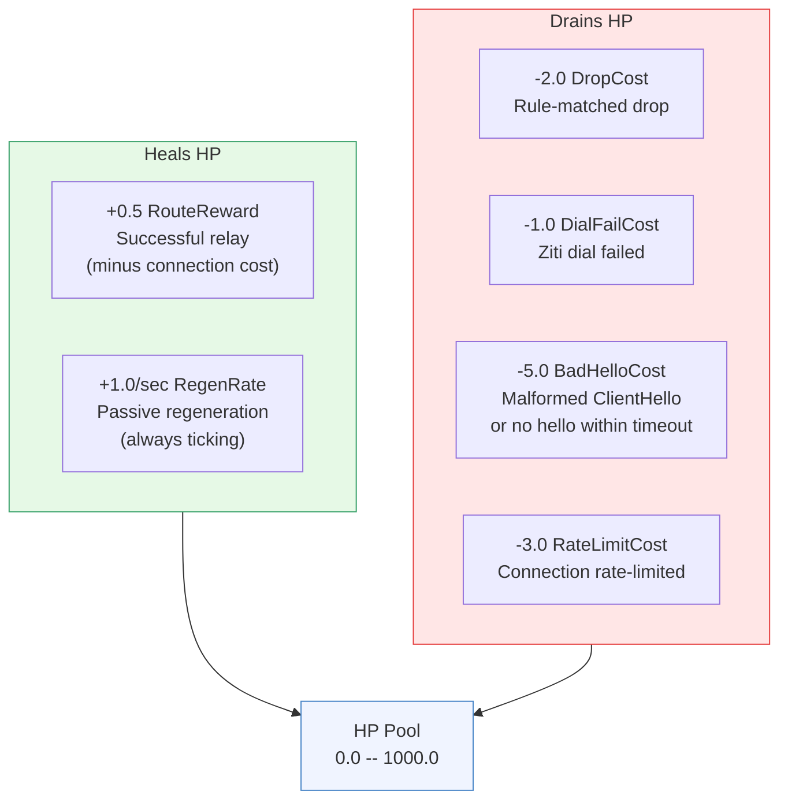
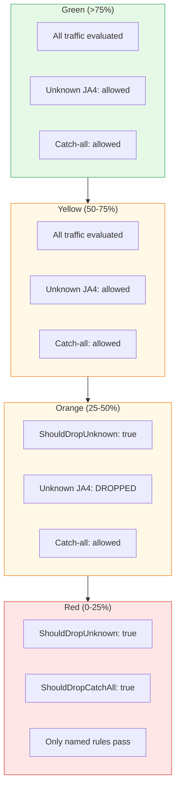
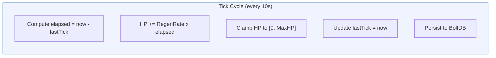
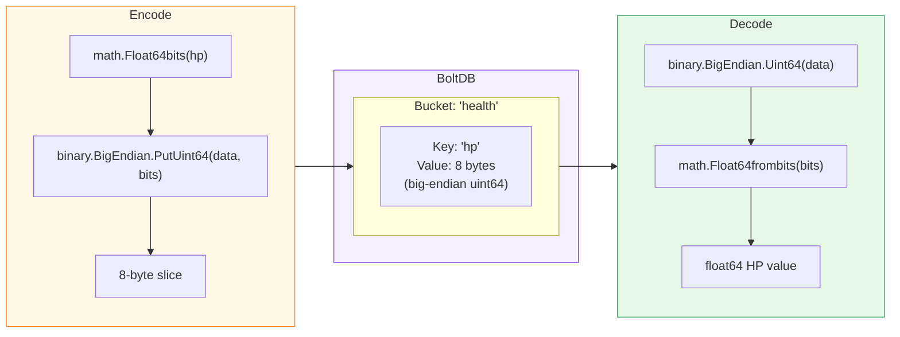
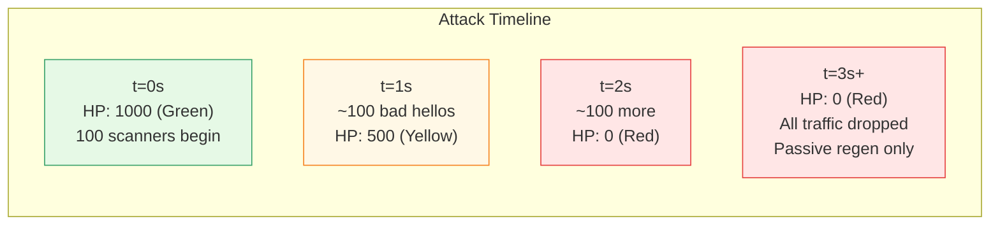
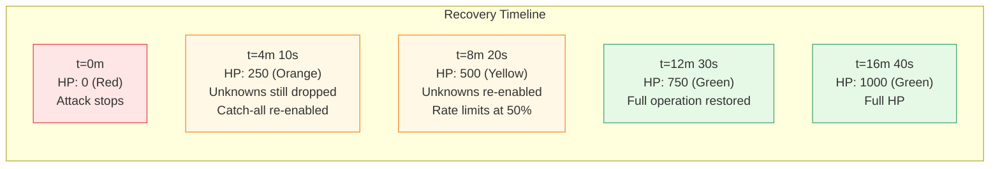
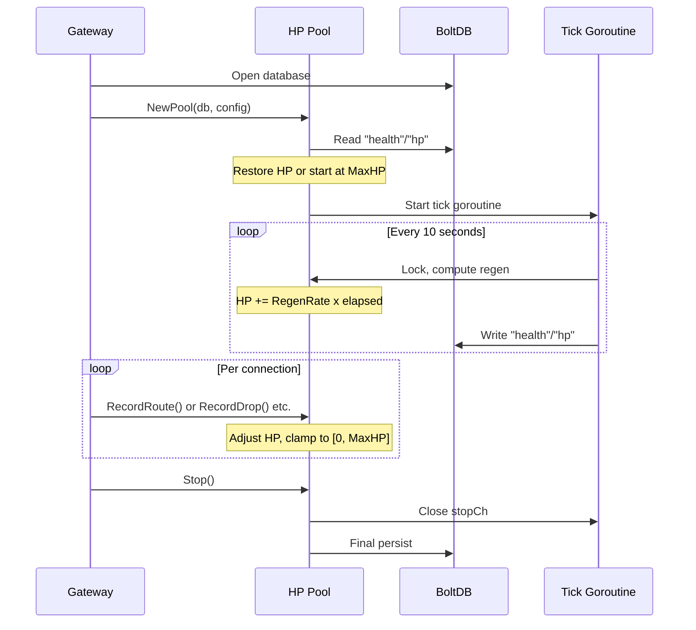

# The HP Algorithm -- Adaptive Defense in Detail

[<- Back to README](../../README.md) | [Architecture](../ARCHITECTURE.md) | [Design](../DESIGN.md)

---

HP (Health Points) is Schmutz's adaptive defense mechanism. Every edge node
maintains a floating-point HP pool that rises with legitimate traffic and
falls under attack. As HP drains, the node progressively tightens its
acceptance policy -- no operator intervention required.

This document covers the exact algorithm, the BoltDB persistence format,
all tuning parameters, and worked scenarios showing behavior under attack
and recovery.

---

## HP Pool: The Core Abstraction



The pool is protected by a `sync.RWMutex`. All modifications acquire
a write lock; reads (`HP()`, `Percent()`, `Level()`) acquire a read lock.
The pool starts at `MaxHP` (1000.0) on first run, or restores from BoltDB
on subsequent starts.

---

## The Four Levels

HP percentage maps to a defensive posture. Thresholds are fixed at 75%,
50%, and 25%.



| Level | HP Range | Percent | Connection Cost | Rate Limit Multiplier | Behavior |
|:------|:---------|:--------|:----------------|:----------------------|:---------|
| Green | 750-1000 | >75% | 0 | 1.0 (100%) | Normal operation. All configured rules apply as written |
| Yellow | 500-750 | 50-75% | 0.5 (FloodCost) | 0.5 (50%) | Rate limits halved. Each connection costs 0.5 HP on top of event costs |
| Orange | 250-500 | 25-50% | 1.5 (FloodCost x3) | 0.25 (25%) | Unknown JA4 fingerprints dropped. Connection cost triples |
| Red | 0-250 | 0-25% | 5.0 (FloodCost x10) | 0.1 (10%) | Catch-all rules drop. Only explicitly named SNI rules pass |

```go
func (p *Pool) Level() Level {
    pct := p.Percent()
    switch {
    case pct > 75:  return Green
    case pct > 50:  return Yellow
    case pct > 25:  return Orange
    default:        return Red
    }
}
```

---

## Events and Their Costs

Every connection generates exactly one HP event. The event type depends on
the outcome.



### Event Cost Table

| Event | Method | Cost | When |
|:------|:-------|:-----|:-----|
| Successful route | `RecordRoute()` | +0.5 (RouteReward) minus ConnectionCost | ClientHello parsed, rule matched, Ziti dial succeeded, relay started |
| Passive regen | tick() | +1.0/sec (RegenRate) | Every PersistSec (10s) tick, regardless of traffic |
| Rule-matched drop | `RecordDrop()` | -2.0 (DropCost) | JA4 or SNI matched a drop rule |
| Dial failure | `RecordDialFail()` | -1.0 (DialFailCost) | Ziti service unreachable |
| Bad ClientHello | `RecordBadHello()` | -5.0 (BadHelloCost) | Not TLS, timeout, truncated, or malformed |
| Rate limited | `RecordRateLimit()` | -3.0 (RateLimitCost) | Source IP exceeded per-rule rate limit |

### Connection Cost Multiplier

When the node is under stress (Yellow or worse), every connection -- even
legitimate ones -- carries an additional HP cost. This models the reality
that processing connections during an attack consumes resources.

```go
func (p *Pool) ConnectionCost() float64 {
    switch p.Level() {
    case Green:  return 0           // Free
    case Yellow: return 0.5         // FloodCost
    case Orange: return 0.5 * 3     // FloodCost x 3
    case Red:    return 0.5 * 10    // FloodCost x 10
    default:     return 0
    }
}
```

### Net HP per Successful Route at Each Level

| Level | RouteReward | ConnectionCost | Net HP Change |
|:------|:------------|:---------------|:--------------|
| Green | +0.5 | 0.0 | **+0.5** |
| Yellow | +0.5 | 0.5 | **0.0** (break even) |
| Orange | +0.5 | 1.5 | **-1.0** (net drain) |
| Red | +0.5 | 5.0 | **-4.5** (heavy drain) |

At Yellow, even legitimate traffic breaks even -- only passive regen heals
the node. At Orange and Red, every connection (including legitimate ones)
drains HP further. This is intentional: the node prioritizes survival over
service.

---

## Drop Policies

Two boolean methods control what gets shed as HP drops.



```go
// Activates at Orange (>= 2) — unknown fingerprints are dropped
func (p *Pool) ShouldDropUnknown() bool {
    return p.Level() >= Orange
}

// Activates at Red (>= 3) — catch-all wildcard rules stop routing
func (p *Pool) ShouldDropCatchAll() bool {
    return p.Level() >= Red
}
```

In the gateway loop, catch-all shedding is applied directly:

```go
if result.Rule == "catch-all" && hp.ShouldDropCatchAll() {
    result.Action = "drop"
    result.Rule = "hp-red-catchall-shed"
}
```

---

## Passive Regeneration

A background goroutine ticks every `PersistSec` (default 10) seconds. On
each tick, it computes the actual elapsed time and applies the regen rate.



```go
func (p *Pool) tick() {
    ticker := time.NewTicker(
        time.Duration(p.cfg.PersistSec) * time.Second,
    )
    defer ticker.Stop()

    for {
        select {
        case <-p.stopCh:
            return
        case now := <-ticker.C:
            p.mu.Lock()
            elapsed := now.Sub(p.lastTick).Seconds()
            p.hp = clamp(
                p.hp + (p.cfg.RegenRate * elapsed),
                0,
                p.cfg.MaxHP,
            )
            p.lastTick = now
            p.mu.Unlock()
            p.persist()
        }
    }
}
```

At the default rate of 1.0 HP/sec with a 10-second tick:
- Each tick adds ~10.0 HP (varies slightly due to ticker jitter)
- Full recovery from 0 to 1000 takes ~1000 seconds (~16.7 minutes)
- From Red to Green threshold (0 to 750) takes ~750 seconds (~12.5 minutes)

---

## BoltDB Persistence Format

HP is stored as a single 8-byte value in a BoltDB bucket.



```go
// Persist: float64 → uint64 bits → big-endian bytes
func (p *Pool) persist() {
    p.mu.RLock()
    hp := p.hp
    p.mu.RUnlock()

    p.db.Update(func(tx *bolt.Tx) error {
        b := tx.Bucket(bucketHealth)
        data := make([]byte, 8)
        binary.BigEndian.PutUint64(data, math.Float64bits(hp))
        return b.Put([]byte("hp"), data)
    })
}

// Restore: big-endian bytes → uint64 bits → float64
if data := b.Get([]byte("hp")); data != nil && len(data) == 8 {
    bits := binary.BigEndian.Uint64(data)
    restored := math.Float64frombits(bits)
    if restored > 0 && restored <= cfg.MaxHP {
        p.hp = restored
    }
}
```

Using `math.Float64bits` / `math.Float64frombits` preserves the exact
IEEE 754 representation. No precision loss from serialization.

---

## Configuration

All HP parameters are configurable via the YAML config file. The `Config`
struct with default values:

```go
type Config struct {
    MaxHP         float64  // 1000.0  — pool ceiling
    RegenRate     float64  // 1.0     — HP/sec passive recovery
    RouteReward   float64  // 0.5     — HP gained per successful route
    DropCost      float64  // 2.0     — HP lost per rule-matched drop
    DialFailCost  float64  // 1.0     — HP lost per failed Ziti dial
    BadHelloCost  float64  // 5.0     — HP lost per malformed ClientHello
    RateLimitCost float64  // 3.0     — HP lost per rate-limited connection
    FloodCost     float64  // 0.5     — base connection cost (multiplied by level)
    PersistSec    int      // 10      — BoltDB write interval
}
```

```yaml
health:
  max_hp: 1000
  regen_rate: 1.0
  route_reward: 0.5
  drop_cost: 2.0
  dial_fail_cost: 1.0
  bad_hello_cost: 5.0
  rate_limit_cost: 3.0
  flood_cost: 0.5
  persist_sec: 10
```

---

## Scenario 1: Attack -- 100 Scanners Hit the Node

Setup: node starts at full HP (1000). 100 scanners start probing
simultaneously. Each scanner sends a raw TCP connection without a valid
TLS ClientHello (e.g., HTTP probe, banner grab, or random bytes). Each
triggers `RecordBadHello()` at -5.0 HP.



### Detailed HP Drain

| Time | Event | HP Delta | HP After | Level |
|:-----|:------|:---------|:---------|:------|
| 0.0s | Start | -- | 1000.0 | Green |
| 0.0-0.5s | 50 bad hellos | -250.0 | 750.0 | Yellow (threshold) |
| 0.5-1.0s | 50 bad hellos | -250.0 | 500.0 | Orange (threshold) |
| 1.0-1.5s | 50 bad hellos | -250.0 | 250.0 | Red (threshold) |
| 1.5-2.0s | 50 bad hellos | -250.0 | 0.0 | Red (floor) |
| 2.0s+ | Scanners still hitting | 0.0 (clamped) | 0.0 | Red |

At Red:
- `ShouldDropUnknown()` returns `true` -- unknown JA4 fingerprints are dropped
- `ShouldDropCatchAll()` returns `true` -- wildcard SNI rules stop routing
- Rate limits are at 10% of configured values
- Connection cost is 5.0 HP per connection (but nothing passes anyway)

The node is a wall. Scanners get TCP RST. No service names leak, no
certificates are exposed, no error messages are returned.

### What About Legitimate Traffic During the Attack?

If a legitimate Chrome browser connects during Red:
1. Its ClientHello parses successfully (no BadHelloCost)
2. Its JA4 is unknown to the node (ShouldDropUnknown = true) -- **DROPPED**
3. Even if the JA4 were known, catch-all rules are disabled
4. Only traffic matching a specific named SNI rule with a known JA4 would pass

This is harsh. The node sacrifices availability for survival. The DNS
round-robin will route most new clients to healthier nodes.

---

## Scenario 2: Recovery After Attack Stops

The 100 scanners stop. The node sits at HP 0 with passive regen ticking.



### Regen Math

At 1.0 HP/sec with no traffic:

| HP Target | Time from 0 | Level |
|:----------|:------------|:------|
| 250 (Red -> Orange) | 4m 10s | Orange: catch-all re-enabled |
| 500 (Orange -> Yellow) | 8m 20s | Yellow: unknown JA4s re-enabled |
| 750 (Yellow -> Green) | 12m 30s | Green: full operation |
| 1000 (full) | 16m 40s | Green: topped off |

If legitimate traffic arrives during recovery, successful routes add +0.5
HP each (at Green). This accelerates recovery. But at Orange, each
successful route still costs -1.0 net (RouteReward 0.5 minus ConnectionCost
1.5), so legitimate traffic during Orange actually slows recovery slightly.

---

## Rate Limit Integration

Rate limits are configured per rule (e.g., `rate: "100/m"`) but the
effective limit is scaled by `RateLimitMultiplier()`:

```go
effectiveMax := int(float64(result.RateMax) * hp.RateLimitMultiplier())
if effectiveMax < 1 {
    effectiveMax = 1
}
```

For a rule with `rate: "100/m"`:

| Level | Multiplier | Effective Limit |
|:------|:-----------|:----------------|
| Green | 1.0 | 100/min |
| Yellow | 0.5 | 50/min |
| Orange | 0.25 | 25/min |
| Red | 0.1 | 10/min |

The minimum effective limit is always 1 (never zero), ensuring that at
least one connection per window can pass even at Red.

---

## Lifecycle



On shutdown (`Stop()`), the pool closes the ticker goroutine and writes
the final HP value to BoltDB. On restart, `NewPool()` reads it back. HP
is preserved across restarts with at most `PersistSec` seconds of drift.

---

## Design Rationale

**Why a single float64?**
The HP pool is intentionally simple. One number captures the node's overall
health. No histograms, no percentiles, no sliding windows. The simplicity
makes the algorithm predictable and debuggable.

**Why does legitimate traffic drain HP at Orange/Red?**
Because the node cannot distinguish "legitimate traffic during an attack"
from "attack traffic that looks legitimate." At Orange and Red, the node
prioritizes its own survival. The DNS round-robin ensures clients can reach
healthier nodes.

**Why passive regen instead of active?**
Active recovery (heal when traffic pattern improves) is harder to reason
about and easier to game. Passive regen is a clock: stop the attack, and
the node heals at a fixed, predictable rate. No attacker behavior can
prevent recovery -- they can only slow it by continuing to attack.

**Why not share HP across nodes?**
Each node's HP reflects its own experience. A targeted attack on one node
doesn't affect others. Sharing HP would create a distributed state problem
and a new attack vector (drain one node to affect all).
