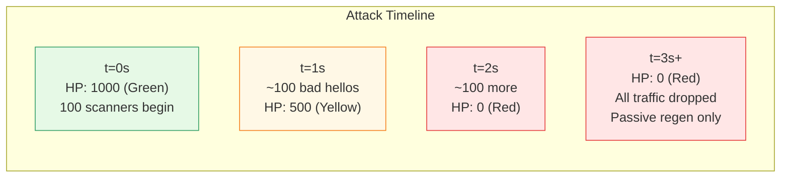
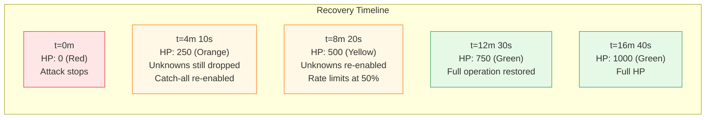

# HP Attack Scenarios

[← Advanced Reference](../README.md)

---

This page walks through concrete attack and recovery scenarios with exact
HP math, showing how the adaptive defense responds in real time.

---

## Scenario 1: 100 Scanners Hit the Node

Setup: node starts at full HP (1000). 100 scanners start probing
simultaneously. Each scanner sends a raw TCP connection without a valid
TLS ClientHello (e.g., HTTP probe, banner grab, or random bytes). Each
triggers `RecordBadHello()` at -5.0 HP.

### Detailed HP Drain

| Time | Event | HP Delta | HP After | Level |
|:-----|:------|:---------|:---------|:------|
| 0.0s | Start | -- | 1000.0 | Green |
| 0.0-0.5s | 50 bad hellos | -250.0 | 750.0 | Yellow (threshold) |
| 0.5-1.0s | 50 bad hellos | -250.0 | 500.0 | Orange (threshold) |
| 1.0-1.5s | 50 bad hellos | -250.0 | 250.0 | Red (threshold) |
| 1.5-2.0s | 50 bad hellos | -250.0 | 0.0 | Red (floor) |
| 2.0s+ | Scanners still hitting | 0.0 (clamped) | 0.0 | Red |

At Red:

- `ShouldDropUnknown()` returns `true` -- unknown JA4 fingerprints are dropped
- `ShouldDropCatchAll()` returns `true` -- wildcard SNI rules stop routing
- Rate limits are at 10% of configured values
- Connection cost is 5.0 HP per connection (but nothing passes anyway)

The node is a wall. Scanners get TCP RST. No service names leak, no
certificates are exposed, no error messages are returned.

---

## Legitimate Traffic During the Attack

If a legitimate Chrome browser connects during Red:

1. Its ClientHello parses successfully (no BadHelloCost)
2. Its JA4 is unknown to the node (ShouldDropUnknown = true) -- **DROPPED**
3. Even if the JA4 were known, catch-all rules are disabled
4. Only traffic matching a specific named SNI rule with a known JA4 would pass

This is harsh. The node sacrifices availability for survival. The DNS
round-robin will route most new clients to healthier nodes.

---

## Scenario 2: Recovery After Attack Stops

The 100 scanners stop. The node sits at HP 0 with passive regen ticking.

### Recovery Math

At 1.0 HP/sec with no traffic:

| HP Target | Time from 0 | Level Transition |
|:----------|:------------|:-----------------|
| 250 (Red -> Orange) | 4m 10s | Catch-all re-enabled |
| 500 (Orange -> Yellow) | 8m 20s | Unknown JA4s re-enabled |
| 750 (Yellow -> Green) | 12m 30s | Full operation |
| 1000 (full) | 16m 40s | Topped off |

### Traffic During Recovery

If legitimate traffic arrives during recovery, successful routes add +0.5
HP each (at Green). This accelerates recovery. But at Orange, each
successful route still costs -1.0 net (RouteReward 0.5 minus ConnectionCost
1.5), so legitimate traffic during Orange actually slows recovery slightly.

---

## Scenario 3: Sustained Low-Level Probing

A slower attack: 10 scanners sending 1 bad hello per second each (10
BadHello/sec = -50 HP/sec). With passive regen at +1.0 HP/sec, the net
drain is -49 HP/sec.

| Time | HP | Level | Notes |
|:-----|:---|:------|:------|
| 0s | 1000 | Green | Attack starts |
| ~5s | 750 | Yellow | Transition |
| ~10s | 500 | Orange | Unknown JA4s dropped |
| ~15s | 250 | Red | Catch-all dropped |
| ~20s | 0 | Red | Floor reached |

Even a modest 10-scanner probe drains a node to zero in about 20 seconds.
The BadHelloCost of -5.0 is deliberately heavy -- invalid TLS handshakes
are the strongest signal of malicious intent.

---

## Scenario 4: Mixed Traffic (Attack + Legitimate)

Node at Green (HP 1000). 20 scanners (-5.0 each = -100 HP/sec) plus 50
legitimate routes per second (+0.5 each = +25 HP/sec) plus passive regen
(+1.0 HP/sec).

Net drain: -100 + 25 + 1 = **-74 HP/sec**

| Time | HP | Level |
|:-----|:---|:------|
| 0s | 1000 | Green |
| ~3.4s | 750 | Yellow |
| ~6.8s | 500 | Orange (legitimate routes now drain -1.0 net each) |

At Orange, legitimate traffic shifts from +0.5 to -1.0 net per route,
accelerating the drain. The node reaches Red faster than the pure-attack
scenario might suggest -- this is by design. Under mixed attack, the
safest posture is to drop aggressively and let DNS route clients to
healthy nodes.
