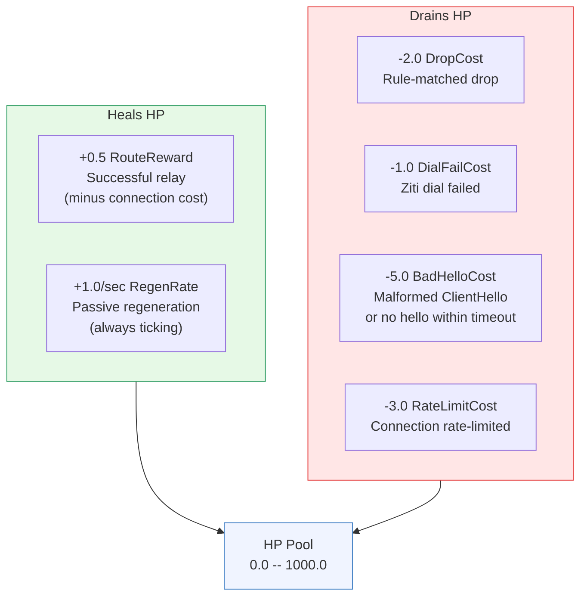
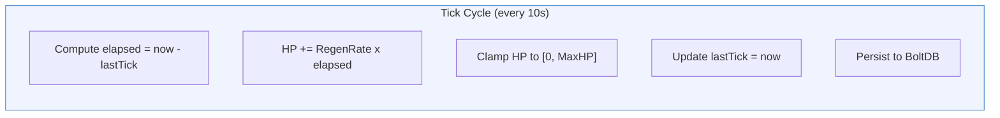
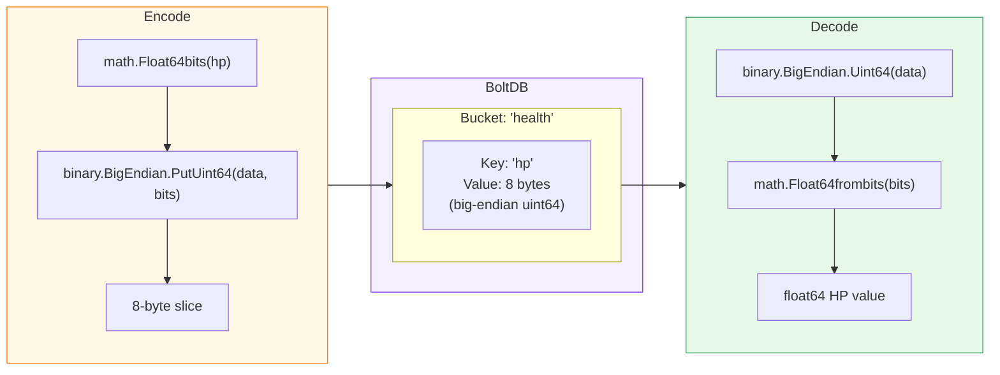

# HP Drain and Healing

[← Advanced Reference](../README.md)

---

Every connection generates exactly one HP event. Events either heal the
pool (successful routes, passive regen) or drain it (drops, failures,
bad handshakes).

---

## Event Costs



### Event Cost Table

| Event | Method | Cost | When |
|:------|:-------|:-----|:-----|
| Successful route | `RecordRoute()` | +0.5 (RouteReward) minus ConnectionCost | ClientHello parsed, rule matched, Ziti dial succeeded, relay started |
| Passive regen | tick() | +1.0/sec (RegenRate) | Every PersistSec (10s) tick, regardless of traffic |
| Rule-matched drop | `RecordDrop()` | -2.0 (DropCost) | JA4 or SNI matched a drop rule |
| Dial failure | `RecordDialFail()` | -1.0 (DialFailCost) | Ziti service unreachable |
| Bad ClientHello | `RecordBadHello()` | -5.0 (BadHelloCost) | Not TLS, timeout, truncated, or malformed |
| Rate limited | `RecordRateLimit()` | -3.0 (RateLimitCost) | Source IP exceeded per-rule rate limit |

---

## Connection Cost Multiplier

When the node is under stress (Yellow or worse), every connection -- even
legitimate ones -- carries an additional HP cost. This models the reality
that processing connections during an attack consumes resources.

```go
func (p *Pool) ConnectionCost() float64 {
    switch p.Level() {
    case Green:  return 0           // Free
    case Yellow: return 0.5         // FloodCost
    case Orange: return 0.5 * 3     // FloodCost x 3
    case Red:    return 0.5 * 10    // FloodCost x 10
    default:     return 0
    }
}
```

| Level | Connection Cost | Notes |
|:------|:----------------|:------|
| Green | 0.0 | Free |
| Yellow | 0.5 | FloodCost base |
| Orange | 1.5 | FloodCost x 3 |
| Red | 5.0 | FloodCost x 10 |

---

## Net HP per Successful Route

The connection cost is subtracted from the RouteReward:

| Level | RouteReward | ConnectionCost | Net HP Change |
|:------|:------------|:---------------|:--------------|
| Green | +0.5 | 0.0 | **+0.5** |
| Yellow | +0.5 | 0.5 | **0.0** (break even) |
| Orange | +0.5 | 1.5 | **-1.0** (net drain) |
| Red | +0.5 | 5.0 | **-4.5** (heavy drain) |

At Yellow, even legitimate traffic breaks even -- only passive regen heals
the node. At Orange and Red, every connection (including legitimate ones)
drains HP further. This is intentional: the node prioritizes survival over
service.

---

## Rate Limit Multiplier

Rate limits are configured per rule but the effective limit is scaled by
the HP level:

```go
effectiveMax := int(float64(result.RateMax) * hp.RateLimitMultiplier())
if effectiveMax < 1 {
    effectiveMax = 1
}
```

For a rule with `rate: "100/m"`:

| Level | Multiplier | Effective Limit |
|:------|:-----------|:----------------|
| Green | 1.0 | 100/min |
| Yellow | 0.5 | 50/min |
| Orange | 0.25 | 25/min |
| Red | 0.1 | 10/min |

The minimum effective limit is always 1 (never zero), ensuring that at
least one connection per window can pass even at Red.

---

## Passive Regeneration

A background goroutine ticks every `PersistSec` (default 10) seconds. On
each tick, it computes the actual elapsed time and applies the regen rate.



Each tick: lock the mutex, compute `HP += RegenRate * elapsed`, clamp to
`[0, MaxHP]`, unlock, persist to BoltDB.

At the default rate of 1.0 HP/sec with a 10-second tick:

- Each tick adds ~10.0 HP (varies slightly due to ticker jitter)
- Full recovery from 0 to 1000 takes ~1000 seconds (~16.7 minutes)
- From Red to Green threshold (0 to 750) takes ~750 seconds (~12.5 minutes)

---

## BoltDB Persistence

HP is stored as a single 8-byte value in a BoltDB bucket.



Using `math.Float64bits` / `math.Float64frombits` preserves the exact
IEEE 754 representation. No precision loss from serialization.

---

## Design Rationale

**Why does legitimate traffic drain HP at Orange/Red?** Because the node
cannot distinguish "legitimate traffic during an attack" from "attack
traffic that looks legitimate." At Orange and Red, the node prioritizes
its own survival. The DNS round-robin ensures clients can reach healthier
nodes.

**Why passive regen instead of active?** Active recovery is harder to
reason about and easier to game. Passive regen is a clock: stop the
attack, and the node heals at a fixed, predictable rate.
