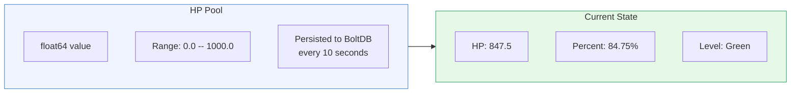
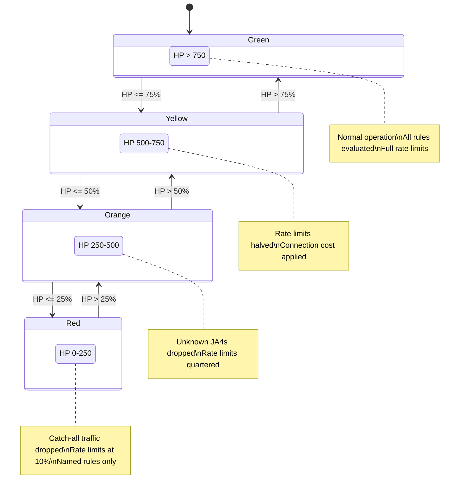
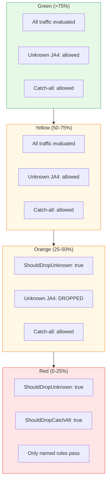

# HP Algorithm Overview

[← Advanced Reference](../README.md)

---

HP (Health Points) is Schmutz's adaptive defense mechanism. Every edge node
maintains a floating-point HP pool that rises with legitimate traffic and
falls under attack. As HP drains, the node progressively tightens its
acceptance policy -- no operator intervention required.

---

## HP Pool: The Core Abstraction



The pool is protected by a `sync.RWMutex`. All modifications acquire
a write lock; reads (`HP()`, `Percent()`, `Level()`) acquire a read lock.
The pool starts at `MaxHP` (1000.0) on first run, or restores from BoltDB
on subsequent starts.

---

## The Four Levels

HP percentage maps to a defensive posture. Thresholds are fixed at 75%,
50%, and 25%.



| Level | HP Range | Percent | Behavior |
|:------|:---------|:--------|:---------|
| Green | 750-1000 | >75% | Normal operation. All configured rules apply as written |
| Yellow | 500-750 | 50-75% | Rate limits halved. Each connection costs 0.5 HP on top of event costs |
| Orange | 250-500 | 25-50% | Unknown JA4 fingerprints dropped. Connection cost triples |
| Red | 0-250 | 0-25% | Catch-all rules drop. Only explicitly named SNI rules pass |

```go
func (p *Pool) Level() Level {
    pct := p.Percent()
    switch {
    case pct > 75:  return Green
    case pct > 50:  return Yellow
    case pct > 25:  return Orange
    default:        return Red
    }
}
```

---

## ShouldDropUnknown and ShouldDropCatchAll

Two boolean methods control what gets shed as HP drops.



```go
// Activates at Orange (>= 2) — unknown fingerprints are dropped
func (p *Pool) ShouldDropUnknown() bool {
    return p.Level() >= Orange
}

// Activates at Red (>= 3) — catch-all wildcard rules stop routing
func (p *Pool) ShouldDropCatchAll() bool {
    return p.Level() >= Red
}
```

In the gateway loop, catch-all shedding is applied directly:

```go
if result.Rule == "catch-all" && hp.ShouldDropCatchAll() {
    result.Action = "drop"
    result.Rule = "hp-red-catchall-shed"
}
```

---

## Design Rationale

**Why a single float64?** The HP pool is intentionally simple. One number
captures the node's overall health. No histograms, no percentiles, no
sliding windows. The simplicity makes the algorithm predictable and
debuggable.

**Why not share HP across nodes?** Each node's HP reflects its own
experience. A targeted attack on one node does not affect others. Sharing
HP would create a distributed state problem and a new attack vector (drain
one node to affect all).
