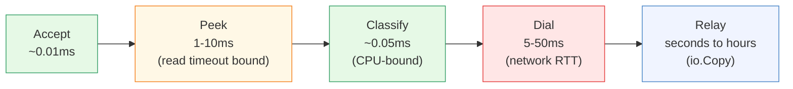
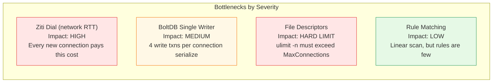
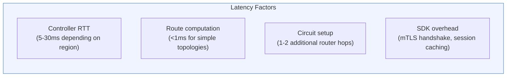
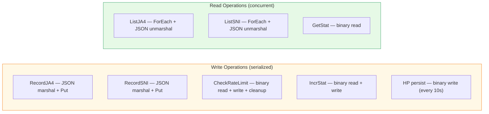
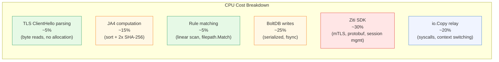

# Bottleneck Analysis

[← Advanced Reference](../README.md)

---

Every connection passes through five stages. Each has a distinct cost
profile. This page identifies the bottlenecks and their mitigations.

---

## Connection Lifecycle Timing

```mermaid
gantt
    title Connection Lifecycle Timing (typical)
    dateFormat X
    axisFormat %L ms

    section Overhead
    TCP Accept           :a, 0, 1
    Read ClientHello     :b, 1, 5
    Parse + JA4          :c, 5, 6
    Rule Match           :d, 6, 7
    BoltDB Writes (4x)   :e, 7, 10
    Ziti Dial            :f, 10, 30

    section Relay
    Bidirectional Copy   :g, 30, 200
```





---

## Bottlenecks by Severity



---

## Ziti Dial Latency

The dominant latency source. The Ziti SDK must contact the controller,
compute a route, and establish a circuit.



| Scenario | Typical Dial Latency |
|:---------|:--------------------|
| Controller on same host | 1-5 ms |
| Controller in same region | 5-15 ms |
| Controller cross-region | 15-50 ms |
| Controller under heavy load | 50-200 ms |
| Session already cached | 1-3 ms |

**Mitigations**:

- Deploy Ziti controllers close to edge nodes (same region)
- The Ziti SDK caches sessions; repeated dials to the same service are faster
- Consider multiple smaller services instead of one catch-all (better session reuse)

---

## BoltDB Single-Writer Lock

BoltDB allows only one write transaction at a time. All other write
transactions queue. Read transactions run concurrently.

**Per-connection write cost**: each connection triggers up to 4 write
transactions (JA4, SNI, rate limit, stat). At high connection rates
(>10,000 new connections/second), these serialize and become a bottleneck.



**Mitigations**:

- Batch writes (future optimization -- combine JA4 + SNI + stat into one tx)
- Reduce writes: stats could use in-memory counters with periodic flush
- Rate limit records are the most write-heavy; consider in-memory rate limiter

---

## File Descriptor Limits

Each active connection consumes 2 file descriptors (client socket + Ziti
circuit). Plus BoltDB holds the database file open. Ensure:

```bash
# Check current limit
ulimit -n

# Set for the schmutz process (e.g., in systemd unit)
LimitNOFILE=65535
```

`MaxConnections` should be set to at most `(ulimit_n - 100) / 2` to leave
headroom for BoltDB, Ziti SDK, and logging.

---

## CPU Profile

Where CPU time is spent per connection, in approximate order:



**JA4 computation**: sort cipher suites `O(n log n)` (n ~ 15-20), sort
extensions (same), two SHA-256 hashes of ~100 byte inputs. Total: ~2-5
microseconds.

**Rule matching**: linear scan `O(R)` where R is the number of rules.
`filepath.Match` allocates internally for glob patterns. `net.ParseCIDR`
allocates per call. For 20 rules: ~1-3 microseconds.

---

## Relay Throughput

Once the circuit is established, `io.Copy` with 32 KB buffers moves bytes
in a tight syscall loop. Throughput is bounded by Ziti circuit bandwidth
(100 Mbps - 1 Gbps) and kernel TCP buffers, not by Schmutz. CPU cost of
relay is near zero -- Schmutz does not inspect or modify the TLS stream.
