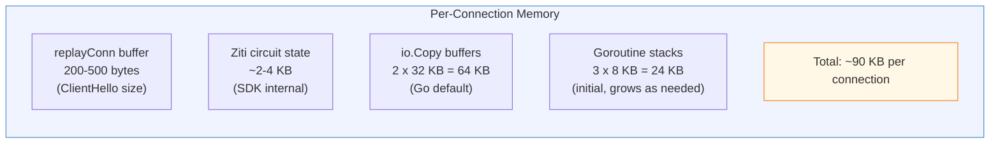
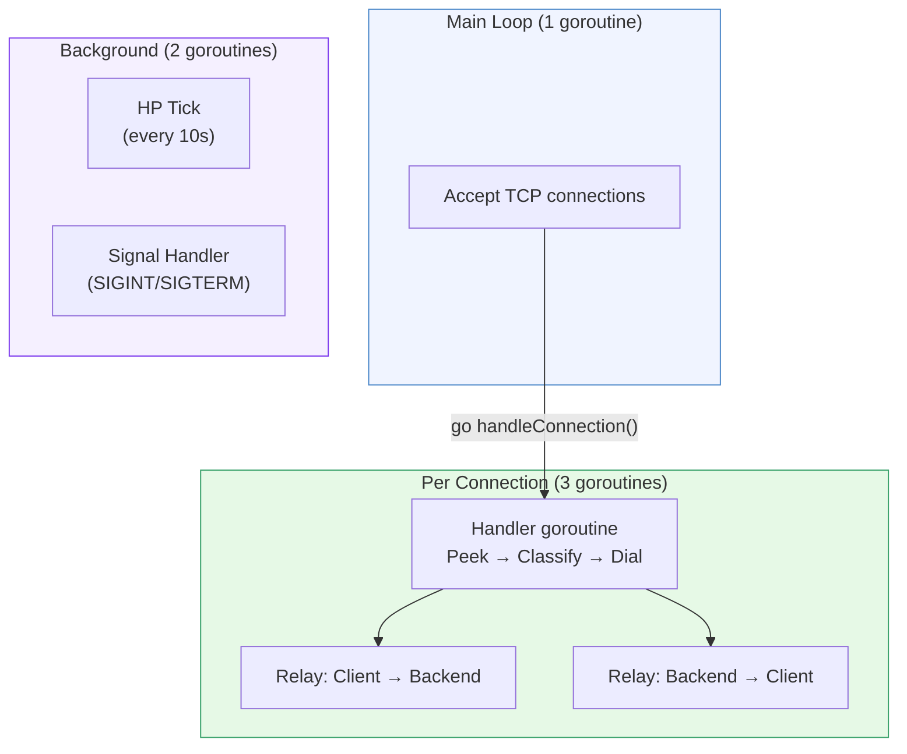
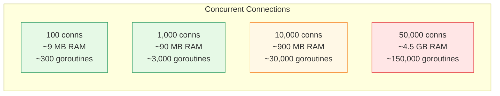
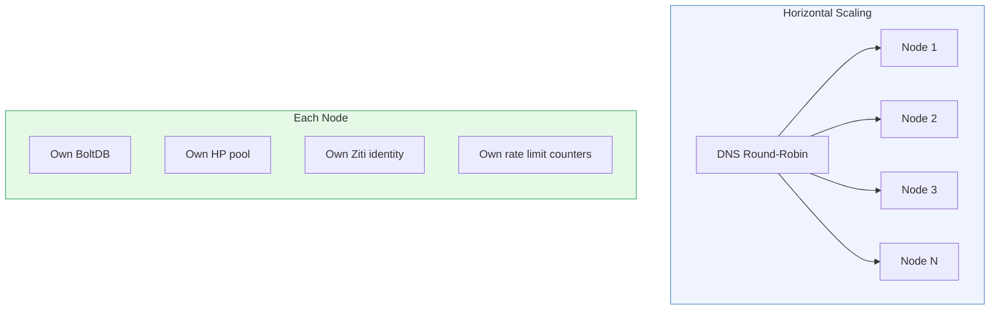

# Memory Budget

[← Advanced Reference](../README.md)

---

Schmutz is designed for low overhead per connection. This page covers the
memory cost of each component and scaling math for capacity planning.

---

## Per-Connection Memory

| Component | Size | Notes |
|:----------|:-----|:------|
| replayConn buffer | 200-500 bytes | Stores the raw ClientHello for replay to the Ziti circuit. Freed when the buffer is fully read |
| Ziti circuit state | ~2-4 KB | SDK-internal session, circuit ID, crypto state |
| io.Copy buffers | 2 x 32 KB | One per direction. Go's `io.Copy` allocates a 32 KB buffer internally |
| Goroutine stacks | 3 x 8 KB | Initial stack size. Grows on demand (up to 1 GB default max) |
| **Total** | **~90 KB** | Per active connection, steady state |

---

## Goroutine Model

**Per active connection**: 3 goroutines

1. **Handler**: accepts the connection, peeks the ClientHello, classifies,
   dials Ziti, then blocks on `wg.Wait()` until both relay goroutines finish
2. **Relay in** (`io.Copy(backend, client)`): copies bytes from client to
   Ziti circuit
3. **Relay out** (`io.Copy(client, backend)`): copies bytes from Ziti
   circuit back to client

**Background**: 2 goroutines total (not per connection)

- HP tick: fires every `PersistSec` seconds, applies passive regen, persists HP
- Signal handler: waits for SIGINT/SIGTERM

**Total goroutines** = 2 (background) + 1 (accept loop) + 3N (connections)

---

## Scaling Math

At 10,000 concurrent connections (the default `MaxConnections`), this is
~900 MB of memory. The actual resident set will be lower because idle
connections with no data flowing have minimal stack usage.

At 10,000 connections: ~30,003 goroutines. Go's scheduler handles this
comfortably.

---

## Horizontal Scaling

**Nodes share nothing**. Adding capacity is: spin up a VM, install Schmutz,
add the IP to DNS. No cluster coordination. No state migration. No leader
election.

**Trade-off**: per-source rate limits are per-node. A client hitting 3 nodes
gets 3x the effective rate limit. This is acceptable because DNS round-robin
distributes reasonably evenly, rate limits are a safety net (not a precise
throttle), and the HP system provides a second line of defense.
