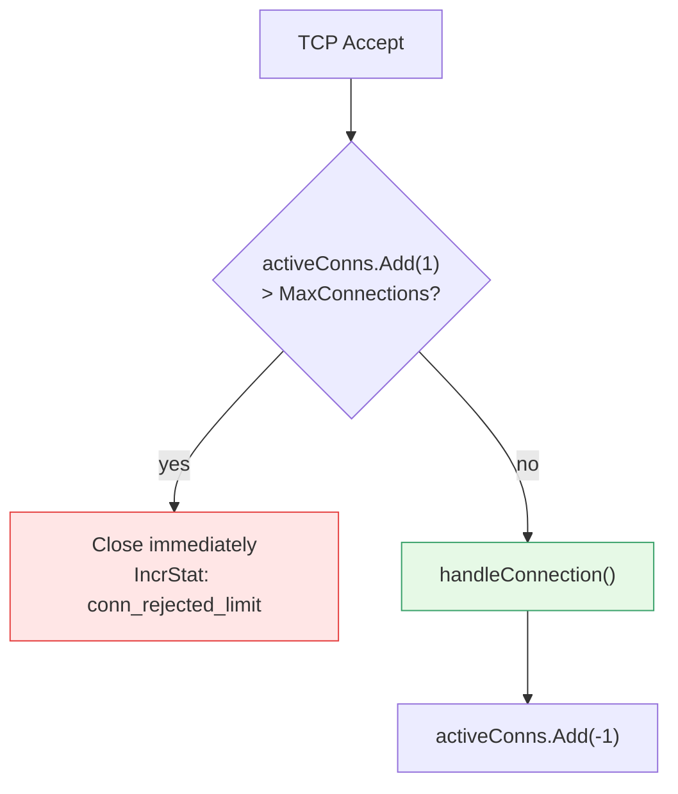
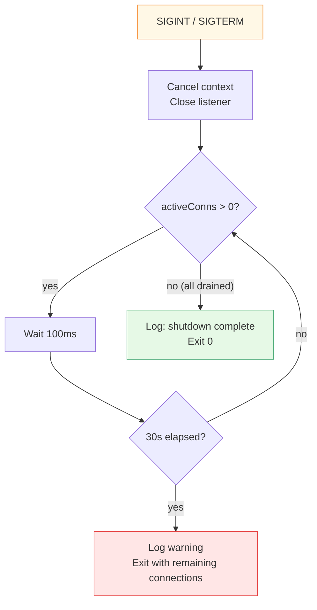

# Tuning Recommendations

[← Advanced Reference](../README.md)

---

Guidelines for configuring Schmutz based on your traffic profile, resource
constraints, and threat model.

---

## MaxConnections vs. ulimit

| ulimit -n | Recommended MaxConnections | Headroom |
|:----------|:---------------------------|:---------|
| 1,024 | 400 | Conservative default |
| 65,535 | 30,000 | Plenty of headroom |
| 1,048,576 | 500,000 | Extreme; test memory first |



Uses an `atomic.Int64` counter. No lock contention. The check is:

```go
current := activeConns.Add(1)
if int(current) > cfg.Limits.MaxConnections {
    activeConns.Add(-1)
    conn.Close()
    // ...
}
```

This is a hard ceiling. Connections over the limit are closed before any
data is read.

---

## ReadTimeout vs. Slow Clients

| ReadTimeout | Trade-off |
|:------------|:----------|
| 1s | Aggressive. May drop legitimate clients on high-latency links |
| 5s | Good balance for most deployments |
| 10s (default) | Conservative. Holds resources for slow/stalled connections |
| 30s | Very permissive. Scanners can hold sockets open cheaply |

Under attack, the HP system naturally tightens behavior. A shorter
`ReadTimeout` frees resources faster but may also shed legitimate traffic.

---

## HP Thresholds for Different Traffic Patterns

The default HP config works well for moderate traffic (100-1,000 connections
per minute). Tuning guidelines:

| Traffic Pattern | Adjustment |
|:----------------|:-----------|
| Low traffic (<10 conn/min) | Reduce `MaxHP` to 500 so HP changes are more visible |
| High traffic (>10,000 conn/min) | Increase `RouteReward` to offset volume-driven HP drain |
| Scanner-heavy | Increase `DropCost` and `BadHelloCost` to drain HP faster on attacks |
| Sensitive services | Decrease thresholds so the node enters Orange/Red sooner |

---

## Storage Management

### BoltDB Path

Place the database on fast storage (SSD or tmpfs). BoltDB's fsync-on-write
means disk latency directly impacts write transaction time:

| Storage | Approx. Write Latency |
|:--------|:---------------------|
| tmpfs (RAM) | ~0.01 ms |
| NVMe SSD | ~0.1 ms |
| SATA SSD | ~0.5 ms |
| HDD | ~5-10 ms |

Using tmpfs means state is lost on reboot, but for an edge node that
rebuilds state from live traffic in minutes, this is often acceptable.

### HP Tick

The HP system's background goroutine fires every `PersistSec` seconds
(default 10):

1. Lock the HP mutex
2. Compute elapsed time since last tick
3. Add `regenRate * elapsed` to HP (clamped to `[0, maxHP]`)
4. Unlock
5. Write HP to BoltDB (one write transaction)

**Cost**: one BoltDB write every 10 seconds, regardless of traffic. This
is negligible compared to per-connection writes.

**Passive regeneration**: at the default rate of 1.0 HP/second, a node at
0 HP recovers to full (1000 HP) in ~17 minutes with zero traffic.

---

## Shutdown Drain



- Listener is closed immediately (no new connections accepted)
- Existing connections are allowed to finish naturally
- Polls `activeConns` every 100ms
- Hard deadline: 30 seconds
- After deadline, the process exits with a warning log

---

## Summary: What Costs What

| Operation | Time | Memory | Disk I/O | Goroutines |
|:----------|:-----|:-------|:---------|:-----------|
| TCP accept | ~0.01 ms | ~0 | 0 | 0 |
| ClientHello peek | 1-10 ms | 200-500 B | 0 | 0 |
| JA4 + classify | ~0.05 ms | ~1 KB (temp) | 0 | 0 |
| BoltDB writes (4x) | ~0.5-2 ms | ~0 | 4 txns | 0 |
| Ziti dial | 5-50 ms | 2-4 KB | 0 | 0 |
| Relay (active) | indefinite | 64 KB | 0 | +2 |
| Relay (idle) | indefinite | ~0 | 0 | +2 (blocked) |
| HP tick | N/A | ~0 | 1 txn/10s | 1 (background) |
