# Performance Characteristics

[← Back to README](../../README.md) | [Architecture](../ARCHITECTURE.md) | [Design](../DESIGN.md)

---

Schmutz is designed for low overhead per connection and high concurrency.
This document covers the cost of every stage, where the bottlenecks are,
and how to tune for your traffic profile.

---

## Connection Lifecycle

Every connection passes through five stages. Each has a distinct cost profile.

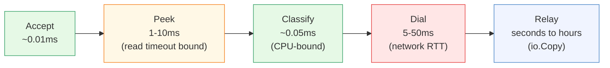

```mermaid
gantt
    title Connection Lifecycle Timing (typical)
    dateFormat X
    axisFormat %L ms

    section Overhead
    TCP Accept           :a, 0, 1
    Read ClientHello     :b, 1, 5
    Parse + JA4          :c, 5, 6
    Rule Match           :d, 6, 7
    BoltDB Writes (4x)   :e, 7, 10
    Ziti Dial            :f, 10, 30

    section Relay
    Bidirectional Copy   :g, 30, 200
```

### Stage Breakdown

**Accept** (~0.01ms): Kernel delivers the socket. Atomic counter increment
to check `MaxConnections`. If over limit, the connection is closed
immediately and `conn_rejected_limit` is incremented.

**Peek** (1-10ms, bounded by `ReadTimeout`): Read the TLS record header
(5 bytes) and payload. The `ReadTimeout` (default 10s) is set as a
deadline on the socket. Legitimate clients send the ClientHello within
1-5ms of connecting. Scanners often delay or send garbage.

**Classify** (~0.05ms): Parse ClientHello fields (byte reads, no allocation
on the hot path), compute JA4 fingerprint (sort + 2x SHA-256 truncated to
12 hex chars), walk rules (linear scan with short-circuit). The JA4
computation is the most CPU-intensive part of classification, but SHA-256
of small inputs (~100 bytes of comma-separated hex values) is fast.

**Dial** (5-50ms): The Ziti SDK contacts the controller, which computes the
optimal route through the router mesh and establishes a circuit. Latency
depends on the RTT to the nearest Ziti controller and the number of hops
in the route. This is the most variable stage.

**Relay** (seconds to hours): `io.Copy` with Go's default 32 KB buffer.
Duration depends entirely on the application protocol. An HTTP request might
take 100ms. A WebSocket or long-lived streaming connection can last hours.

---

## Memory Per Connection

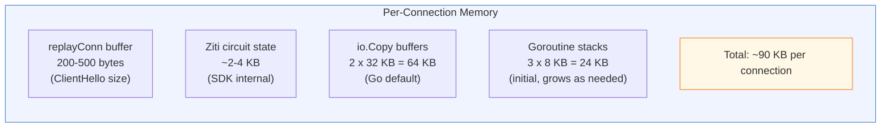

| Component | Size | Notes |
|:----------|:-----|:------|
| replayConn buffer | 200-500 bytes | Stores the raw ClientHello for replay to the Ziti circuit. Freed when the buffer is fully read |
| Ziti circuit state | ~2-4 KB | SDK-internal session, circuit ID, crypto state |
| io.Copy buffers | 2 x 32 KB | One per direction. Go's `io.Copy` allocates a 32 KB buffer internally |
| Goroutine stacks | 3 x 8 KB | Initial stack size. Grows on demand (up to 1 GB default max) |
| **Total** | **~90 KB** | Per active connection, steady state |

At 10,000 concurrent connections (the default `MaxConnections`), this is
~900 MB of memory. The actual resident set will be lower because idle
connections with no data flowing have minimal stack usage.

---

## Goroutine Model

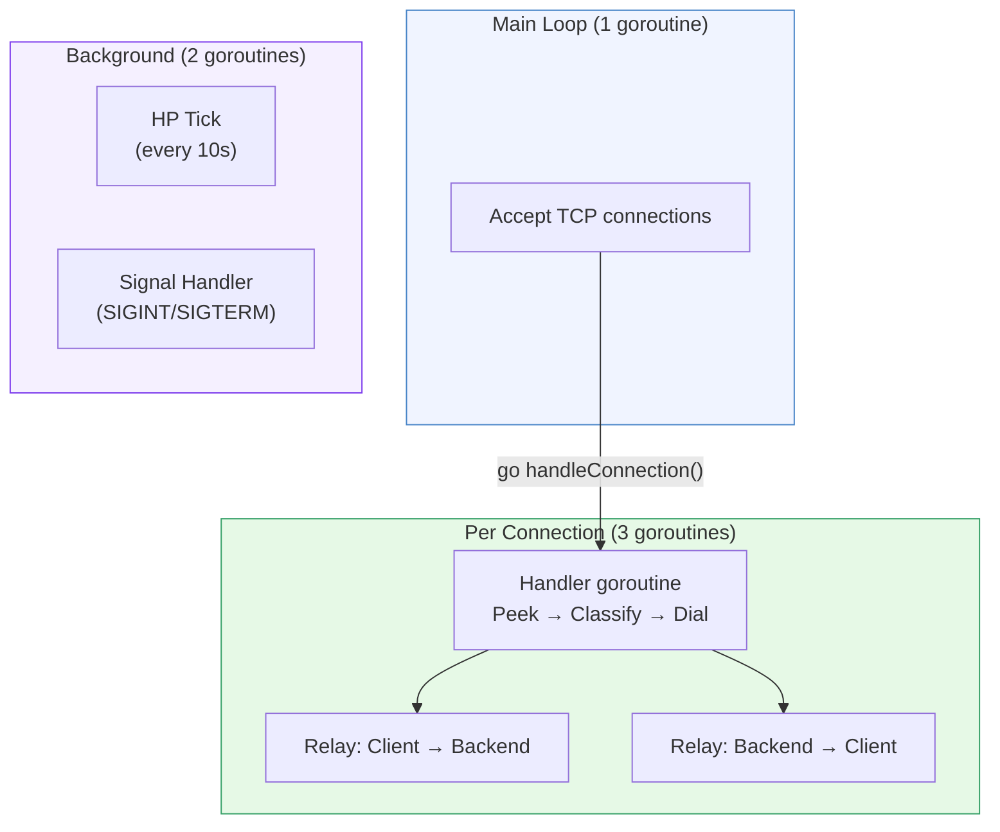

**Per active connection**: 3 goroutines

1. **Handler**: accepts the connection, peeks the ClientHello, classifies,
   dials Ziti, then blocks on `wg.Wait()` until both relay goroutines finish
2. **Relay in** (`io.Copy(backend, client)`): copies bytes from client to
   Ziti circuit
3. **Relay out** (`io.Copy(client, backend)`): copies bytes from Ziti
   circuit back to client

**Background**: 2 goroutines total (not per connection)

- HP tick: fires every `PersistSec` seconds, applies passive regen, persists HP
- Signal handler: waits for SIGINT/SIGTERM

**Total goroutines** = 2 (background) + 1 (accept loop) + 3N (connections)

At 10,000 connections: ~30,003 goroutines. Go's scheduler handles this
comfortably.

---

## Connection Limits

### MaxConnections

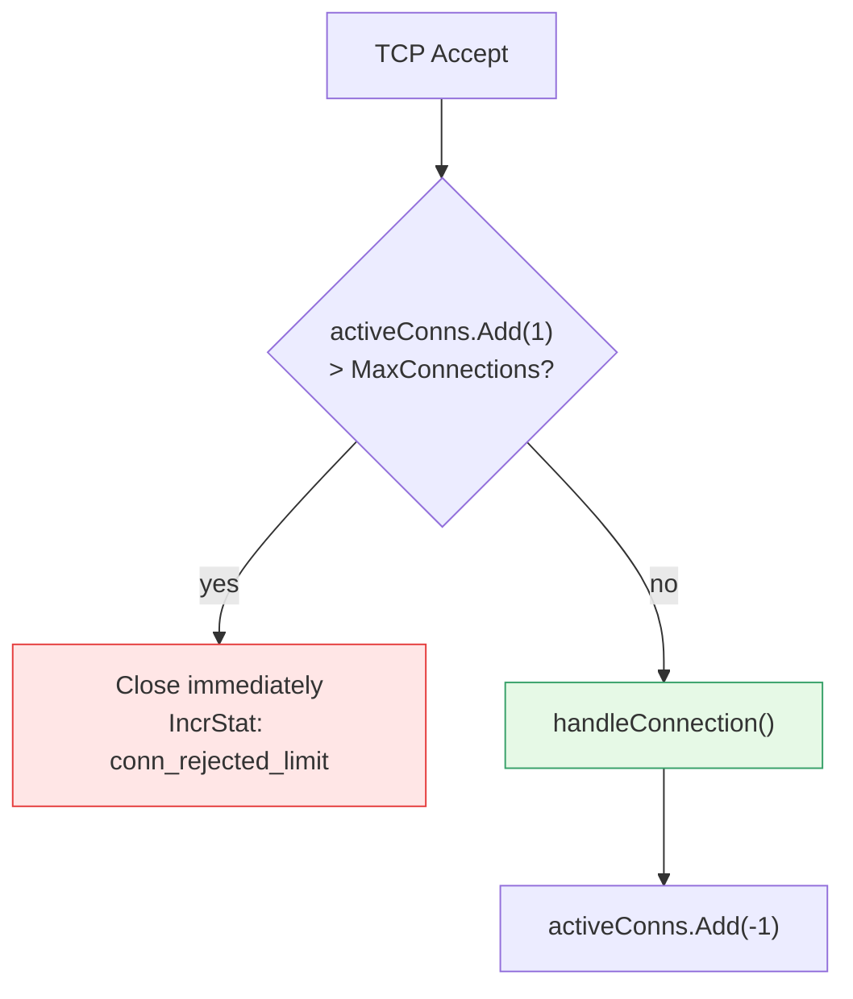

Uses an `atomic.Int64` counter. No lock contention. The check is:

```go
current := activeConns.Add(1)
if int(current) > cfg.Limits.MaxConnections {
    activeConns.Add(-1)
    conn.Close()
    // ...
}
```

This is a hard ceiling. Connections over the limit are closed before any
data is read. The stat `conn_rejected_limit` tracks how often this fires.

### PerSourceMax

Per-source rate limiting is checked **after** classification, not at accept
time. It uses BoltDB's `CheckRateLimit` function, which means:

- One disk I/O (BoltDB write transaction) per rate-limited connection
- Serialized through BoltDB's single-writer lock
- Only applies to rules that have a `rate` field

The effective rate limit is adjusted by HP level (see
[Rule Engine](rule-engine.md#hp-adjusted-rate-limits)).

---

## BoltDB Performance

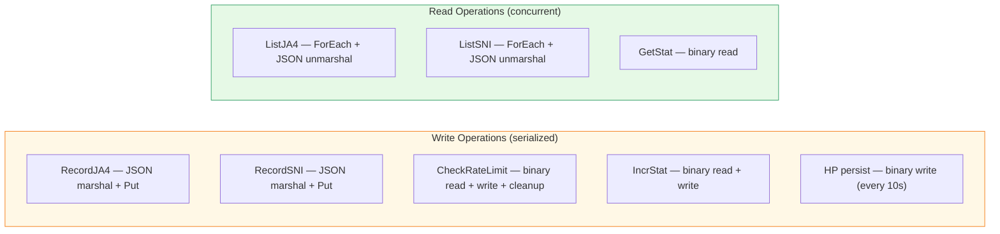

**Single-writer lock**: BoltDB allows only one write transaction at a time.
All other write transactions queue. Read transactions run concurrently with
each other and with the single active write.

**Per-connection write cost**: each connection triggers up to 4 write
transactions (JA4, SNI, rate limit, stat). At high connection rates, these
serialize and become a bottleneck.

**JSON vs. binary**: JA4 and SNI records use JSON marshaling (~1-2 us per
marshal). Stats and rate limit counters use raw binary encoding (~100 ns).
The JSON overhead is measurable but not dominant.

**Mitigation**: write batching is a possible future optimization. Currently,
each write is independent. Batching JA4 + SNI + stat into a single
transaction would reduce lock contention by ~3x.

---

## HP Tick

The HP system's background goroutine fires every `PersistSec` seconds
(default 10):

1. Lock the HP mutex
2. Compute elapsed time since last tick
3. Add `regenRate * elapsed` to HP (clamped to `[0, maxHP]`)
4. Unlock
5. Write HP to BoltDB (one write transaction)

**Cost**: one BoltDB write every 10 seconds, regardless of traffic. This is
negligible compared to per-connection writes.

**Passive regeneration**: at the default rate of 1.0 HP/second, a node at
0 HP recovers to full (1000 HP) in ~17 minutes with zero traffic.

---

## Ziti Dial Latency

The most variable cost in the pipeline. The Ziti SDK must:

1. Contact the controller (network RTT)
2. Controller looks up service bindings and computes route
3. Controller instructs routers to establish circuit
4. Circuit confirmation returns to the SDK

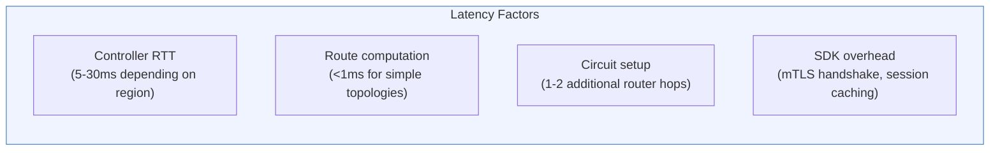

| Scenario | Typical Dial Latency |
|:---------|:--------------------|
| Controller on same host | 1-5 ms |
| Controller in same region | 5-15 ms |
| Controller cross-region | 15-50 ms |
| Controller under heavy load | 50-200 ms |
| Session already cached | 1-3 ms |

The Ziti SDK caches sessions internally. Repeated dials to the same service
from the same node reuse the cached session, reducing latency to just the
circuit setup time.

---

## Relay Throughput

Once the Ziti circuit is established, `io.Copy` moves bytes with Go's
default 32 KB buffer:

```go
go io.Copy(backend, client)   // client → Ziti
go io.Copy(client, backend)   // Ziti → client
```

**Throughput is limited by**:

1. **Ziti circuit bandwidth**: depends on the router mesh path, link quality,
   and congestion. Typical: 100 Mbps - 1 Gbps per circuit
2. **Kernel TCP buffers**: standard Linux defaults (128 KB - 4 MB)
3. **io.Copy buffer**: 32 KB per copy. Not the bottleneck --- data flows in
   a tight loop

**CPU cost of relay**: near zero. `io.Copy` is a `read`/`write` syscall loop.
Schmutz does not inspect, modify, or buffer the TLS stream.

---

## Shutdown Drain

When Schmutz receives SIGINT or SIGTERM:

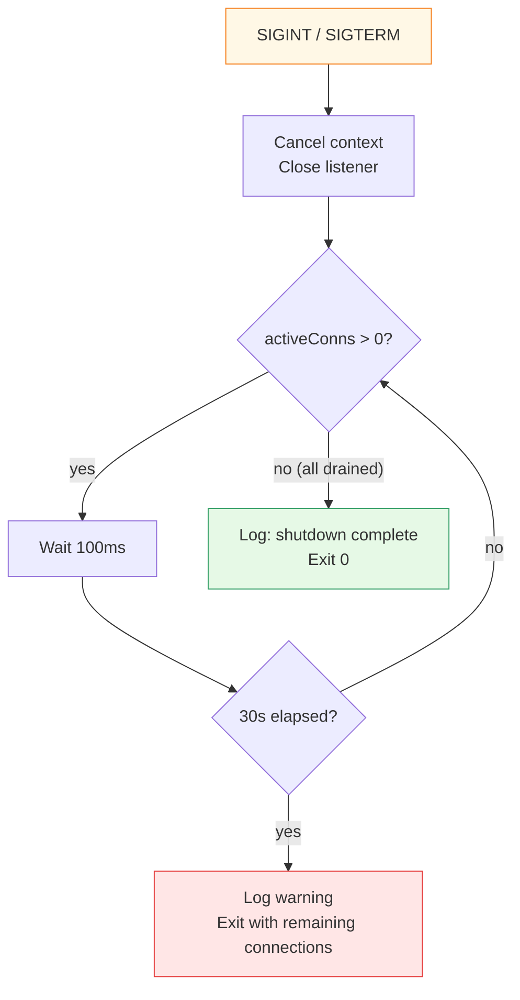

- Listener is closed immediately (no new connections accepted)
- Existing connections are allowed to finish naturally
- Polls `activeConns` every 100ms
- Hard deadline: 30 seconds
- After deadline, the process exits with a warning log

Long-lived connections (WebSocket, streaming) will be terminated at the
30-second mark. For graceful handling, upstream load balancers should drain
the node from DNS before sending the signal.

---

## CPU Profile

Where CPU time is spent per connection, in approximate order:

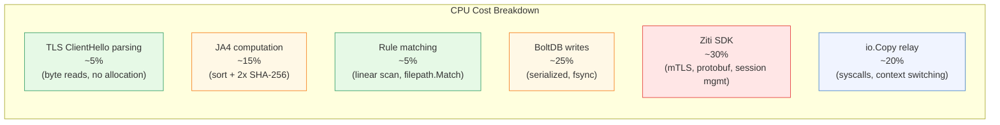

**JA4 computation details**:
- Sort cipher suites: `O(n log n)` where n is typically 15-20 values
- Sort extensions: same
- SHA-256 of sorted hex strings: two hashes of ~100 byte inputs
- Total: ~2-5 microseconds

**Rule matching**:
- Linear scan: `O(R)` where R is the number of rules
- `filepath.Match`: allocates internally, but only for glob patterns
- `net.ParseCIDR`: allocates per call per CIDR (could be cached)
- For 20 rules: ~1-3 microseconds

---

## Scaling

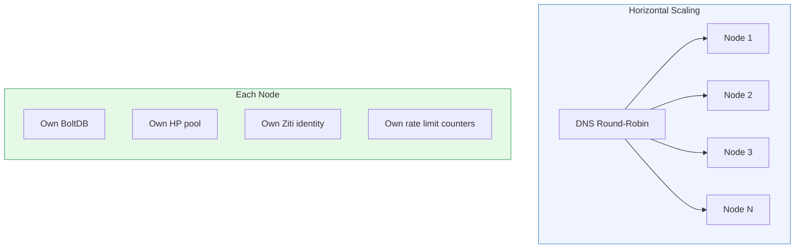

**Nodes share nothing**. Adding capacity is: spin up a VM, install Schmutz,
add the IP to DNS. No cluster coordination. No state migration. No leader
election.

**Trade-off**: per-source rate limits are per-node. A client hitting 3 nodes
gets 3x the effective rate limit. This is acceptable because:

1. DNS round-robin distributes reasonably evenly
2. The rate limits are a safety net, not a precise throttle
3. The HP system provides a second line of defense

### Resource Usage at Scale

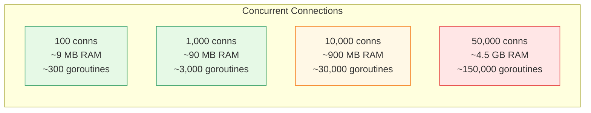

---

## Bottleneck Identification

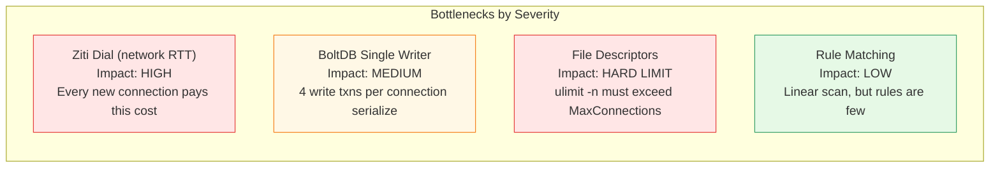

### Ziti Dial

The dominant latency source. Mitigations:

- Deploy Ziti controllers close to edge nodes (same region)
- The Ziti SDK caches sessions; repeated dials to the same service are faster
- Consider multiple smaller services instead of one catch-all (better session reuse)

### BoltDB Single Writer

At very high connection rates (>10,000 new connections/second), the 4 serial
write transactions per connection become a bottleneck. Mitigations:

- Batch writes (future optimization)
- Reduce writes: stats could use in-memory counters with periodic flush
- Rate limit records are the most write-heavy; consider in-memory rate limiter

### File Descriptors

Each active connection consumes 2 file descriptors (client socket + Ziti
circuit). Plus BoltDB holds the database file open. Ensure:

```bash
# Check current limit
ulimit -n

# Set for the schmutz process (e.g., in systemd unit)
LimitNOFILE=65535
```

`MaxConnections` should be set to at most `(ulimit_n - 100) / 2` to leave
headroom for BoltDB, Ziti SDK, and logging.

---

## Tuning Recommendations

### MaxConnections vs. ulimit

| ulimit -n | Recommended MaxConnections | Headroom |
|:----------|:---------------------------|:---------|
| 1,024 | 400 | Conservative default |
| 65,535 | 30,000 | Plenty of headroom |
| 1,048,576 | 500,000 | Extreme; test memory first |

### ReadTimeout vs. Slow Clients

| ReadTimeout | Trade-off |
|:------------|:----------|
| 1s | Aggressive. May drop legitimate clients on high-latency links |
| 5s | Good balance for most deployments |
| 10s (default) | Conservative. Holds resources for slow/stalled connections |
| 30s | Very permissive. Scanners can hold sockets open cheaply |

Under attack, the HP system naturally tightens behavior. A shorter
`ReadTimeout` frees resources faster but may also shed legitimate traffic.

### HP Thresholds

The default HP config works well for moderate traffic (100-1,000 connections
per minute). Tuning guidelines:

| Traffic Pattern | Adjustment |
|:----------------|:-----------|
| Low traffic (<10 conn/min) | Reduce `MaxHP` to 500 so HP changes are more visible |
| High traffic (>10,000 conn/min) | Increase `RouteReward` to offset volume-driven HP drain |
| Scanner-heavy | Increase `DropCost` and `BadHelloCost` to drain HP faster on attacks |
| Sensitive services | Decrease thresholds so the node enters Orange/Red sooner |

### BoltDB Path

Place the database on fast storage (SSD or tmpfs). BoltDB's fsync-on-write
means disk latency directly impacts write transaction time:

| Storage | Approx. Write Latency |
|:--------|:---------------------|
| tmpfs (RAM) | ~0.01 ms |
| NVMe SSD | ~0.1 ms |
| SATA SSD | ~0.5 ms |
| HDD | ~5-10 ms |

Using tmpfs means state is lost on reboot, but for an edge node that
rebuilds state from live traffic in minutes, this is often acceptable.

---

## Summary: What Costs What

| Operation | Time | Memory | Disk I/O | Goroutines |
|:----------|:-----|:-------|:---------|:-----------|
| TCP accept | ~0.01 ms | ~0 | 0 | 0 |
| ClientHello peek | 1-10 ms | 200-500 B | 0 | 0 |
| JA4 + classify | ~0.05 ms | ~1 KB (temp) | 0 | 0 |
| BoltDB writes (4x) | ~0.5-2 ms | ~0 | 4 txns | 0 |
| Ziti dial | 5-50 ms | 2-4 KB | 0 | 0 |
| Relay (active) | indefinite | 64 KB | 0 | +2 |
| Relay (idle) | indefinite | ~0 | 0 | +2 (blocked) |
| HP tick | N/A | ~0 | 1 txn/10s | 1 (background) |
