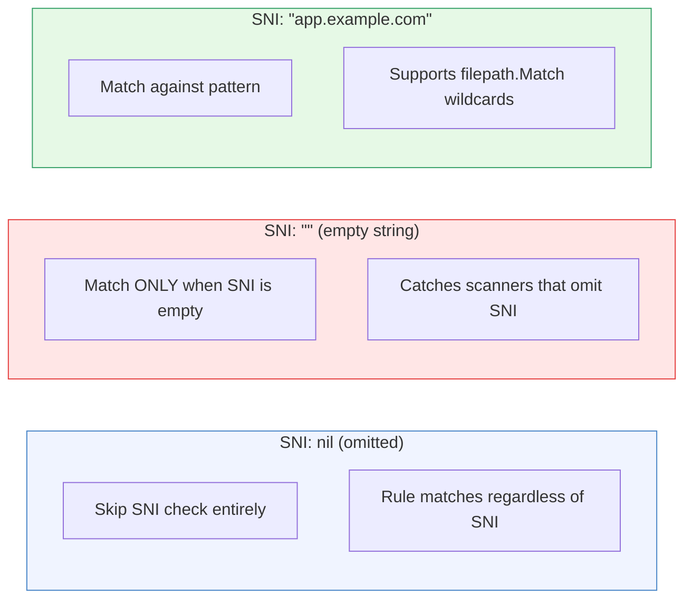
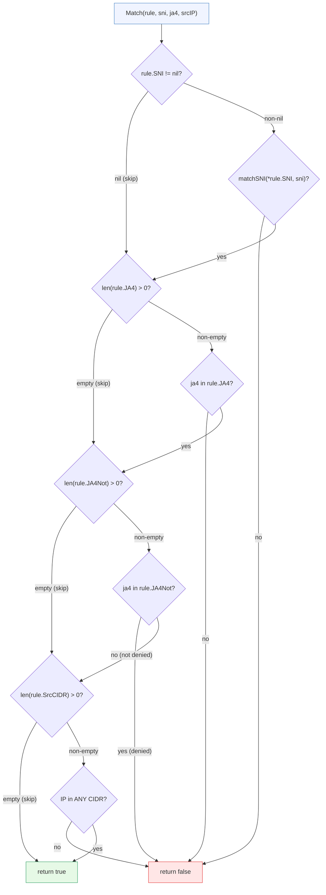
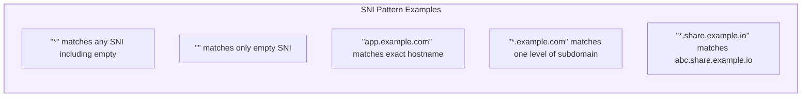
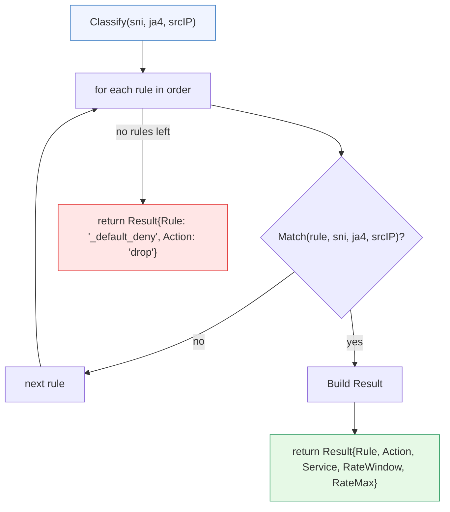
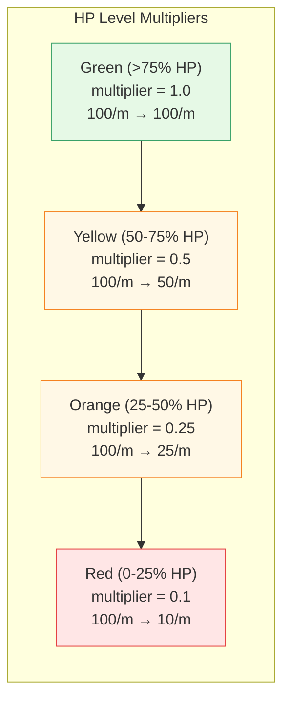
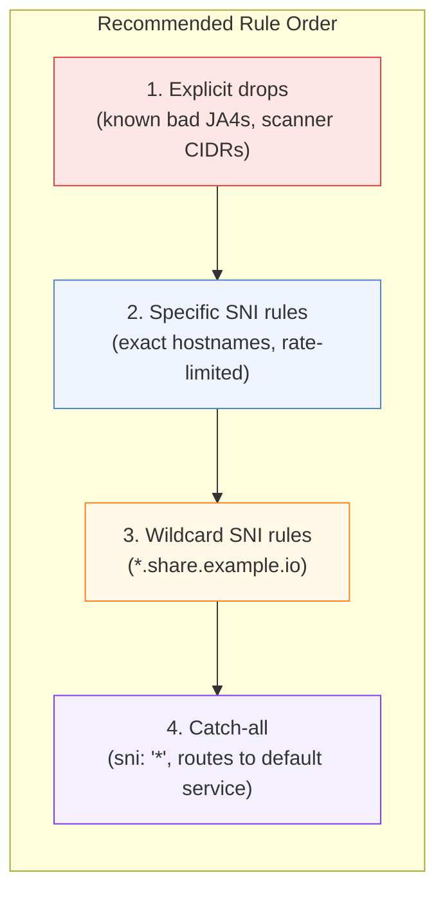

# The Rule Engine --- Classification Logic in Detail

[← Back to README](../../README.md) | [Architecture](../ARCHITECTURE.md) | [Design](../DESIGN.md)

---

Every connection that reaches Schmutz is evaluated by the rule engine exactly
once. The engine walks rules top-down, applies each condition as a
short-circuiting AND, and returns the first match. If nothing matches, the
connection is dropped.

This document covers every detail of how that evaluation works.

---

## The Rule Struct

```yaml
rules:
  - name: block-scanners          # Human-readable identifier (required)
    comment: "Drop known scanner fingerprints"  # Documentation (optional)
    sni: null                      # *string pointer (nil = skip this check)
    ja4:                           # Allowlist — JA4 must be IN this list
      - "t13d191000_9dc..."
    ja4_not:                       # Denylist — JA4 must NOT be in this list
      - "t13d301000_4bf..."
    src_cidr:                      # Source IP must match ANY of these CIDRs
      - "198.51.100.0/24"
    service: ""                    # Ziti service name (empty for drops)
    action: "drop"                 # "route" (default) or "drop"
    rate: "100/m"                  # "count/unit" — rate limit for this rule
```

Each field maps directly to a `config.Rule` struct field:

| Field | Go Type | YAML | Default | Semantics |
|:------|:--------|:-----|:--------|:----------|
| `Name` | `string` | `name` | required | Identifies the rule in logs and stats |
| `Comment` | `string` | `comment` | `""` | Human documentation, ignored by engine |
| `SNI` | `*string` | `sni` | `nil` | Pointer: `nil` = skip, `""` = match empty SNI, `"*"` = match any |
| `JA4` | `[]string` | `ja4` | `nil` | Allowlist: connection JA4 must appear in list |
| `JA4Not` | `[]string` | `ja4_not` | `nil` | Denylist: connection JA4 must NOT appear in list |
| `SrcCIDR` | `[]string` | `src_cidr` | `nil` | IP must match at least one CIDR |
| `Service` | `string` | `service` | `""` | Ziti service to dial (empty for drops) |
| `Action` | `string` | `action` | `"route"` | What to do on match |
| `Rate` | `string` | `rate` | `""` | Rate limit in `count/unit` format |

### The SNI Pointer Trick

The `SNI` field is a `*string`, not a `string`. This gives three distinct states:



In YAML, `sni: null` or omitting the field entirely produces a nil pointer.
`sni: ""` produces a pointer to an empty string.

---

## The Match Function

Every rule is evaluated by `Match()`, which applies conditions as a
short-circuiting AND. Each condition that is present must pass. Conditions
that are absent (nil slice, nil pointer) are skipped.



Key properties:

- **Short-circuit**: the first failing condition ends evaluation immediately
- **AND logic**: all present conditions must pass
- **Absent = pass**: a nil/empty condition is not checked, it does not block
- **Order**: SNI first, then JA4 allow, then JA4 deny, then CIDR

---

## SNI Matching

The `matchSNI` function handles three cases:

```go
func matchSNI(pattern, sni string) bool {
    if pattern == "*"  { return true }        // Wildcard: match everything
    if pattern == ""   { return sni == "" }   // Empty: match only empty SNI
    ok, _ := filepath.Match(pattern, sni)     // Glob pattern
    return ok
}
```



`filepath.Match` uses Go's standard glob semantics:

| Pattern | Matches | Does NOT match |
|:--------|:--------|:---------------|
| `"*"` | everything | (nothing excluded) |
| `""` | `""` (empty SNI only) | `"app.example.com"` |
| `"app.example.com"` | `"app.example.com"` | `"other.example.com"` |
| `"*.example.com"` | `"app.example.com"` | `"a.b.example.com"` (two levels) |
| `"*.share.example.io"` | `"x.share.example.io"` | `"share.example.io"` (no subdomain) |

Note: `filepath.Match` does **not** match path separators (`.` is not special,
but `*` does not cross them in file paths). In DNS hostnames, `*` matches any
characters including dots within a single glob segment. In practice,
`*.example.com` matches `foo.example.com` but not `foo.bar.example.com`.

---

## CIDR Matching

Source IP is checked against a list of CIDRs. The connection matches if the
IP falls within **any** CIDR in the list (OR logic within the CIDR list):

```go
func matchCIDR(cidrs []string, ip net.IP) bool {
    for _, cidr := range cidrs {
        _, network, err := net.ParseCIDR(cidr)
        if err != nil { continue }     // Skip malformed CIDRs
        if network.Contains(ip) { return true }
    }
    return false
}
```

Malformed CIDR strings are silently skipped (logged at debug level). This is
intentional --- a typo in one CIDR should not break the entire rule.

---

## JA4 List Containment

Both `JA4` (allowlist) and `JA4Not` (denylist) use simple string equality:

```go
func contains(list []string, s string) bool {
    for _, item := range list {
        if item == s { return true }
    }
    return false
}
```

No wildcards. No prefix matching. No regex. The JA4 fingerprint is a
deterministic hash --- you either know the exact value or you don't.

The allowlist and denylist serve different purposes:

| Field | Semantics | Use case |
|:------|:----------|:---------|
| `JA4` (allowlist) | JA4 **must** be in this list | "Only allow Chrome and Firefox" |
| `JA4Not` (denylist) | JA4 must **not** be in this list | "Block zgrab2 and masscan" |

Both can be used in the same rule (allowlist is checked first).

---

## The Classify Function

`Classify()` is the entry point. It walks rules in order and returns the
first match:



The `Result` struct carries everything the gateway needs to act:

```go
type Result struct {
    Rule       string   // Name of the matched rule
    Action     string   // "route" or "drop"
    Service    string   // Ziti service name (empty if dropped)
    RateWindow int      // Rate limit window in seconds (0 = no limit)
    RateMax    int      // Max connections per window (0 = no limit)
}
```

If no rule explicitly sets `Action`, it defaults to `"route"` when a `Service`
is configured.

---

## Rate String Parsing

The `Rate` field uses a compact `count/unit` format:

```go
func parseRate(rate string) (windowSec, maxCount int) {
    // rate = "100/m" → windowSec=60, maxCount=100
    fmt.Sscanf(rate, "%d/%s", &count, &unit)
    switch unit {
    case "s": return 1, count      // per second
    case "m": return 60, count     // per minute
    case "h": return 3600, count   // per hour
    }
}
```

| Rate string | Window (seconds) | Max connections |
|:------------|:-----------------|:----------------|
| `"10/s"` | 1 | 10 |
| `"100/m"` | 60 | 100 |
| `"1000/h"` | 3600 | 1000 |
| `""` (empty) | 0 | 0 (no limit) |
| `"bad"` | 0 | 0 (no limit, parse fails silently) |

### HP-Adjusted Rate Limits

The raw `RateMax` from the rule is not used directly. The gateway multiplies
it by the HP system's `RateLimitMultiplier()`:

```
effectiveMax = RateMax * hp.RateLimitMultiplier()
if effectiveMax < 1 { effectiveMax = 1 }
```



The minimum effective rate is always 1 --- even at Red HP, each source IP
gets at least 1 connection per window.

---

## Rule Ordering Strategy

Rules are evaluated top-down, first match wins. Order matters.



**Why drops first**: if a connection matches a drop rule, you want to bail
immediately. Putting drops after route rules means a scanner targeting a
valid SNI would be routed instead of dropped.

**Why specific before wildcard**: a rule for `app.example.com` with a tight
rate limit should take precedence over `*.example.com` with a loose one.

**Why catch-all last**: the `*` wildcard matches everything. It's your safety
net. Anything that didn't match a more specific rule lands here.

---

## Complete Example

Here is a realistic ruleset and five connections walked through it.

### The Ruleset

```yaml
rules:
  # 1. Drop known scanners by JA4
  - name: block-scanners
    comment: "zgrab2 and masscan fingerprints"
    ja4_not:
      - "t13d191000_9dc949e3a4_e7c285222f"
      - "t13d301000_4bf3ab6530_000000000000"
    action: drop

  # 2. Drop empty SNI (probing)
  - name: block-empty-sni
    sni: ""
    action: drop

  # 3. Auth service — tight rate limit, specific SNI
  - name: auth
    sni: "auth.example.com"
    service: auth-provider
    rate: "20/m"

  # 4. Share subdomains — wildcard SNI
  - name: shares
    sni: "*.share.example.io"
    service: share-frontend
    rate: "100/m"

  # 5. Catch-all — everything else
  - name: catch-all
    sni: "*"
    service: default-ingress
    rate: "200/m"
```

> Note: rule 1 uses `ja4_not` (denylist). The rule has no `sni` (nil = skip
> SNI check) and no `ja4` allowlist. It matches any connection whose JA4 is
> NOT in the denylist. Wait --- that's backwards. Let's re-read: `ja4_not`
> means "if JA4 IS in this list, the rule does NOT match." So rule 1 matches
> connections whose JA4 is NOT one of these scanner fingerprints. That means
> legitimate traffic would match rule 1 and be dropped. That's wrong.
>
> **Correct approach**: to drop scanners, use `ja4` as the allowlist of bad
> fingerprints and `action: drop`:

```yaml
rules:
  # 1. Drop known scanners by JA4 fingerprint
  - name: block-scanners
    comment: "zgrab2 and masscan fingerprints"
    ja4:
      - "t13d191000_9dc949e3a4_e7c285222f"
      - "t13d301000_4bf3ab6530_000000000000"
    action: drop

  # 2. Drop empty SNI (probing)
  - name: block-empty-sni
    sni: ""
    action: drop

  # 3. Auth service — tight rate limit, specific SNI
  - name: auth
    sni: "auth.example.com"
    service: auth-provider
    rate: "20/m"

  # 4. Share subdomains — wildcard SNI
  - name: shares
    sni: "*.share.example.io"
    service: share-frontend
    rate: "100/m"

  # 5. Catch-all — everything else
  - name: catch-all
    sni: "*"
    service: default-ingress
    rate: "200/m"
```

### Five Connections

```mermaid
flowchart TD
    subgraph C1["Connection 1: zgrab2 scanner"]
        direction LR
        C1_IN["SNI: app.example.com\nJA4: t13d191000_9dc...\nIP: 198.51.100.5"]
        C1_R1["Rule 1: block-scanners\nja4 allowlist contains JA4? YES"]
        C1_OUT["MATCH → DROP"]
        C1_IN --> C1_R1 --> C1_OUT
    end

    subgraph C2["Connection 2: no ClientHello SNI"]
        direction LR
        C2_IN["SNI: (empty)\nJA4: t13d201100_abc...\nIP: 203.0.113.10"]
        C2_R1["Rule 1: JA4 not in list → no match"]
        C2_R2["Rule 2: block-empty-sni\nSNI == empty? YES"]
        C2_OUT["MATCH → DROP"]
        C2_IN --> C2_R1 --> C2_R2 --> C2_OUT
    end

    subgraph C3["Connection 3: Chrome to auth"]
        direction LR
        C3_IN["SNI: auth.example.com\nJA4: t13d1517h2_...\nIP: 192.0.2.50"]
        C3_R1["Rule 1: JA4 not in list → skip"]
        C3_R2["Rule 2: SNI not empty → skip"]
        C3_R3["Rule 3: auth\nSNI matches exact → YES"]
        C3_OUT["MATCH → ROUTE\nauth-provider, 20/m"]
        C3_IN --> C3_R1 --> C3_R2 --> C3_R3 --> C3_OUT
    end

    subgraph C4["Connection 4: Firefox to share"]
        direction LR
        C4_IN["SNI: alice.share.example.io\nJA4: t13d1516h2_...\nIP: 192.0.2.80"]
        C4_R3["Rules 1-3: no match"]
        C4_R4["Rule 4: shares\n*.share.example.io matches"]
        C4_OUT["MATCH → ROUTE\nshare-frontend, 100/m"]
        C4_IN --> C4_R3 --> C4_R4 --> C4_OUT
    end

    subgraph C5["Connection 5: curl to unknown host"]
        direction LR
        C5_IN["SNI: unknown.example.com\nJA4: t13d191000_...\nIP: 192.0.2.99"]
        C5_R4["Rules 1-4: no match"]
        C5_R5["Rule 5: catch-all\nSNI '*' matches everything"]
        C5_OUT["MATCH → ROUTE\ndefault-ingress, 200/m"]
        C5_IN --> C5_R4 --> C5_R5 --> C5_OUT
    end

    style C1 fill:#ffe6e6,stroke:#e53e3e
    style C2 fill:#ffe6e6,stroke:#e53e3e
    style C3 fill:#e6f9e6,stroke:#38a169
    style C4 fill:#e6f9e6,stroke:#38a169
    style C5 fill:#f0f4ff,stroke:#4a86c8
```



### Walkthrough Detail

**Connection 1** (zgrab2 scanning `app.example.com`):
Rule 1 has `ja4: [t13d191000_9dc...]`. The connection's JA4 matches. Rule 1
has `action: drop`. Result: dropped. The scanner never reaches rule 3 or 5.

**Connection 2** (probe with no SNI):
Rule 1's JA4 allowlist does not contain this fingerprint --- rule 1 does not
match. Rule 2 has `sni: ""` and the connection's SNI is empty --- match.
Result: dropped.

**Connection 3** (Chrome visiting auth):
Rules 1-2 do not match (JA4 not a scanner, SNI not empty). Rule 3 matches
on exact SNI `auth.example.com`. Result: route to `auth-provider` with
a rate limit of 20 connections per minute.

**Connection 4** (Firefox visiting a share):
Rules 1-3 do not match. Rule 4's `*.share.example.io` matches
`alice.share.example.io`. Result: route to `share-frontend`, 100/m.

**Connection 5** (curl to an unknown hostname):
Rules 1-4 do not match. Rule 5's `*` wildcard matches everything. Result:
route to `default-ingress`, 200/m. If the node is at Red HP, this would be
overridden to a drop by the HP system's `ShouldDropCatchAll()` check.

---

## Edge Cases

| Scenario | Behavior |
|:---------|:---------|
| Rule has both `ja4` and `ja4_not` | Allowlist checked first. JA4 must be in allowlist AND not in denylist |
| Rule has no conditions at all | Matches everything (all checks are skipped) |
| Multiple CIDRs in `src_cidr` | OR logic --- IP must match at least one |
| Malformed CIDR string | Silently skipped, does not cause match failure |
| Rate parse failure | Returns 0/0, treated as no rate limit |
| No rules match | Returns `_default_deny` with `action: drop` |
| `Action` field omitted | Defaults to `"route"` if `Service` is set |

---

## Performance Notes

Rule evaluation is a linear scan. For N rules, worst case is N iterations
(no match). In practice, the most common traffic hits early rules (drops and
popular SNIs), so average evaluation is much faster than worst case.

The match function allocates nothing on the hot path. `filepath.Match` is the
only call with internal allocation, and only when a glob pattern is present.
CIDR parsing with `net.ParseCIDR` does allocate, but the result could be
cached at config load time in a future optimization.

For deployments with hundreds of rules, consider grouping related rules and
putting high-traffic matchers first.
