# Rule Examples

[← Advanced Reference](../README.md)

---

This page presents a complete 5-rule ruleset and walks five different
connections through it step by step.

---

## The Ruleset

```yaml
rules:
  # 1. Drop known scanners by JA4 fingerprint
  - name: block-scanners
    comment: "zgrab2 and masscan fingerprints"
    ja4:
      - "t13d191000_9dc949e3a4_e7c285222f"
      - "t13d301000_4bf3ab6530_000000000000"
    action: drop

  # 2. Drop empty SNI (probing)
  - name: block-empty-sni
    sni: ""
    action: drop

  # 3. Auth service — tight rate limit, specific SNI
  - name: auth
    sni: "auth.example.com"
    service: auth-provider
    rate: "20/m"

  # 4. Share subdomains — wildcard SNI
  - name: shares
    sni: "*.share.example.io"
    service: share-frontend
    rate: "100/m"

  # 5. Catch-all — everything else
  - name: catch-all
    sni: "*"
    service: default-ingress
    rate: "200/m"
```

### Rule Design Notes

- **Rule 1** uses `ja4` as an allowlist of known-bad fingerprints with
  `action: drop`. If the connection's JA4 matches any entry, the rule
  fires and the connection is dropped. The rule has no `sni` (nil = skip
  SNI check), so it applies regardless of hostname.

- **Rule 2** uses `sni: ""` (pointer to empty string) to match connections
  with no SNI. This catches scanners and probes that omit the hostname.

- **Rules 3-5** are route rules with progressively broader SNI patterns
  and progressively looser rate limits.

---

## Five Connections

```mermaid
flowchart TD
    subgraph C1["Connection 1: zgrab2 scanner"]
        direction LR
        C1_IN["SNI: app.example.com\nJA4: t13d191000_9dc...\nIP: 198.51.100.5"]
        C1_R1["Rule 1: block-scanners\nja4 allowlist contains JA4? YES"]
        C1_OUT["MATCH → DROP"]
        C1_IN --> C1_R1 --> C1_OUT
    end

    subgraph C2["Connection 2: no ClientHello SNI"]
        direction LR
        C2_IN["SNI: (empty)\nJA4: t13d201100_abc...\nIP: 203.0.113.10"]
        C2_R1["Rule 1: JA4 not in list → no match"]
        C2_R2["Rule 2: block-empty-sni\nSNI == empty? YES"]
        C2_OUT["MATCH → DROP"]
        C2_IN --> C2_R1 --> C2_R2 --> C2_OUT
    end

    subgraph C3["Connection 3: Chrome to auth"]
        direction LR
        C3_IN["SNI: auth.example.com\nJA4: t13d1517h2_...\nIP: 192.0.2.50"]
        C3_R1["Rule 1: JA4 not in list → skip"]
        C3_R2["Rule 2: SNI not empty → skip"]
        C3_R3["Rule 3: auth\nSNI matches exact → YES"]
        C3_OUT["MATCH → ROUTE\nauth-provider, 20/m"]
        C3_IN --> C3_R1 --> C3_R2 --> C3_R3 --> C3_OUT
    end

    subgraph C4["Connection 4: Firefox to share"]
        direction LR
        C4_IN["SNI: alice.share.example.io\nJA4: t13d1516h2_...\nIP: 192.0.2.80"]
        C4_R3["Rules 1-3: no match"]
        C4_R4["Rule 4: shares\n*.share.example.io matches"]
        C4_OUT["MATCH → ROUTE\nshare-frontend, 100/m"]
        C4_IN --> C4_R3 --> C4_R4 --> C4_OUT
    end

    subgraph C5["Connection 5: curl to unknown host"]
        direction LR
        C5_IN["SNI: unknown.example.com\nJA4: t13d191000_...\nIP: 192.0.2.99"]
        C5_R4["Rules 1-4: no match"]
        C5_R5["Rule 5: catch-all\nSNI '*' matches everything"]
        C5_OUT["MATCH → ROUTE\ndefault-ingress, 200/m"]
        C5_IN --> C5_R4 --> C5_R5 --> C5_OUT
    end

    style C1 fill:#ffe6e6,stroke:#e53e3e
    style C2 fill:#ffe6e6,stroke:#e53e3e
    style C3 fill:#e6f9e6,stroke:#38a169
    style C4 fill:#e6f9e6,stroke:#38a169
    style C5 fill:#f0f4ff,stroke:#4a86c8
```



---

## Walkthrough Detail

### Connection 1: zgrab2 scanning app.example.com

| Step | Rule | Check | Result |
|:-----|:-----|:------|:-------|
| 1 | block-scanners | SNI: nil (skip). JA4 allowlist contains `t13d191000_9dc...`? **YES** | **MATCH** |

Result: **DROP**. The scanner never reaches rule 3 or 5. Its valid-looking
SNI is irrelevant because the JA4 fingerprint identified it as zgrab2.

### Connection 2: probe with no SNI

| Step | Rule | Check | Result |
|:-----|:-----|:------|:-------|
| 1 | block-scanners | SNI: nil (skip). JA4 `t13d201100_abc...` in allowlist? **NO** | no match |
| 2 | block-empty-sni | SNI: `""` matches empty SNI? **YES** | **MATCH** |

Result: **DROP**. The connection's JA4 is not a known scanner, but the
missing SNI is enough to trigger the empty-SNI drop rule.

### Connection 3: Chrome visiting auth.example.com

| Step | Rule | Check | Result |
|:-----|:-----|:------|:-------|
| 1 | block-scanners | JA4 `t13d1517h2_...` in allowlist? **NO** | no match |
| 2 | block-empty-sni | SNI `auth.example.com` == `""`? **NO** | no match |
| 3 | auth | SNI `auth.example.com` == `auth.example.com`? **YES** | **MATCH** |

Result: **ROUTE** to `auth-provider` with a rate limit of 20
connections per minute.

### Connection 4: Firefox visiting alice.share.example.io

| Step | Rule | Check | Result |
|:-----|:-----|:------|:-------|
| 1 | block-scanners | JA4 not in list | no match |
| 2 | block-empty-sni | SNI not empty | no match |
| 3 | auth | SNI `alice.share.example.io` != `auth.example.com` | no match |
| 4 | shares | `*.share.example.io` matches `alice.share.example.io`? **YES** | **MATCH** |

Result: **ROUTE** to `share-frontend`, 100/m.

### Connection 5: curl to unknown.example.com

| Step | Rule | Check | Result |
|:-----|:-----|:------|:-------|
| 1 | block-scanners | JA4 not in list | no match |
| 2 | block-empty-sni | SNI not empty | no match |
| 3 | auth | SNI does not match | no match |
| 4 | shares | SNI does not match wildcard | no match |
| 5 | catch-all | `*` matches everything | **MATCH** |

Result: **ROUTE** to `default-ingress`, 200/m. If the node is at Red HP,
this would be overridden to a drop by the HP system's
`ShouldDropCatchAll()` check.

---

## HP Interaction at Red

If the node were at Red HP during connection 5:

1. Rule 5 (catch-all) matches as normal
2. Gateway checks `hp.ShouldDropCatchAll()` -- returns `true` at Red
3. Result is overridden: `action: "drop"`, `rule: "hp-red-catchall-shed"`
4. Connection is dropped despite matching a valid route rule

Connections 3 and 4 (specific named SNI rules) would still be routed at
Red, assuming their JA4 fingerprints are known. The HP system only sheds
catch-all and unknown traffic.
