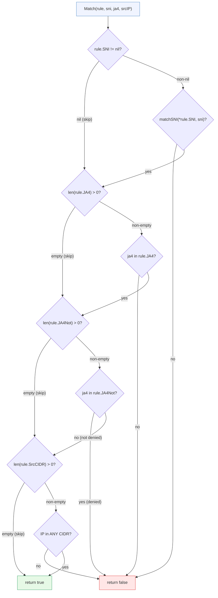
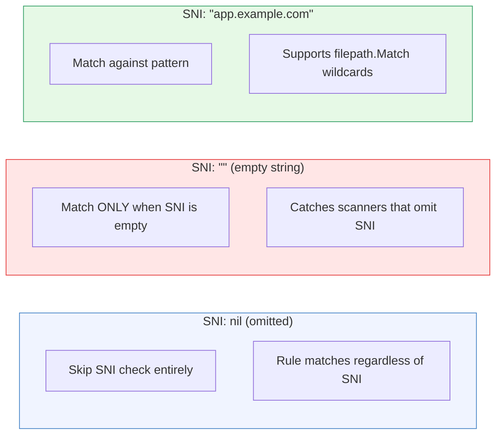

# Rule Matching

[← Advanced Reference](../README.md)

---

Every connection is evaluated by the rule engine exactly once. The engine
walks rules top-down with short-circuiting AND logic and returns the first
match. If nothing matches, the connection is dropped.

---

## The Rule Struct

```yaml
rules:
  - name: block-scanners          # Human-readable identifier (required)
    comment: "Drop known scanner fingerprints"  # Documentation (optional)
    sni: null                      # *string pointer (nil = skip this check)
    ja4:                           # Allowlist — JA4 must be IN this list
      - "t13d191000_9dc..."
    ja4_not:                       # Denylist — JA4 must NOT be in this list
      - "t13d301000_4bf..."
    src_cidr:                      # Source IP must match ANY of these CIDRs
      - "198.51.100.0/24"
    service: ""                    # Ziti service name (empty for drops)
    action: "drop"                 # "route" (default) or "drop"
    rate: "100/m"                  # "count/unit" — rate limit for this rule
```

| Field | Go Type | YAML | Default | Semantics |
|:------|:--------|:-----|:--------|:----------|
| `Name` | `string` | `name` | required | Identifies the rule in logs and stats |
| `Comment` | `string` | `comment` | `""` | Human documentation, ignored by engine |
| `SNI` | `*string` | `sni` | `nil` | Pointer: `nil` = skip, `""` = match empty SNI, `"*"` = match any |
| `JA4` | `[]string` | `ja4` | `nil` | Allowlist: connection JA4 must appear in list |
| `JA4Not` | `[]string` | `ja4_not` | `nil` | Denylist: connection JA4 must NOT appear in list |
| `SrcCIDR` | `[]string` | `src_cidr` | `nil` | IP must match at least one CIDR |
| `Service` | `string` | `service` | `""` | Ziti service to dial (empty for drops) |
| `Action` | `string` | `action` | `"route"` | What to do on match |
| `Rate` | `string` | `rate` | `""` | Rate limit in `count/unit` format |

---

## The Match Function

Every rule is evaluated by `Match()`, which applies conditions as a
short-circuiting AND. Each condition that is present must pass. Conditions
that are absent (nil slice, nil pointer) are skipped.



Key properties:

- **Short-circuit**: the first failing condition ends evaluation immediately
- **AND logic**: all present conditions must pass
- **Absent = pass**: a nil/empty condition is not checked, it does not block
- **Order**: SNI first, then JA4 allow, then JA4 deny, then CIDR

---

## SNI Matching

The `matchSNI` function handles three cases:

```go
func matchSNI(pattern, sni string) bool {
    if pattern == "*"  { return true }        // Wildcard: match everything
    if pattern == ""   { return sni == "" }   // Empty: match only empty SNI
    ok, _ := filepath.Match(pattern, sni)     // Glob pattern
    return ok
}
```

### The SNI Pointer Trick

The `SNI` field is a `*string`, not a `string`. This gives three distinct
states:



In YAML, `sni: null` or omitting the field entirely produces a nil pointer.
`sni: ""` produces a pointer to an empty string.

### SNI Pattern Examples

| Pattern | Matches | Does NOT match |
|:--------|:--------|:---------------|
| `"*"` | everything | (nothing excluded) |
| `""` | `""` (empty SNI only) | `"app.example.com"` |
| `"app.example.com"` | `"app.example.com"` | `"other.example.com"` |
| `"*.example.com"` | `"app.example.com"` | `"a.b.example.com"` (two levels) |
| `"*.share.example.io"` | `"x.share.example.io"` | `"share.example.io"` (no subdomain) |

---

## CIDR Matching

Source IP is checked against a list of CIDRs. The connection matches if the
IP falls within **any** CIDR in the list (OR logic within the CIDR list):

```go
func matchCIDR(cidrs []string, ip net.IP) bool {
    for _, cidr := range cidrs {
        _, network, err := net.ParseCIDR(cidr)
        if err != nil { continue }     // Skip malformed CIDRs
        if network.Contains(ip) { return true }
    }
    return false
}
```

Malformed CIDRs are silently skipped -- a typo should not break the rule.

---

## JA4 List Containment

Both `JA4` (allowlist) and `JA4Not` (denylist) use simple string equality:

```go
func contains(list []string, s string) bool {
    for _, item := range list {
        if item == s { return true }
    }
    return false
}
```

No wildcards, no prefix matching, no regex. The JA4 fingerprint is a
deterministic hash -- you either know the exact value or you don't.

| Field | Semantics | Use case |
|:------|:----------|:---------|
| `JA4` (allowlist) | JA4 **must** be in this list | "Only allow Chrome and Firefox" |
| `JA4Not` (denylist) | JA4 must **not** be in this list | "Block zgrab2 and masscan" |

Both can be used in the same rule (allowlist is checked first).

---

## Edge Cases

| Scenario | Behavior |
|:---------|:---------|
| Rule has both `ja4` and `ja4_not` | Allowlist checked first. JA4 must be in allowlist AND not in denylist |
| Rule has no conditions at all | Matches everything (all checks are skipped) |
| Multiple CIDRs in `src_cidr` | OR logic -- IP must match at least one |
| Malformed CIDR string | Silently skipped, does not cause match failure |
| `Action` field omitted | Defaults to `"route"` if `Service` is set |
