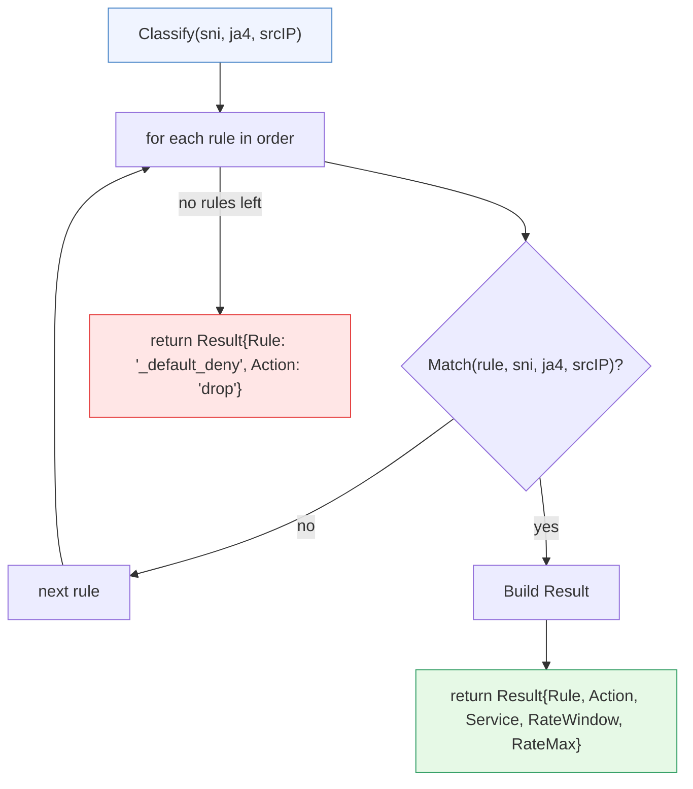
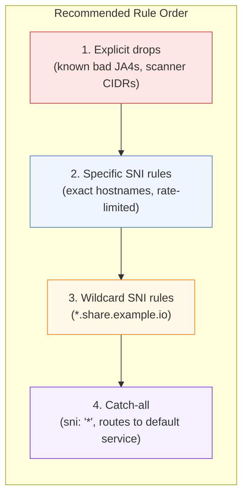

# Rule Ordering

[← Advanced Reference](../README.md)

---

Rules are evaluated top-down, first match wins. The order in which rules
appear in the config file determines which rule handles a given connection.
Getting the order wrong can route scanners to backends or drop legitimate
traffic.

---

## First-Match-Wins

The `Classify()` function walks rules in order and returns the first match:



The `Result` struct carries everything the gateway needs to act:

```go
type Result struct {
    Rule       string   // Name of the matched rule
    Action     string   // "route" or "drop"
    Service    string   // Ziti service name (empty if dropped)
    RateWindow int      // Rate limit window in seconds (0 = no limit)
    RateMax    int      // Max connections per window (0 = no limit)
}
```

---

## Recommended Order



---

## Why Drops First

If a connection matches a drop rule, you want to bail immediately. Putting
drops after route rules means a scanner targeting a valid SNI would be
routed instead of dropped.

**Bad order:**
```yaml
rules:
  - name: auth
    sni: "auth.example.com"
    service: auth-provider
  - name: block-scanners        # Too late! Scanner already routed above
    ja4: ["t13d191000_9dc..."]
    action: drop
```

A zgrab2 scanner requesting `auth.example.com` matches the `auth` rule
first and gets routed to the backend.

**Good order:**
```yaml
rules:
  - name: block-scanners        # Checked first
    ja4: ["t13d191000_9dc..."]
    action: drop
  - name: auth
    sni: "auth.example.com"
    service: auth-provider
```

The scanner's JA4 matches the drop rule before the SNI rule is evaluated.

---

## Why Specific Before Wildcard

A rule for `app.example.com` with a tight rate limit should take precedence
over `*.example.com` with a loose one:

```yaml
rules:
  - name: auth                          # Tight limit: 20/m
    sni: "auth.example.com"
    service: auth-provider
    rate: "20/m"
  - name: wildcard                      # Loose limit: 200/m
    sni: "*.example.com"
    service: default-ingress
    rate: "200/m"
```

A connection to `auth.example.com` hits the `auth` rule (20/m). A
connection to `other.example.com` falls through to the wildcard (200/m).
If the wildcard were first, the auth endpoint would get the loose 200/m
limit.

---

## Why Catch-All Last

The `*` wildcard matches everything. It is the safety net. Anything that
did not match a more specific rule lands here.

```yaml
rules:
  # ... specific rules above ...
  - name: catch-all
    sni: "*"
    service: default-ingress
    rate: "200/m"
```

If the catch-all were first, every connection would match it and no other
rule would ever fire.

---

## The _default_deny

If no rule matches at all, the engine returns a synthetic result:

```go
Result{Rule: "_default_deny", Action: "drop"}
```

This is the implicit drop at the bottom of every ruleset. You never need
to write it -- it exists automatically. A ruleset with no catch-all and no
matching rule results in `_default_deny`.

---

## Performance Notes

Rule evaluation is a linear scan. For N rules, worst case is N iterations
(no match). In practice, the most common traffic hits early rules (drops
and popular SNIs), so average evaluation is much faster than worst case.

The match function allocates nothing on the hot path. `filepath.Match` is
the only call with internal allocation, and only when a glob pattern is
present. CIDR parsing with `net.ParseCIDR` does allocate, but the result
could be cached at config load time in a future optimization.

For deployments with hundreds of rules, consider grouping related rules
and putting high-traffic matchers first.
