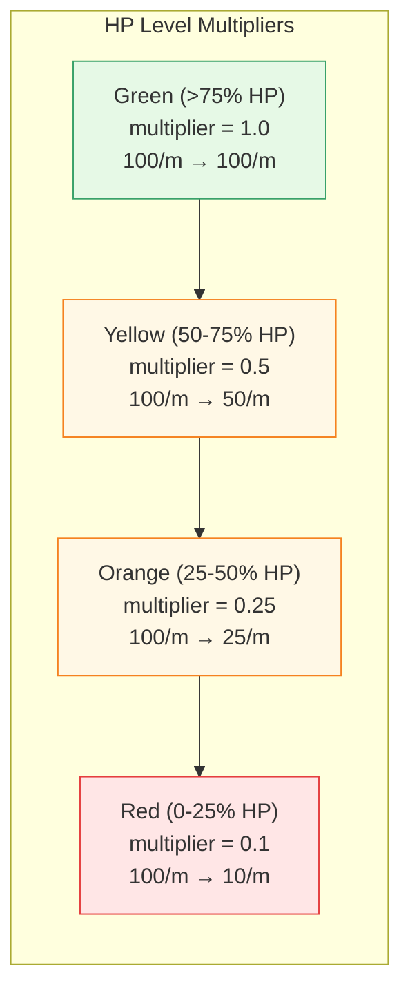

# Rate Limiting

[← Advanced Reference](../README.md)

---

Each rule can specify a per-source-IP rate limit. The limit is expressed
as a compact `count/unit` string and is dynamically scaled by the HP
system's current level.

---

## Rate String Format

```go
func parseRate(rate string) (windowSec, maxCount int) {
    // rate = "100/m" → windowSec=60, maxCount=100
    fmt.Sscanf(rate, "%d/%s", &count, &unit)
    switch unit {
    case "s": return 1, count      // per second
    case "m": return 60, count     // per minute
    case "h": return 3600, count   // per hour
    }
}
```

| Rate string | Window (seconds) | Max connections |
|:------------|:-----------------|:----------------|
| `"10/s"` | 1 | 10 |
| `"100/m"` | 60 | 100 |
| `"1000/h"` | 3600 | 1000 |
| `""` (empty) | 0 | 0 (no limit) |
| `"bad"` | 0 | 0 (no limit, parse fails silently) |

An empty rate string or a parse failure results in no rate limit being
applied. This is intentional -- a typo should not block all traffic.

---

## HP Rate Limit Multiplier

The raw `RateMax` from the rule is not used directly. The gateway
multiplies it by the HP system's `RateLimitMultiplier()`:

```
effectiveMax = RateMax * hp.RateLimitMultiplier()
if effectiveMax < 1 { effectiveMax = 1 }
```



For a rule with `rate: "100/m"`:

| Level | Multiplier | Effective Limit |
|:------|:-----------|:----------------|
| Green | 1.0 | 100/min |
| Yellow | 0.5 | 50/min |
| Orange | 0.25 | 25/min |
| Red | 0.1 | 10/min |

The minimum effective rate is always 1 -- even at Red HP, each source IP
gets at least 1 connection per window.

---

## Effective Rate Calculation

The full calculation for a given connection:

1. Rule match produces `RateMax` and `RateWindow` from the `rate` string
2. Gateway reads `hp.RateLimitMultiplier()` for the current HP level
3. `effectiveMax = floor(RateMax * multiplier)`
4. If `effectiveMax < 1`, set to 1
5. Check source IP's connection count in the current window
6. If count >= effectiveMax, drop and call `hp.RecordRateLimit()`

---

## CheckRateLimit Flow

The rate limiter uses a per-rule, per-source-IP sliding window:

```
Key: rule.Name + ":" + srcIP
Window: RateWindow seconds
Counter: atomic increment per connection
```

When a connection matches a rule with a rate limit:

1. Look up the counter for `ruleName:srcIP`
2. If the window has expired, reset the counter
3. Increment the counter
4. Compare against `effectiveMax`
5. If over limit: return `true` (rate limited), gateway calls
   `hp.RecordRateLimit()` which costs -3.0 HP
6. If under limit: return `false` (allowed)

---

## Rate Limit and HP Interaction

Rate limiting creates a feedback loop with HP:

- When a source exceeds its rate limit, the connection is dropped and
  costs -3.0 HP (RateLimitCost)
- As HP drops, the rate limit multiplier decreases, making limits tighter
- Tighter limits cause more connections to be rate-limited
- More rate-limited connections drain more HP

This positive feedback loop accelerates the transition to Red under a
flood attack, which is the desired behavior -- the node locks down fast.

During recovery, the loop works in reverse: as HP rises, multipliers
increase, fewer connections are rate-limited, less HP is drained.

---

## Edge Cases

| Scenario | Behavior |
|:---------|:---------|
| Rate parse failure | Returns 0/0, treated as no rate limit |
| No rules match | `_default_deny` drop, no rate check |
| Rate limit at Red with effectiveMax=1 | Exactly 1 connection per window per source IP |
| Multiple rules with different rates | Each rule has its own counter namespace |
