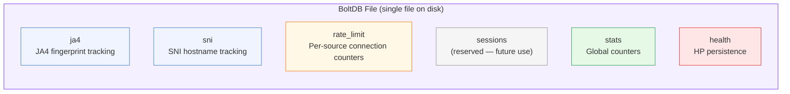

# BoltDB Bucket Layout

[← Advanced Reference](../README.md)

---

Schmutz uses [bbolt](https://github.com/etcd-io/bbolt) (the etcd fork of
BoltDB) as its local state store. Each edge node has its own independent
database file. There is no cross-node replication -- the Ziti controller
handles distributed state. BoltDB is strictly for local observability,
rate limiting, and HP persistence.

---

## Bucket Overview



All six buckets are created on startup via `CreateBucketIfNotExists`. If the
database file does not exist, BoltDB creates it.

---

## `ja4` -- JA4 Fingerprint Tracking

Tracks every unique TLS fingerprint seen by this node.

**Key**: JA4 fingerprint string (e.g., `t13d1517h2_8daaf6152771_e5627efa2ab1`)

**Value**: JSON-encoded `JA4Record`

```go
type JA4Record struct {
    Fingerprint string    `json:"fingerprint"`
    Count       uint64    `json:"count"`
    FirstSeen   time.Time `json:"first_seen"`
    LastSeen    time.Time `json:"last_seen"`
    LastSNI     string    `json:"last_sni"`
    LastSrcIP   string    `json:"last_src_ip"`
    Action      string    `json:"action"`
}
```

**Example stored value**:

```json
{
  "fingerprint": "t13d1517h2_8daaf6152771_e5627efa2ab1",
  "count": 14823,
  "first_seen": "2026-03-15T08:12:44Z",
  "last_seen": "2026-03-30T14:22:01Z",
  "last_sni": "app.example.com",
  "last_src_ip": "192.0.2.50:49821",
  "action": "route"
}
```

**Update logic**: on every connection, `RecordJA4()` opens a read-write
transaction, fetches the existing record (or initializes a new one with
`FirstSeen = now`), increments `Count`, updates `LastSeen`, `LastSNI`,
`LastSrcIP`, and `Action`, then marshals back to JSON and writes.

---

## `sni` -- SNI Hostname Tracking

Tracks every unique SNI hostname requested.

**Key**: SNI hostname string (e.g., `app.example.com`)

**Value**: JSON-encoded `SNIRecord`

```go
type SNIRecord struct {
    Hostname  string    `json:"hostname"`
    Count     uint64    `json:"count"`
    FirstSeen time.Time `json:"first_seen"`
    LastSeen  time.Time `json:"last_seen"`
    LastJA4   string    `json:"last_ja4"`
    LastSrcIP string    `json:"last_src_ip"`
}
```

**Update logic**: identical pattern to JA4 -- upsert on every connection
via `RecordSNI()`.

---

## `rate_limit` -- Per-Source Connection Counters

Implements sliding-window rate limiting per source IP. See
[Rate Windows](rate-windows.md) for the full key format and flow.

---

## `sessions` -- Reserved

Created on startup but currently unused. Reserved for future caching of Ziti
session metadata to reduce controller round-trips on repeated dials.

---

## `stats` -- Global Counters

Simple named counters for operational metrics.

**Key**: stat name string (e.g., `conn_total`)

**Value**: `uint64` counter, stored as big-endian 8 bytes

| Stat Name | Incremented When |
|:----------|:-----------------|
| `conn_total` | Every accepted TCP connection |
| `conn_bad_clienthello` | ClientHello parse fails or times out |
| `conn_dropped` | Rule engine returns `action: drop` |
| `conn_routed` | Ziti dial succeeds, relay begins |
| `conn_dial_failed` | Ziti dial returns an error |
| `conn_rate_limited` | Source IP exceeds rate limit |
| `conn_rejected_limit` | MaxConnections limit reached |

**Read**: `GetStat(name)` uses a read-only transaction (`db.View`) --
no lock contention with writes.

**Write**: `IncrStat(name)` uses a write transaction. The pattern is:
read current value (or 0), increment, write back as 8 big-endian bytes.

---

## `health` -- HP Persistence

Stores the HP pool's current value so it survives restarts.

**Key**: `"hp"` (literal string)

**Value**: `float64` encoded via `math.Float64bits()` -- a `uint64` stored
as big-endian 8 bytes. See [Encoding](encoding.md) for details.

**Persistence frequency**: the HP pool's `tick()` goroutine fires every
`PersistSec` seconds (default: 10). Each tick applies passive regen,
clamps HP to `[0, maxHP]`, and writes.

**Restore on startup**: `NewPool()` reads the `"hp"` key. If present and
between 0 and `maxHP`, it replaces the default (full HP) with the restored
value. A node under attack retains reduced HP across restarts.

---

## Open() Function

See [Encoding](encoding.md) for the `bolt.Open()` call, configuration
options, compaction, and file size guidance.

---

## Querying State

Three read functions are available for operational inspection:

- **ListJA4()**: Returns all JA4 records. Read-only transaction, iterates
  the entire `ja4` bucket. Corrupt entries are silently skipped.
- **ListSNI()**: Returns all SNI records. Same pattern as `ListJA4()`.
- **GetStat(name)**: Returns a single stat counter. Returns 0 if absent.

All three use `db.View()` (read-only transactions), so they do not block
writes and can run concurrently with each other.

---

## Record Lifecycle

JA4 and SNI records are **append-only** (never deleted). Rate limit records
are **ephemeral** (cleaned up after their window expires). See
[Rate Windows](rate-windows.md) for the cleanup mechanism.

Every connection triggers 4 write transactions (JA4, SNI, rate limit, stats)
plus reads. The HP tick adds 1 write every 10 seconds regardless of traffic.
