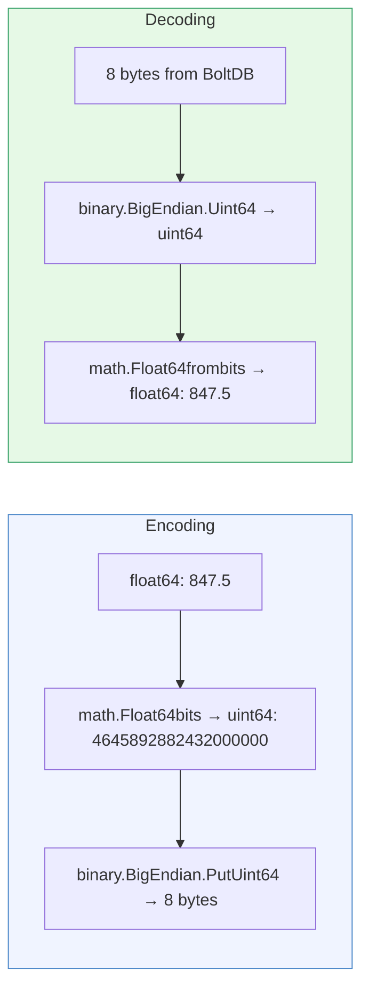

# Storage Encoding

[← Advanced Reference](../README.md)

---

BoltDB stores all values as raw byte slices. Schmutz uses two encoding
strategies depending on the data type: JSON for structured records and
big-endian binary for numeric counters.

---

## JSON Encoding (JA4 and SNI Records)

JA4 and SNI records are stored as JSON-encoded byte slices. This makes
them human-readable when inspecting the database with the `bbolt` CLI
and tolerant of schema evolution (new fields can be added without
migration).

**Marshal cost**: ~1-2 microseconds per record. Measurable but not
dominant in the per-connection write path.

**Unmarshal on read**: `ListJA4()` and `ListSNI()` deserialize every
record during iteration. Corrupt entries (JSON unmarshal failure) are
silently skipped.

---

## Big-Endian uint64 (Stats and Rate Limit Counters)

Stats counters and rate limit counters are stored as raw 8-byte
big-endian `uint64` values:

```go
// Write
buf := make([]byte, 8)
binary.BigEndian.PutUint64(buf, value)
bucket.Put(key, buf)

// Read
val := bucket.Get(key)
count := binary.BigEndian.Uint64(val)
```

**Why big-endian?** Convention for portable binary encoding. BoltDB does
not interpret values, so endianness only matters for consistency within
the application.

**Cost**: ~100 nanoseconds per encode/decode -- an order of magnitude
cheaper than JSON.

---

## Float64 Encoding (HP Persistence)

The HP pool stores its current value as a `float64`. Since BoltDB only
stores byte slices, the float is converted to a `uint64` bit pattern
using `math.Float64bits()`, then encoded as big-endian 8 bytes:



This preserves the full IEEE 754 double precision without any rounding.

---

## BoltDB Configuration Options

```go
db, err := bolt.Open(path, 0600, &bolt.Options{
    Timeout:      5 * time.Second,
    NoGrowSync:   false,
    FreelistType: bolt.FreelistMapType,
})
```

| Option | Value | Rationale |
|:-------|:------|:----------|
| File mode | `0600` | Owner read/write only. No group or other access |
| Timeout | `5s` | Max wait to acquire file lock. Prevents deadlock if another process holds the file |
| NoGrowSync | `false` | Sync to disk on file growth (safety over speed) |
| FreelistType | `FreelistMapType` | Map-based freelist for better performance with frequent deletes (rate limit cleanup) |

**Default file location**: configured via `store.path` in the YAML config.
The default is `/opt/schmutz/edge-gateway/edge-gateway.db`.

---

## Compaction and File Size

BoltDB uses a B+ tree with copy-on-write pages. Deleted data is added to
the freelist, not reclaimed on disk.

### When to Worry

| Scenario | Impact | Mitigation |
|:---------|:-------|:-----------|
| Many unique JA4 fingerprints | Linear growth, ~200 bytes per record | Acceptable -- thousands of JA4s = ~200 KB |
| Many unique SNI hostnames | Linear growth, ~150 bytes per record | Rarely exceeds thousands |
| High rate limit churn | Frequent creates + deletes | `FreelistMapType` handles this well |
| Long uptime, no restarts | Freelist grows, file size creeps | Periodic restart reclaims space |
| Disk full | BoltDB write fails, connections dropped | Monitor disk space, alert on low |

### Practical File Sizes

For a typical edge node seeing 10,000 unique JA4 fingerprints, 500 unique
SNIs, and active rate limiting for 1,000 concurrent source IPs:

- JA4 bucket: ~2 MB
- SNI bucket: ~75 KB
- Rate limit bucket: ~50 KB (ephemeral, stays small)
- Stats bucket: < 1 KB (handful of counters)
- Health bucket: 8 bytes
- **Total**: ~2-3 MB on disk

If the file grows beyond 100 MB (unlikely in normal operation), a restart
will compact it. For programmatic compaction:

```bash
bbolt compact -o new.db old.db
mv new.db old.db
```

### Backup

The database is a single file. Copy it while Schmutz is stopped, or use
BoltDB's `Tx.WriteTo()` for a consistent online snapshot. Since edge nodes
are disposable and share no state, backup is optional -- the data is
reconstructed from live traffic within minutes of a fresh start.
