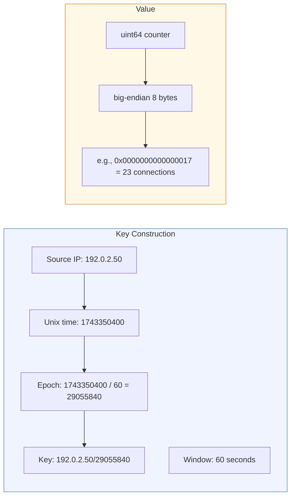
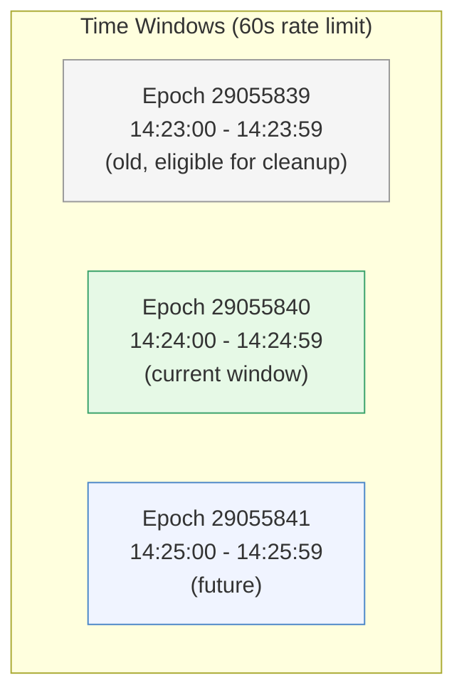
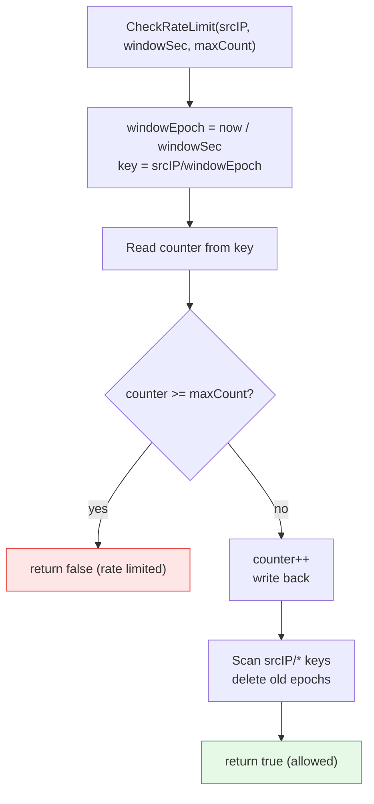

# Rate Limit Windows

[← Advanced Reference](../README.md)

---

The `rate_limit` bucket implements sliding-window rate limiting per source
IP. Each window is a fixed time interval, and each source IP gets an
independent counter per window.

---

## Key Format

Keys follow the pattern `{srcIP}/{windowEpoch}`, where `windowEpoch` is
computed by integer division of the current Unix timestamp by the window
size in seconds.

---

## Epoch Calculation

The epoch groups all connections from a source IP within a time window
into a single counter. When the window rolls over, a new key is created.

---

## Counter Increment

Values are `uint64` counters stored as big-endian 8 bytes. On each
connection from a source IP:

1. Read the current counter for the key (0 if absent)
2. If the counter already equals or exceeds the limit, deny
3. Otherwise, increment and write back

---

## CheckRateLimit Flow

The full sequence inside a single write transaction:

1. Compute `windowEpoch = now / windowSec`
2. Build key `"{srcIP}/{windowEpoch}"`
3. Read current counter (0 if absent)
4. If counter >= maxCount, return `allowed = false`
5. Increment counter, write back
6. Clean up old windows for this srcIP (best effort)

---

## Old Window Cleanup

After incrementing, the function scans all keys with the same srcIP
prefix. Any key whose epoch, multiplied by `windowSec`, falls before the
current window start (`now - windowSec`) is deleted. This runs inside the
same write transaction.

This piggyback cleanup keeps the bucket small without requiring a
separate garbage collection goroutine.

---

## Transaction Semantics

`CheckRateLimit` uses a **write transaction** (`db.Update`), not a read
transaction. This is because it atomically reads, increments, and cleans
up in a single transaction. BoltDB's single-writer lock means rate limit
checks are serialized -- one check completes before the next begins.

At very high connection rates, this serialization can become a bottleneck.
See [Bottlenecks](../ops/bottlenecks.md) for mitigation strategies.
