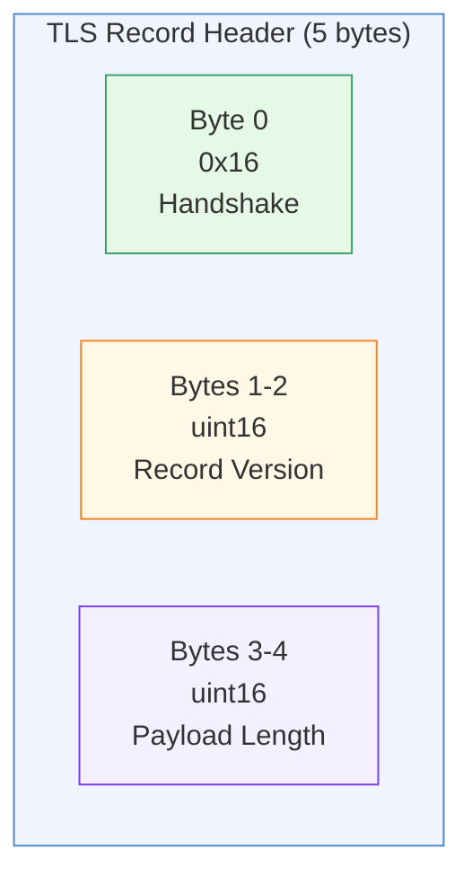
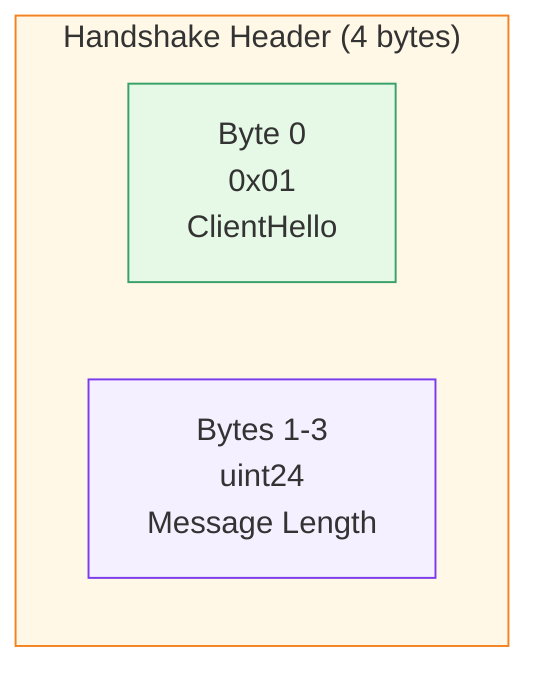
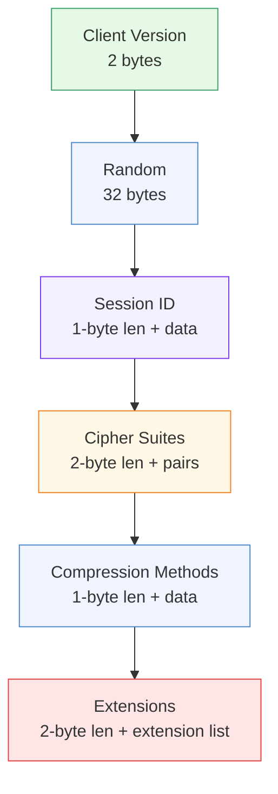
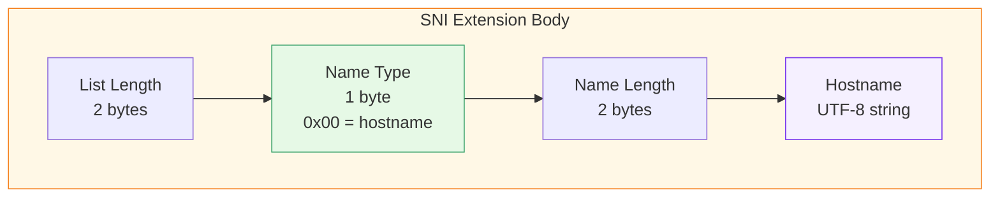
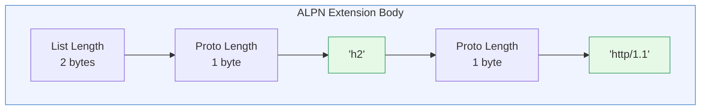

# ClientHello Format

[← Advanced Reference](../README.md)

---

Every TLS connection begins with a ClientHello. Schmutz reads this
message -- and only this message -- to classify the connection. It never
terminates TLS, never sees plaintext, and never modifies a single byte.

---

## The TLS Record Layer (5 bytes)



| Offset | Size | Field | Expected Value |
|:-------|:-----|:------|:---------------|
| 0 | 1 byte | Content type | `0x16` = Handshake |
| 1 | 2 bytes | Record version | Usually `0x0301` (TLS 1.0) regardless of actual version |
| 3 | 2 bytes | Payload length | Up to 16384 (enforced by Schmutz) |

The record version at bytes 1-2 is a legacy field. Modern clients always
write `0x0301` here even when negotiating TLS 1.3. The actual version is
inside the ClientHello or the `supported_versions` extension.

```go
header := make([]byte, 5)
io.ReadFull(conn, header)
if header[0] != 0x16 {
    return nil, errors.New("not a TLS handshake")
}
length := int(header[3])<<8 | int(header[4])
```

---

## The Handshake Header

Inside the record payload, the handshake message has its own 4-byte header.



| Offset | Size | Field | Expected Value |
|:-------|:-----|:------|:---------------|
| 0 | 1 byte | Handshake type | `0x01` = ClientHello |
| 1 | 3 bytes | Message length | Remaining bytes in the handshake message |

Schmutz validates `payload[0] == 0x01` then skips the 4-byte header.

---

## The ClientHello Body

The body is a sequence of fields, each with explicit lengths. The parser
walks forward through the byte slice, consuming fields in order.



### Field-by-Field Layout

| Field | Size | Description |
|:------|:-----|:------------|
| Client Version | 2 bytes | `0x0303` for TLS 1.2, `0x0303` for TLS 1.3 (yes, same -- version moved to extensions) |
| Random | 32 bytes | Cryptographic nonce. Skipped entirely by Schmutz |
| Session ID Length | 1 byte | Length of the session ID that follows |
| Session ID | 0-32 bytes | Legacy session resumption. Skipped |
| Cipher Suites Length | 2 bytes | Total byte length of cipher suites list |
| Cipher Suites | N x 2 bytes | Each cipher suite is a 2-byte identifier |
| Compression Length | 1 byte | Length of compression methods |
| Compression Methods | N bytes | Always `[0x00]` (null) in modern TLS |
| Extensions Length | 2 bytes | Total byte length of all extensions |
| Extensions | variable | The payload Schmutz actually cares about |

The parser reads version (2 bytes), skips random (32 bytes), reads and
skips session ID (1-byte length + data), then enters cipher suite and
extension parsing.

---

## SNI Extension (Type 0x0000)

The SNI extension contains a list of server names. In practice, there is
always exactly one, with type `0x00` (hostname).



```go
func parseSNI(data []byte) string {
    if len(data) < 5 { return "" }
    data = data[2:]          // skip list length
    if data[0] != 0x00 { return "" }
    nameLen := int(data[1])<<8 | int(data[2])
    return string(data[3:][:nameLen])
}
```

---

## ALPN Extension (Type 0x0010)

The ALPN extension contains a length-prefixed list of protocol strings
(e.g., `h2`, `http/1.1`).



---

## The Complete Parsing Pipeline

```mermaid
flowchart TD
    TCP["TCP Accept"] --> DL["Set read deadline\n(10s timeout)"]
    DL --> RH["Read 5-byte\nrecord header"]
    RH --> VH{Type == 0x16?}
    VH -->|No| ERR1["Error:\nnot a TLS handshake"]
    VH -->|Yes| RL["Read payload\n(length from header)"]
    RL --> VS{Size <= 16384?}
    VS -->|No| ERR2["Error:\nrecord too large"]
    VS -->|Yes| VT{payload[0] == 0x01?}
    VT -->|No| ERR3["Error:\nnot a ClientHello"]
    VT -->|Yes| PV["Parse version\n(2 bytes)"]
    PV --> PR["Skip random\n(32 bytes)"]
    PR --> PS["Skip session ID\n(1-byte len + data)"]
    PS --> PC["Parse cipher suites\n(2-byte len + pairs)\nFilter GREASE"]
    PC --> PM["Skip compression\n(1-byte len + data)"]
    PM --> PE["Parse extensions\n(2-byte len + list)\nFilter GREASE\nExtract SNI + ALPN"]
    PE --> RC["Wrap in replayConn\n(header + payload)"]
    RC --> JA["Compute JA4\nfrom parsed Info"]
    JA --> CL["Classify:\nSNI + JA4 + srcIP\nagainst rules"]

    style ERR1 fill:#ffe6e6,stroke:#e53e3e
    style ERR2 fill:#ffe6e6,stroke:#e53e3e
    style ERR3 fill:#ffe6e6,stroke:#e53e3e
    style RC fill:#f0f4ff,stroke:#4a86c8
    style JA fill:#f5f0ff,stroke:#7c3aed
    style CL fill:#e6f9e6,stroke:#38a169
```

Every error path drops the connection and charges HP via
`RecordBadHello()`. No error message, no certificate, no banner.
