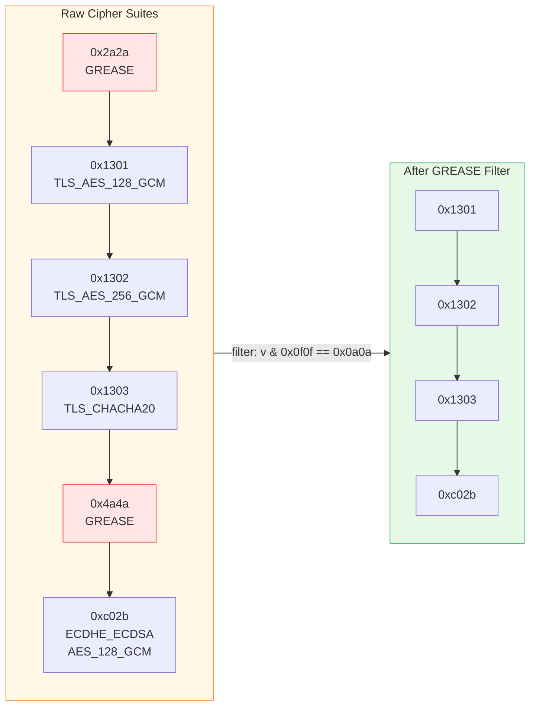

# GREASE Filtering

[← Advanced Reference](../README.md)

---

GREASE (Generate Random Extensions And Sustain Extensibility) is a
mechanism defined in RFC 8701 that prevents TLS implementations from
ossifying around specific sets of cipher suites and extensions. Schmutz
must filter GREASE values before computing JA4 fingerprints -- without
this step, the same browser generates a different fingerprint on every
connection.

---

## What is GREASE?

TLS servers are supposed to ignore unknown cipher suites and extension
types. In practice, many servers were written to reject anything they did
not recognize, which made it impossible to deploy new TLS features. GREASE
solves this by having clients inject random dummy values that servers must
tolerate.

Every TLS client that implements GREASE inserts one or more dummy values
into:

- The cipher suites list
- The extensions list
- The supported groups list
- The signature algorithms list

These dummy values change on every connection. A server that rejects them
is buggy. A fingerprinting system that includes them produces unstable
fingerprints.

---

## The 0x0a0a Bitmask Pattern

All GREASE values follow a single bitmask rule:

```
value & 0x0f0f == 0x0a0a
```

This matches exactly 16 two-byte values:

| GREASE Value | Hex | Binary (relevant nibbles) |
|:-------------|:----|:--------------------------|
| `0x0a0a` | 0a0a | `0000_**1010**_0000_**1010**` |
| `0x1a1a` | 1a1a | `0001_**1010**_0001_**1010**` |
| `0x2a2a` | 2a2a | `0010_**1010**_0010_**1010**` |
| `0x3a3a` | 3a3a | `0011_**1010**_0011_**1010**` |
| `0x4a4a` | 4a4a | `0100_**1010**_0100_**1010**` |
| `0x5a5a` | 5a5a | `0101_**1010**_0101_**1010**` |
| `0x6a6a` | 6a6a | `0110_**1010**_0110_**1010**` |
| `0x7a7a` | 7a7a | `0111_**1010**_0111_**1010**` |
| `0x8a8a` | 8a8a | `1000_**1010**_1000_**1010**` |
| `0x9a9a` | 9a9a | `1001_**1010**_1001_**1010**` |
| `0xaaaa` | aaaa | `1010_**1010**_1010_**1010**` |
| `0xbaba` | baba | `1011_**1010**_1011_**1010**` |
| `0xcaca` | caca | `1100_**1010**_1100_**1010**` |
| `0xdada` | dada | `1101_**1010**_1101_**1010**` |
| `0xeaea` | eaea | `1110_**1010**_1110_**1010**` |
| `0xfafa` | fafa | `1111_**1010**_1111_**1010**` |

The pattern: both the low nibble of the high byte and the low nibble of
the low byte are `0xa`. The high nibbles vary randomly.

---

## Why GREASE Breaks Fingerprints

Consider two connections from the same Chrome browser, 5 seconds apart:

**Connection 1 cipher suites:**
```
0x2a2a, 0x1301, 0x1302, 0x1303, 0xc02b, ...
```

**Connection 2 cipher suites:**
```
0x7a7a, 0x1301, 0x1302, 0x1303, 0xc02b, ...
```

The only difference is the GREASE value (`0x2a2a` vs `0x7a7a`). Without
filtering, the sorted cipher suite hash changes, producing two different
JA4 fingerprints for the same browser. The fingerprint becomes useless
for identification.

---

## Filtering in Schmutz

Schmutz strips GREASE from both cipher suites and extensions before
computing the JA4 fingerprint:



```go
// Filter GREASE cipher suites
for i := 0; i < csLen; i += 2 {
    cs := uint16(msg[i])<<8 | uint16(msg[i+1])
    if cs&0x0f0f == 0x0a0a {
        continue  // GREASE — skip
    }
    info.CipherSuites = append(info.CipherSuites, cs)
}
```

The same filter is applied to extension type codes during extension
iteration. The GREASE-filtered counts (cipher suites and extensions) are
what appear in JA4 Section A.

---

## Impact on JA4 Section A Counts

GREASE values are excluded from the cipher suite count and extension count
in Section A. For example, if a ClientHello contains 14 raw cipher suites
and 1 is GREASE, the JA4 cipher count field shows `13`, not `14`.

This is critical for fingerprint stability -- the number of GREASE values
injected can vary between connections from the same client.

---

## Design Decision

**Why not just hash the non-GREASE values in order?** Because GREASE
values can appear at any position in the list (beginning, middle, end).
Filtering them before sorting ensures the hash input is identical
regardless of where the client chose to insert its dummy values.
