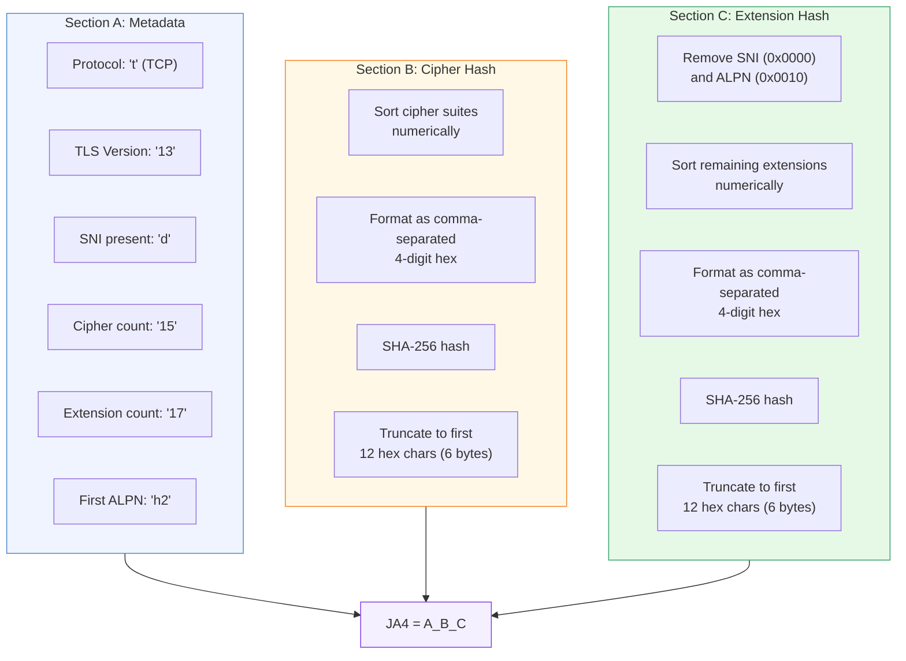

# JA4 Fingerprinting

[← Advanced Reference](../README.md)

---

JA4 produces a deterministic fingerprint from a TLS ClientHello that
identifies the TLS library -- not the user, not the destination, not the
network path. The same browser version produces the same JA4 regardless of
which site it visits or what IP it connects from.

---

## Fingerprint Structure

JA4 is a string with three sections separated by underscores:

```
t13d1517h2_a2b1c3d4e5f6_7a8b9c0d1e2f
|________| |____________| |____________|
 Section A    Section B     Section C
```



---

## Section A: Protocol Metadata (Plaintext)

Six fields concatenated without separators:

| Position | Field | Values | Example |
|:---------|:------|:-------|:--------|
| 1 | Protocol | `t` (TCP), `q` (QUIC) | `t` |
| 2-3 | TLS version | `13`, `12`, `11`, `10`, `00` | `13` |
| 4 | SNI indicator | `d` (domain present), `i` (IP or absent) | `d` |
| 5-6 | Cipher suite count | 2-digit, zero-padded, capped at 99 | `15` |
| 7-8 | Extension count | 2-digit, zero-padded, capped at 99 | `17` |
| 9-10 | First ALPN | First 2 chars of first ALPN proto, `00` if absent | `h2` |

---

## TLS Version Mapping

The ClientHello version field maps to a two-character code:

```go
switch clientVersion {
case 0x0304: return "13"  // TLS 1.3
case 0x0303: return "12"  // TLS 1.2
case 0x0302: return "11"  // TLS 1.1
case 0x0301: return "10"  // TLS 1.0
default:     return "00"  // Unknown
}
```

| Wire Value | TLS Version | JA4 Code |
|:-----------|:------------|:---------|
| `0x0304` | TLS 1.3 | `13` |
| `0x0303` | TLS 1.2 | `12` |
| `0x0302` | TLS 1.1 | `11` |
| `0x0301` | TLS 1.0 | `10` |
| anything else | Unknown | `00` |

Note: TLS 1.3 clients typically send `0x0303` in the ClientHello version
field (for backward compatibility) and advertise `0x0304` in the
`supported_versions` extension. Schmutz currently uses the ClientHello
version field directly.

---

## Section B: Sorted Cipher Suite Hash

1. Take the GREASE-filtered cipher suite list
2. Sort numerically (ascending)
3. Format each as 4-digit lowercase hex
4. Join with commas: `"1301,1302,1303,c02b,c02c,c02f,..."`
5. SHA-256 the resulting string
6. Take the first 6 bytes (12 hex characters)

---

## Section C: Sorted Extension Hash

1. Take the GREASE-filtered extension type list
2. Remove `0x0000` (SNI) and `0x0010` (ALPN)
3. Sort numerically (ascending)
4. Format each as 4-digit lowercase hex
5. Join with commas: `"0005,000a,000b,000d,0017,..."`
6. SHA-256 the resulting string
7. Take the first 6 bytes (12 hex characters)

SNI and ALPN are excluded because they vary per request (different hostnames
and protocols) while the rest of the extension set is determined by the TLS
library.

Both sections use the same hashing function: sort numerically, format as
comma-separated 4-digit hex, SHA-256, truncate to first 6 bytes (12 hex
chars). The truncation gives 2^48 possible values -- more than enough to
distinguish TLS libraries while keeping fingerprints human-readable.

---

## Worked Example: Chrome 124 ClientHello

A Chrome 124 browser connects to `app.example.com`.

### Raw Data (abbreviated)

```
Cipher Suites (after GREASE filter, 13 suites):
  1301, 1302, 1303, c02b, c02f, c02c, c030, cca9, cca8, c013, c014, 009c, 009d

Extensions (after GREASE filter, 14 extensions):
  0000 (SNI), 0017, ff01, 000a, 000b, 0023, 0010 (ALPN),
  0005, 000d, 002b, 002d, 0033, 001b, 0045

SNI: "app.example.com"
ALPN: ["h2", "http/1.1"]
ClientHello version: 0x0303
```

### Section A

| Field | Value | Reason |
|:------|:------|:-------|
| Protocol | `t` | TCP connection |
| Version | `12` | ClientHello says `0x0303` = TLS 1.2 |
| SNI | `d` | Domain "app.example.com" is present |
| Cipher count | `13` | 14 raw suites minus 1 GREASE = 13 |
| Extension count | `14` | 15 raw extensions minus 1 GREASE = 14 |
| ALPN | `h2` | First 2 chars of "h2" |

Section A = `t12d1314h2`

### Section B

Sorted cipher suites (GREASE removed):

```
009c,009d,1301,1302,1303,c013,c014,c02b,c02c,c02f,c030,cca8,cca9
```

SHA-256 of that string, first 6 bytes as hex = (e.g.) `8daaf6152771`

### Section C

Extensions minus SNI (0x0000) and ALPN (0x0010), sorted, GREASE removed:

```
0005,000a,000b,000d,0017,001b,0023,002b,002d,0033,0045,ff01
```

SHA-256 of that string, first 6 bytes as hex = (e.g.) `e5627efa2ab1`

### Final JA4

```
t12d1314h2_8daaf6152771_e5627efa2ab1
```

This fingerprint is stable across requests from the same Chrome version,
regardless of which site the user visits, which IP they connect from, or
what HTTP headers they send. A bot using Python's `requests` library will
produce a completely different fingerprint even if it copies Chrome's
User-Agent header perfectly.
