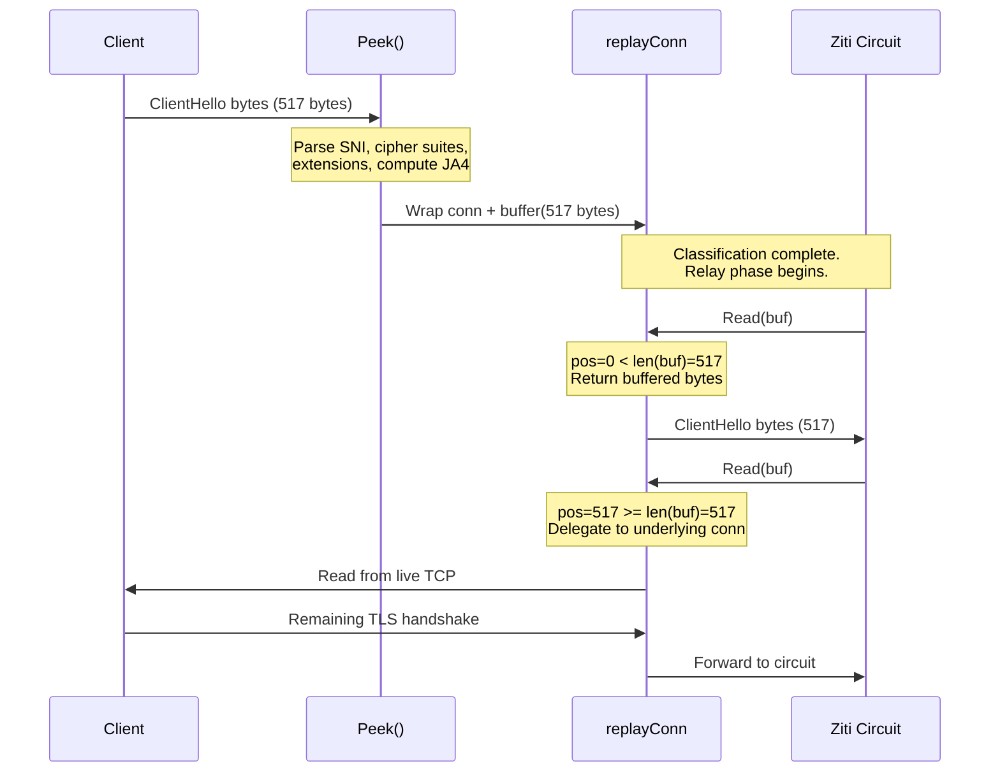

# The replayConn Pattern

[← Advanced Reference](../README.md)

---

Schmutz needs to read the ClientHello to classify the connection, but it
cannot consume those bytes -- they must also reach the backend, which
expects a complete TLS handshake starting from byte zero. The solution is
`replayConn`: a wrapper around `net.Conn` that replays already-read bytes
before delegating to the underlying connection.

---

## The Problem: Peek Without Consuming

TLS is a byte-stream protocol. The backend server expects the very first
bytes on the connection to be the TLS record header followed by the
ClientHello. If Schmutz reads those bytes for classification, they are gone
from the stream -- the backend receives a broken handshake.

Options considered:

| Approach | Problem |
|:---------|:--------|
| `io.TeeReader` | Requires a secondary buffer and does not integrate with `net.Conn` |
| `bufio.Reader.Peek` | Returns a view into the buffer but does not wrap `net.Conn` |
| Kernel-level `MSG_PEEK` | Not portable, not available in Go's `net` package |
| **`replayConn`** | Simple, zero-copy for the replay phase, works with any `net.Conn` |

---

## The replayConn Struct

```go
type replayConn struct {
    net.Conn
    buf []byte
    pos int
}

func (c *replayConn) Read(p []byte) (int, error) {
    if c.pos < len(c.buf) {
        n := copy(p, c.buf[c.pos:])
        c.pos += n
        return n, nil
    }
    return c.Conn.Read(p)
}
```

Three fields:

| Field | Type | Purpose |
|:------|:-----|:--------|
| `Conn` | `net.Conn` | The underlying TCP connection (embedded) |
| `buf` | `[]byte` | The bytes already read during classification (record header + payload) |
| `pos` | `int` | Current read position within `buf` |

The `Read` method has two phases:

1. **Replay phase** (`pos < len(buf)`): return bytes from the buffer, advance `pos`
2. **Live phase** (`pos >= len(buf)`): delegate to the underlying `net.Conn`

---

## Lifecycle



From the backend's perspective, it receives a complete, unmodified byte
stream starting with the ClientHello. The peek is invisible.

---

## Buffer Contents

The buffer contains exactly the bytes Schmutz read during classification:

| Bytes | Content | Size |
|:------|:--------|:-----|
| 0-4 | TLS record header | 5 bytes |
| 5-N | Record payload (handshake header + ClientHello body) | Variable (up to 16384) |

The total buffer size is `5 + payload_length`. For a typical Chrome
ClientHello, this is around 500-600 bytes.

---

## Why Not Just Buffer Everything?

The `replayConn` only buffers the bytes that were already read. Once the
replay phase is over, reads go directly to the underlying connection with
no buffering overhead. This means:

- No memory allocation after classification
- No copy overhead for the bulk data transfer
- No latency added to the relay phase
- The `net.Conn` interface is fully satisfied (all other methods like
  `Write`, `Close`, `SetDeadline` pass through to the embedded connection)

---

## Design Decision

**Why parse by hand instead of using `crypto/tls`?** Go's `crypto/tls`
package terminates TLS. Schmutz needs to read the ClientHello without
consuming the bytes and without completing the handshake. Manual parsing
lets us peek at exactly what we need and replay the bytes downstream.
