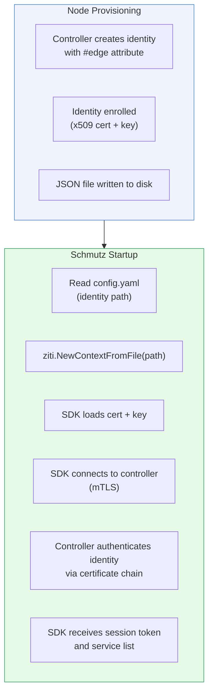
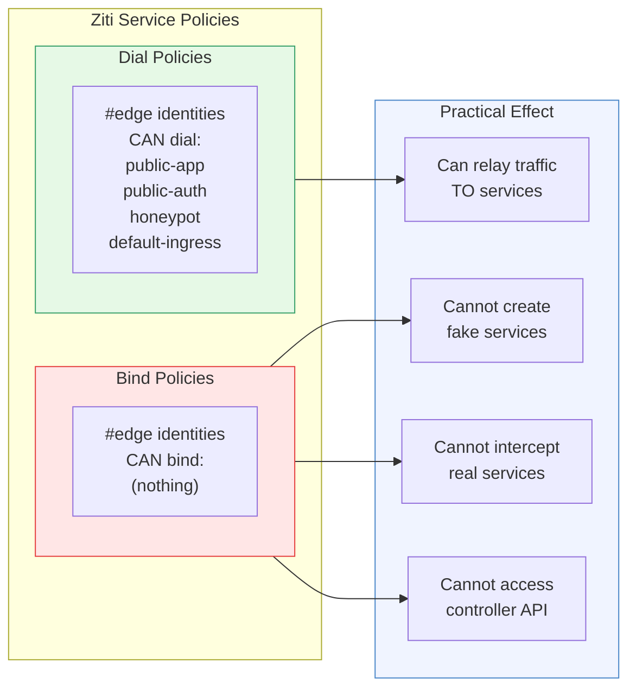
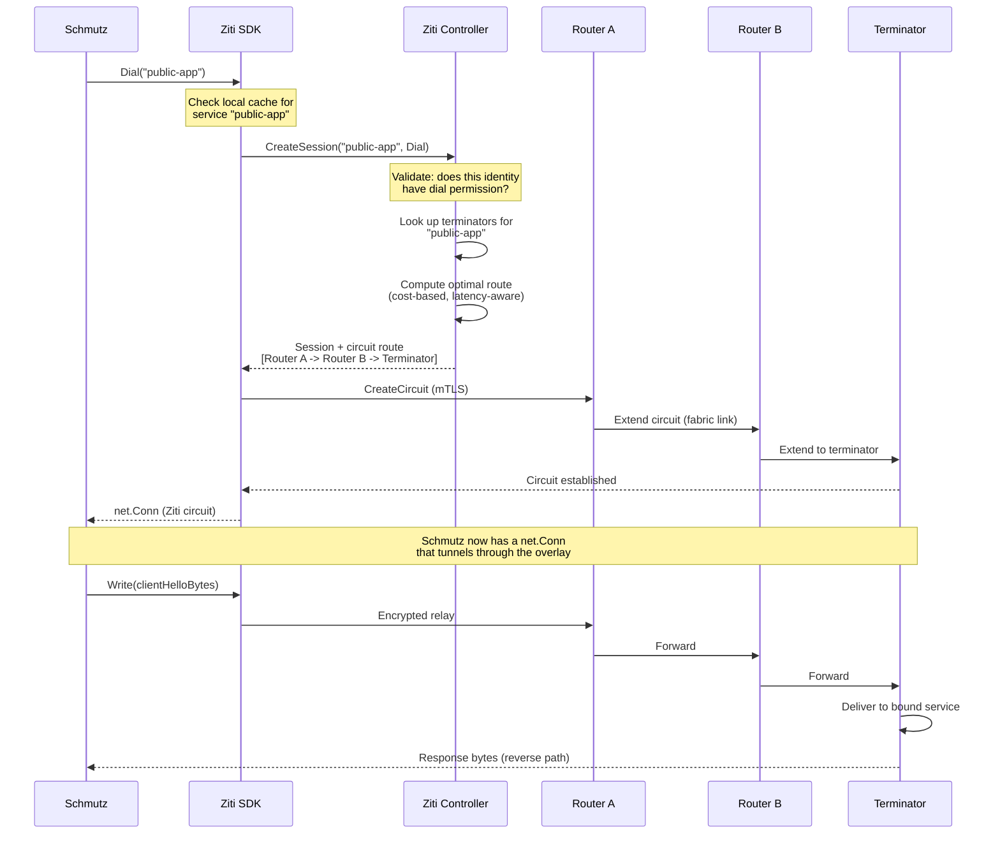
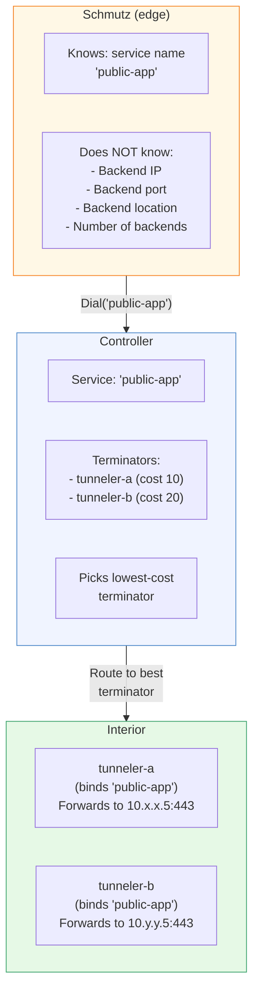
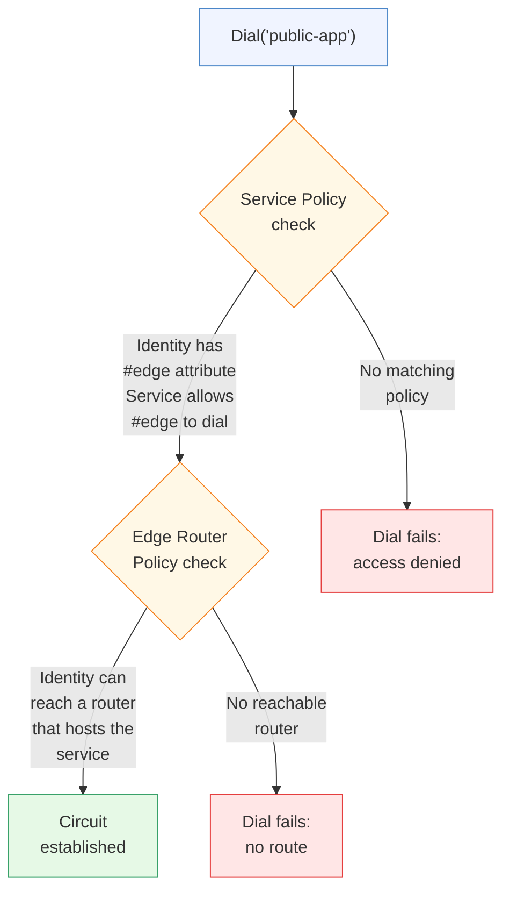
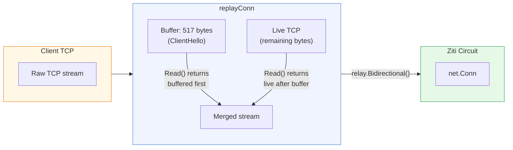
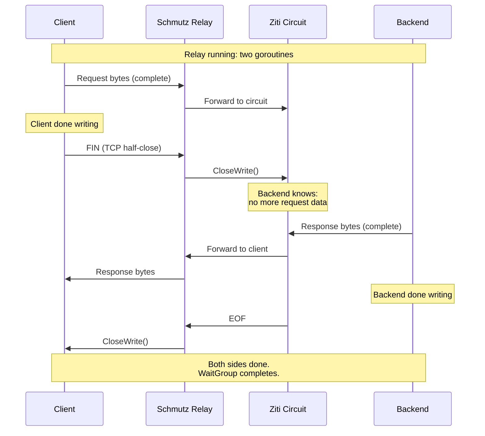
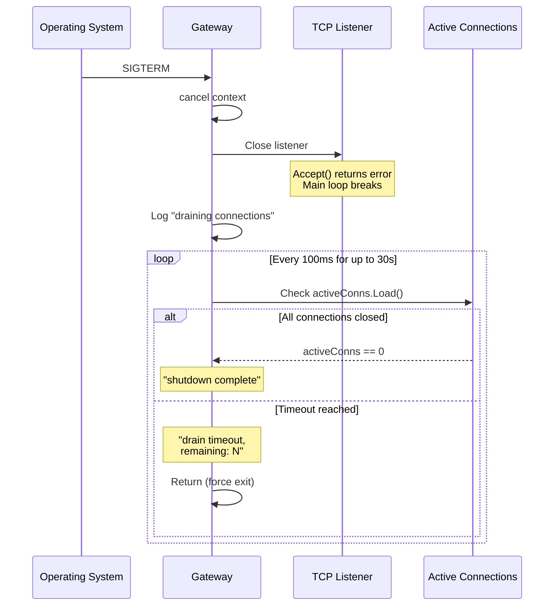
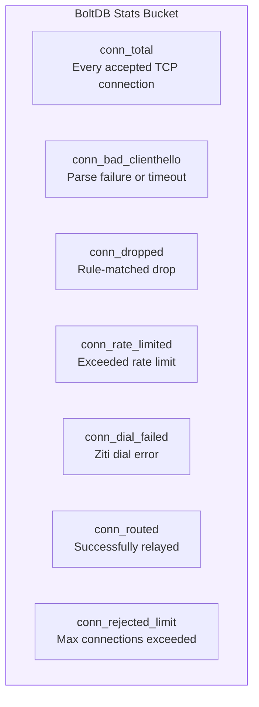
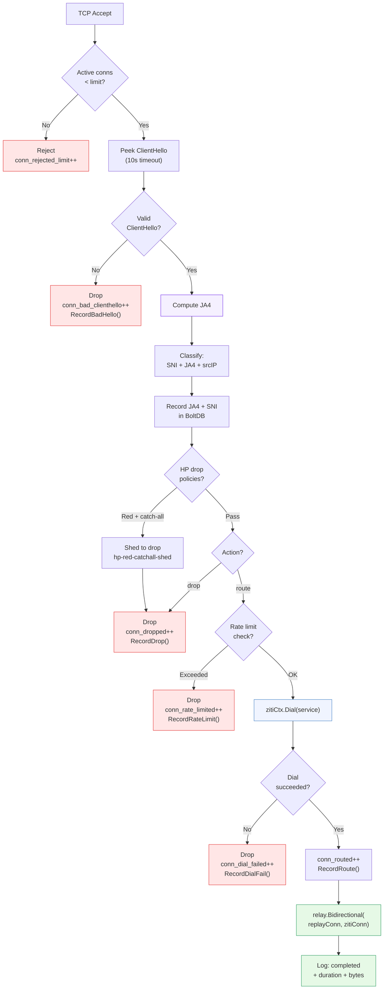

# Ziti SDK Integration -- How Schmutz Uses the Overlay

[<- Back to README](../../README.md) | [Architecture](../ARCHITECTURE.md) | [Identity Model](../IDENTITY.md)

---

Schmutz is a Ziti SDK application. It uses the
[openziti/sdk-golang](https://github.com/openziti/sdk-golang) library to
dial services through the Ziti overlay network. It never terminates TLS,
never knows backend IP addresses, and never hosts (binds) any service. This
document covers every aspect of the Ziti integration: identity loading, the
dial sequence, circuit lifecycle, the replayConn bridge, connection draining,
and statistics tracking.

---

## Identity Loading

Each Schmutz edge node has a Ziti identity file -- a JSON document containing
the node's x509 certificate, private key, and controller endpoint(s). The
identity is created during node provisioning and is the only secret on the
machine.



```go
zitiCtx, err := ziti.NewContextFromFile(cfg.Identity)
if err != nil {
    logger.Error("load ziti identity",
        "identity", cfg.Identity,
        "error", err,
    )
    os.Exit(1)
}
defer zitiCtx.Close()
```

The SDK handles all certificate validation, session management, and
reconnection internally. Schmutz calls one function and gets back a
context that can dial services.

### What the Identity File Contains

```json
{
    "ztAPI": "https://ctrl.example.io:1280/edge/client/v1",
    "ztAPIs": [
        "https://ctrl-1.example.io:1280/edge/client/v1",
        "https://ctrl-2.example.io:1280/edge/client/v1",
        "https://ctrl-3.example.io:1280/edge/client/v1"
    ],
    "id": {
        "cert": "pem-encoded x509 certificate",
        "key": "pem-encoded private key",
        "ca": "pem-encoded CA bundle"
    }
}
```

The `ztAPIs` list enables controller failover. If one controller is
unreachable, the SDK tries the next.

---

## Dial-Only Permissions Model

Ziti identities can have two types of permissions:

- **Bind** -- host a service (accept incoming connections)
- **Dial** -- connect to a service (make outgoing connections)

Edge node identities have **dial-only** permissions. They can connect to
public-facing services but cannot host anything on the overlay.



### Why No Bind?

If an edge node could bind services, a compromised node could:
1. Register as a terminator for `auth-provider`
2. Intercept authentication traffic
3. Steal credentials or session tokens

With dial-only permissions, a compromised edge node can only do what a
random internet client already can: connect to public services. The blast
radius is zero.

---

## The Dial Sequence

When Schmutz classifies a connection and determines it should be routed to
a Ziti service, it calls `zitiCtx.Dial(serviceName)`. Here is what happens
inside that call.



### Key Points

1. **Schmutz never knows the route.** The controller computes it. Schmutz
   gets back a `net.Conn` and writes bytes into it.

2. **The controller validates permissions.** If the identity doesn't have
   dial access to the requested service, the dial fails immediately.

3. **Route computation is dynamic.** The controller picks the lowest-cost
   path through the router mesh. If a router goes down, the next dial
   gets a different route.

4. **The circuit is mTLS end-to-end.** Every hop is encrypted. The
   ClientHello bytes from the original client are encrypted again inside
   the Ziti circuit -- double-wrapped TLS.

---

## The Ziti Service Model

Schmutz routes by service name, not by IP address. This is a fundamental
property of the overlay.



A service can have multiple terminators in different regions. The controller
routes to the best one based on cost metrics. If `tunneler-a` goes down,
subsequent dials automatically route to `tunneler-b`. Schmutz does not need
to know about this failover -- it just dials the same service name.

---

## Policy Enforcement

Before a dial succeeds, the Ziti controller checks two policy layers:



1. **Service Policy**: Does this identity (with `#edge` attribute) have
   dial access to `public-app`?
2. **Edge Router Policy**: Can this identity reach an edge router that is
   connected to a terminator for `public-app`?

Both must pass. This means the controller administrator can revoke an edge
node's access to specific services without touching the edge node itself.

---

## The replayConn Bridge

The ClientHello bytes have already been read from the client TCP connection
during parsing. The Ziti circuit expects a complete TLS stream starting
from byte zero. The `replayConn` bridges these two worlds.



The relay function receives the `replayConn` as the client-side connection:

```go
// In handleConnection:
bytesIn, bytesOut := relay.Bidirectional(replayConn, zitiConn)
```

The first `Read()` call from the relay goroutine returns the buffered
ClientHello bytes. Subsequent reads go through to the live TCP connection.
From the Ziti circuit's perspective, it receives a complete, unmodified
byte stream.

---

## Half-Close Semantics in Relay

The relay uses half-close to signal when each side is done writing. This
is critical for protocols like HTTP/1.1 where the client sends a request
and then waits for a response without closing the connection.



```go
// Client -> Backend direction
go func() {
    defer wg.Done()
    bytesIn, _ = io.Copy(backend, client)
    // Signal backend: client is done writing
    if tc, ok := backend.(interface{ CloseWrite() error }); ok {
        tc.CloseWrite()
    }
}()

// Backend -> Client direction
go func() {
    defer wg.Done()
    bytesOut, _ = io.Copy(client, backend)
    // Signal client: backend is done writing
    if tc, ok := client.(interface{ CloseWrite() error }); ok {
        tc.CloseWrite()
    }
}()
```

The `CloseWrite()` interface check handles the case where the connection
type does not support half-close (some Ziti connection types may not). In
that case, the goroutine simply finishes without signaling.

---

## Error Handling

### Dial Failures

When `zitiCtx.Dial(serviceName)` fails, Schmutz:
1. Increments the `conn_dial_failed` counter in BoltDB
2. Records the failure in the HP system (`RecordDialFail()`, -1.0 HP)
3. Logs the error with full context (service name, source IP, SNI, JA4)
4. Closes the client connection (no error response sent)

```go
zitiConn, err := zitiCtx.Dial(result.Service)
if err != nil {
    db.IncrStat("conn_dial_failed")
    hp.RecordDialFail()
    connLogger.Error("dial failed",
        "service", result.Service,
        "error", err,
    )
    return  // defer closes client conn
}
```

Common dial failure causes:
- Service does not exist (typo in config)
- No available terminators (backend down)
- Policy denies access (identity revoked)
- Controller unreachable (network partition)
- Context timeout

### Context and Timeouts

The Ziti SDK manages its own timeouts for controller communication and
circuit establishment. Schmutz's `ReadTimeout` (default 10s) applies only
to the initial ClientHello read, not to the Ziti dial. The relay phase has
no explicit timeout -- it runs until one side closes or errors.

---

## Connection Draining on Shutdown

When Schmutz receives SIGINT or SIGTERM, it stops accepting new connections
but allows active relays to finish. The drain uses a 30-second deadline
with 100ms polling.



```go
// Stop accepting
ln.Close()

// Drain active connections
logger.Info("draining connections",
    "active", activeConns.Load(),
)
deadline := time.After(30 * time.Second)
for activeConns.Load() > 0 {
    select {
    case <-deadline:
        logger.Warn("drain timeout",
            "remaining", activeConns.Load(),
        )
        return
    case <-time.After(100 * time.Millisecond):
        // Poll again
    }
}
logger.Info("shutdown complete")
```

Active relay goroutines continue until their `io.Copy` calls return (which
happens when either side closes the connection). The 30-second deadline is
a safety net -- most relays finish within seconds of the backend responding.

---

## Statistics Tracking

Schmutz tracks connection lifecycle events as named counters in BoltDB's
`stats` bucket. Each counter is a uint64 stored as 8 big-endian bytes.



| Counter | Incremented When | HP Event |
|:--------|:-----------------|:---------|
| `conn_total` | TCP accept (before any parsing) | None |
| `conn_bad_clienthello` | ClientHello parse fails or times out | `RecordBadHello()` |
| `conn_dropped` | Rule evaluates to "drop" | `RecordDrop()` |
| `conn_rate_limited` | Source IP exceeds effective rate limit | `RecordRateLimit()` |
| `conn_dial_failed` | `zitiCtx.Dial()` returns error | `RecordDialFail()` |
| `conn_routed` | Ziti dial succeeds, relay starts | `RecordRoute()` |
| `conn_rejected_limit` | Active connections >= MaxConnections | None |

The invariant: `conn_total = conn_bad_clienthello + conn_dropped +
conn_rate_limited + conn_dial_failed + conn_routed + conn_rejected_limit`
(approximately -- race conditions between counter increments mean this may
be off by a small amount at any instant).

---

## Full Connection Lifecycle

Putting it all together -- from TCP accept to relay completion:



Every path through this flowchart results in exactly one of: successful
relay, or connection close with a specific counter increment and HP event.
There is no state leaked to the client in any failure path -- the
connection simply closes.

---

## Design Rationale

**Why use the Ziti SDK directly instead of a tunnel?**
A Ziti tunnel (like `ziti-edge-tunnel`) intercepts DNS and redirects
traffic transparently. Schmutz needs finer control: it classifies each
connection individually and dials different services based on SNI and JA4.
The SDK gives programmatic access to the dial operation.

**Why dial per connection instead of maintaining persistent circuits?**
Ziti circuits are lightweight and fast to establish (typically <10ms within
a region). Per-connection circuits mean each connection gets the optimal
route at dial time. If a terminator fails between connections, the next
dial automatically routes elsewhere.

**Why not expose dial errors to the client?**
Any information returned to the client is information an attacker can use.
A dial failure means the client gets a closed socket -- same as a dropped
scanner. The attacker cannot distinguish "service is down" from "you were
blocked."

**Why 30 seconds for drain timeout?**
Most TLS connections complete within seconds. The 30-second window handles
long-lived connections (websockets, streaming) while preventing the process
from hanging indefinitely during deployment. The 100ms poll interval keeps
CPU usage negligible during drain.
