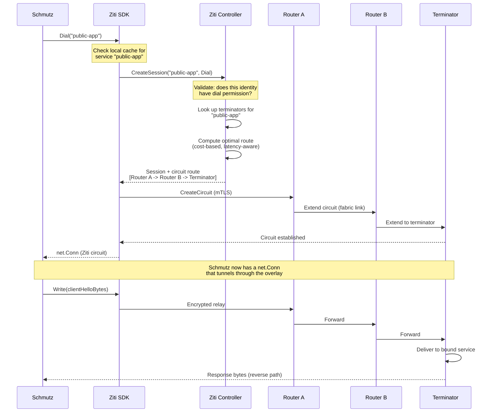
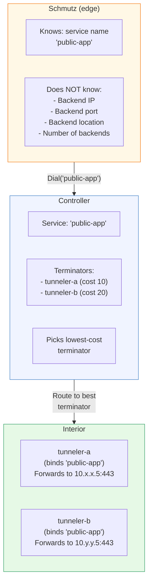
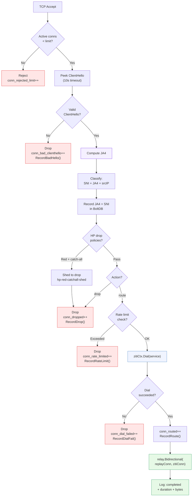

# Ziti Dial Lifecycle

[← Advanced Reference](../README.md)

---

When Schmutz classifies a connection and determines it should be routed to
a Ziti service, it calls `zitiCtx.Dial(serviceName)`. This page covers the
full dial sequence, route computation, error handling, and reconnection.

---

## The Dial Sequence



---

## Key Properties

1. **Schmutz never knows the route.** The controller computes it. Schmutz
   gets back a `net.Conn` and writes bytes into it.

2. **The controller validates permissions.** If the identity does not have
   dial access to the requested service, the dial fails immediately.

3. **Route computation is dynamic.** The controller picks the lowest-cost
   path through the router mesh. If a router goes down, the next dial
   gets a different route.

4. **The circuit is mTLS end-to-end.** Every hop is encrypted. The
   ClientHello bytes from the original client are encrypted again inside
   the Ziti circuit -- double-wrapped TLS.

---

## The Ziti Service Model

Schmutz routes by service name, not by IP address. This is a fundamental
property of the overlay.



A service can have multiple terminators in different regions. The controller
routes to the best one based on cost metrics. If `tunneler-a` goes down,
subsequent dials automatically route to `tunneler-b`. Schmutz does not need
to know about this failover -- it just dials the same service name.

---

## Error Handling

When `zitiCtx.Dial(serviceName)` fails, Schmutz:

1. Increments the `conn_dial_failed` counter in BoltDB
2. Records the failure in the HP system (`RecordDialFail()`, -1.0 HP)
3. Logs the error with full context (service name, source IP, SNI, JA4)
4. Closes the client connection (no error response sent)

```go
zitiConn, err := zitiCtx.Dial(result.Service)
if err != nil {
    db.IncrStat("conn_dial_failed")
    hp.RecordDialFail()
    connLogger.Error("dial failed",
        "service", result.Service,
        "error", err,
    )
    return  // defer closes client conn
}
```

Common dial failure causes: service does not exist (typo in config), no
available terminators (backend down), policy denies access (identity
revoked), controller unreachable (network partition), or context timeout.

The Ziti SDK manages its own reconnection. If a controller becomes
unreachable, it tries the next in the `ztAPIs` list. Schmutz's
`ReadTimeout` applies only to the initial ClientHello read, not the dial.

---

## Full Connection Lifecycle

From TCP accept to relay completion:



Every path results in either a successful relay or connection close with a
specific counter increment and HP event. No state is leaked to the client
in any failure path -- the connection simply closes.

---

## Design Rationale

**Why the SDK instead of a tunnel?** Schmutz classifies each connection
individually and dials different services based on SNI and JA4. The SDK
gives programmatic access to the dial operation that a transparent tunnel
cannot provide.

**Why dial per connection?** Ziti circuits are lightweight (<10ms within a
region). Per-connection circuits get the optimal route at dial time and
automatically fail over if a terminator goes down.

**Why no error response to client?** Any information returned to the client
is information an attacker can use. A closed socket is indistinguishable
from a drop.
