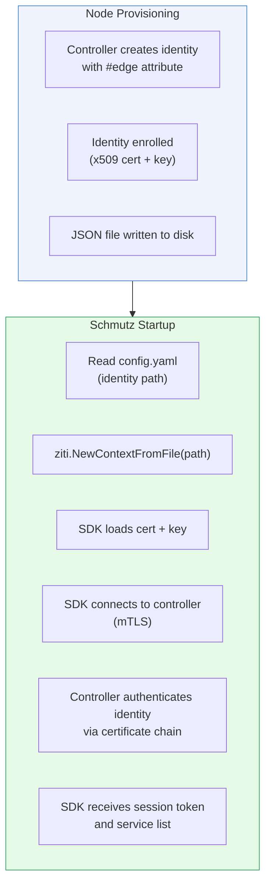
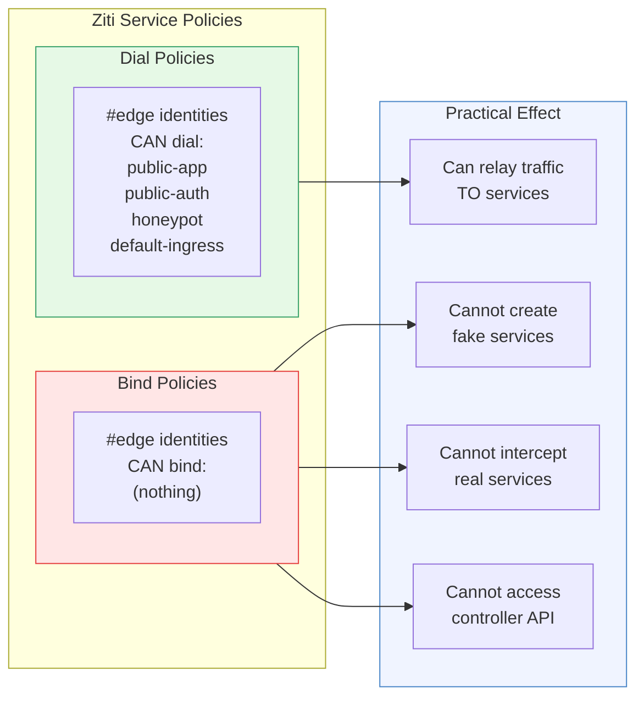
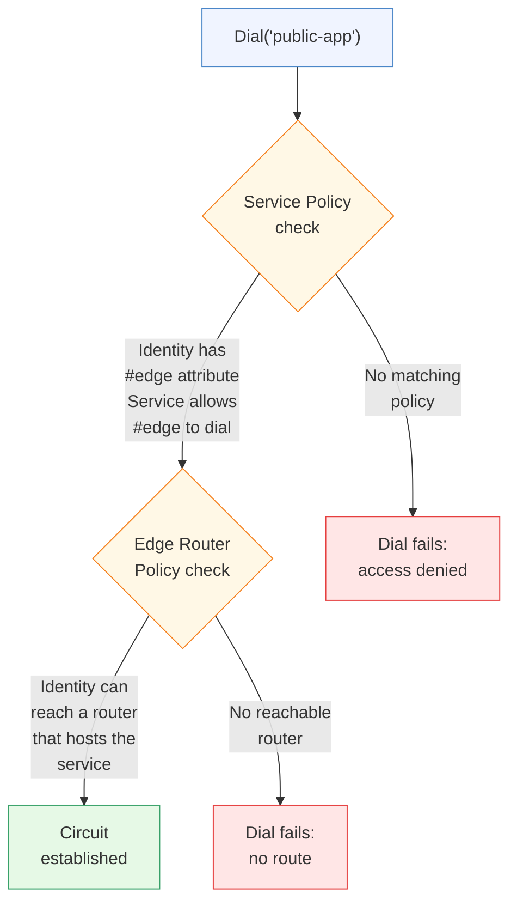

# Ziti Identity and Permissions

[← Advanced Reference](../README.md)

---

Schmutz is a Ziti SDK application. Each edge node has a Ziti identity
file -- a JSON document containing the node's x509 certificate, private
key, and controller endpoint(s). The identity is the only secret on the
machine.

---

## Identity Loading



```go
zitiCtx, err := ziti.NewContextFromFile(cfg.Identity)
if err != nil {
    logger.Error("load ziti identity",
        "identity", cfg.Identity,
        "error", err,
    )
    os.Exit(1)
}
defer zitiCtx.Close()
```

The SDK handles all certificate validation, session management, and
reconnection internally. Schmutz calls one function and gets back a
context that can dial services.

---

## Identity File Contents

```json
{
    "ztAPI": "https://ctrl.example.io:1280/edge/client/v1",
    "ztAPIs": [
        "https://ctrl-1.example.io:1280/edge/client/v1",
        "https://ctrl-2.example.io:1280/edge/client/v1",
        "https://ctrl-3.example.io:1280/edge/client/v1"
    ],
    "id": {
        "cert": "pem-encoded x509 certificate",
        "key": "pem-encoded private key",
        "ca": "pem-encoded CA bundle"
    }
}
```

The `ztAPIs` list enables controller failover. If one controller is
unreachable, the SDK tries the next.

---

## Dial-Only Permissions Model

Ziti identities can have two types of permissions:

- **Bind** -- host a service (accept incoming connections)
- **Dial** -- connect to a service (make outgoing connections)

Edge node identities have **dial-only** permissions. They can connect to
public-facing services but cannot host anything on the overlay.



---

## Why No Bind?

If an edge node could bind services, a compromised node could:

1. Register as a terminator for `auth-provider`
2. Intercept authentication traffic
3. Steal credentials or session tokens

With dial-only permissions, a compromised edge node can only do what a
random internet client already can: connect to public services. The blast
radius is zero.

---

## Attribute-Based Policy Enforcement

Before a dial succeeds, the Ziti controller checks two policy layers:



1. **Service Policy**: Does this identity (with `#edge` attribute) have
   dial access to `public-app`?
2. **Edge Router Policy**: Can this identity reach an edge router that is
   connected to a terminator for `public-app`?

Both must pass. The controller administrator can revoke an edge node's
access to specific services without touching the edge node itself.
