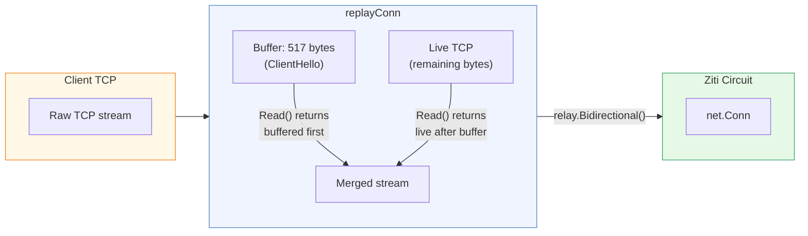
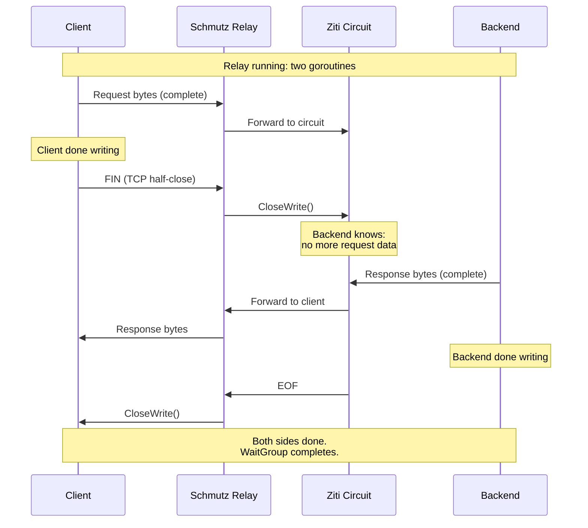

# Relay Bridge (replayConn)

[← Advanced Reference](../README.md)

---

The ClientHello bytes have already been read from the client TCP connection
during parsing. The Ziti circuit expects a complete TLS stream starting
from byte zero. The `replayConn` bridges these two worlds.

---

## How replayConn Works



The relay function receives the `replayConn` as the client-side connection:

```go
// In handleConnection:
bytesIn, bytesOut := relay.Bidirectional(replayConn, zitiConn)
```

The first `Read()` call from the relay goroutine returns the buffered
ClientHello bytes. Subsequent reads go through to the live TCP connection.
From the Ziti circuit's perspective, it receives a complete, unmodified
byte stream.

---

## Bidirectional io.Copy

Two goroutines run simultaneously, one per direction:

```go
// Client -> Backend direction
go func() {
    defer wg.Done()
    bytesIn, _ = io.Copy(backend, client)
    // Signal backend: client is done writing
    if tc, ok := backend.(interface{ CloseWrite() error }); ok {
        tc.CloseWrite()
    }
}()

// Backend -> Client direction
go func() {
    defer wg.Done()
    bytesOut, _ = io.Copy(client, backend)
    // Signal client: backend is done writing
    if tc, ok := client.(interface{ CloseWrite() error }); ok {
        tc.CloseWrite()
    }
}()
```

---

## Half-Close via CloseWrite()

The relay uses half-close to signal when each side is done writing. This
is critical for protocols like HTTP/1.1 where the client sends a request
and then waits for a response without closing the connection.



The `CloseWrite()` interface check handles the case where the connection
type does not support half-close (some Ziti connection types may not). In
that case, the goroutine simply finishes without signaling.

---

## Bytes In/Out Tracking

`relay.Bidirectional()` returns the total bytes copied in each direction.
These values are logged at connection completion for operational visibility:

- **bytesIn**: total bytes from client to backend (through the Ziti circuit)
- **bytesOut**: total bytes from backend to client (back through the circuit)
