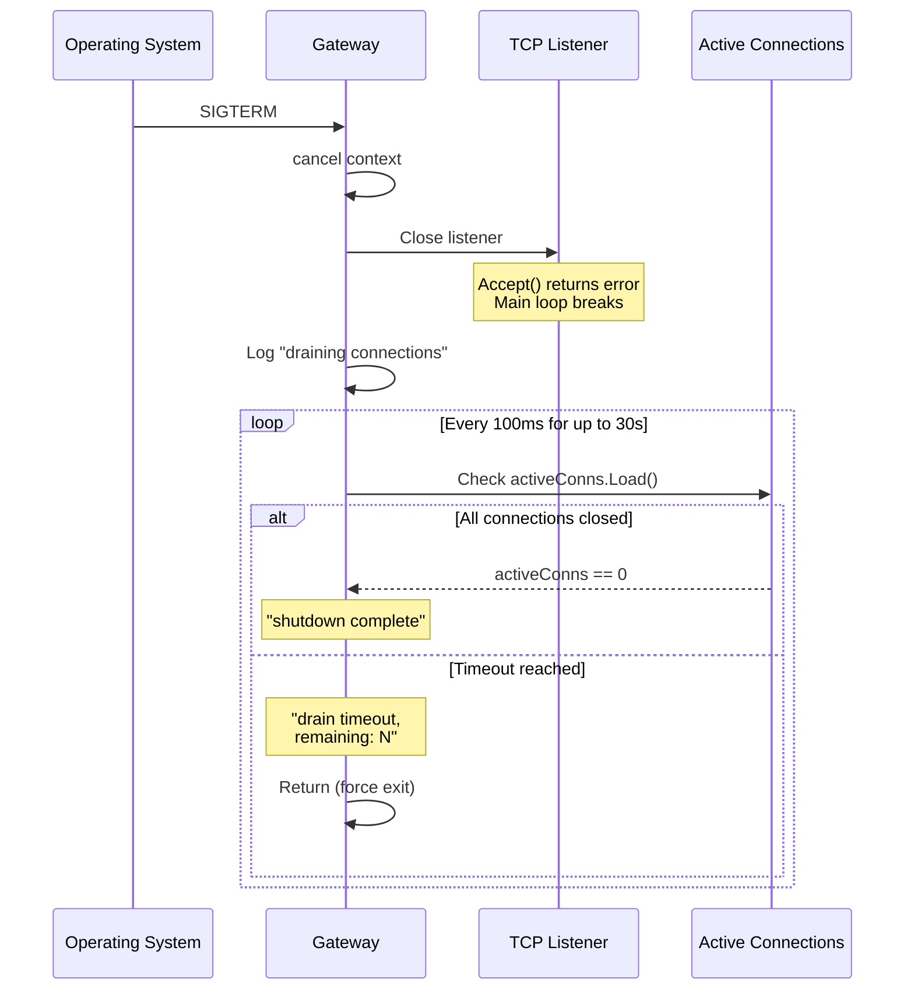
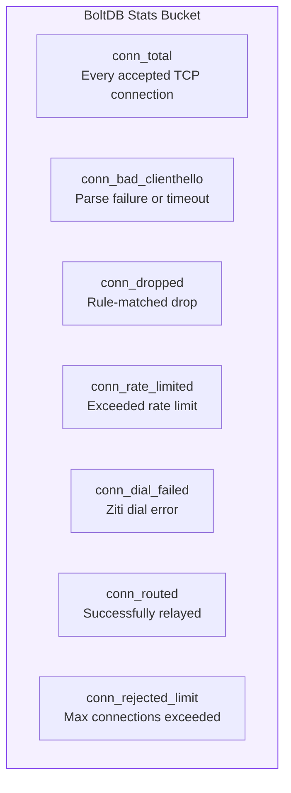

# Graceful Shutdown

[← Advanced Reference](../README.md)

---

When Schmutz receives SIGINT or SIGTERM, it stops accepting new connections
but allows active relays to finish. The drain uses a 30-second deadline
with 100ms polling.

---

## Drain Sequence



---

## Implementation

```go
// Stop accepting
ln.Close()

// Drain active connections
logger.Info("draining connections",
    "active", activeConns.Load(),
)
deadline := time.After(30 * time.Second)
for activeConns.Load() > 0 {
    select {
    case <-deadline:
        logger.Warn("drain timeout",
            "remaining", activeConns.Load(),
        )
        return
    case <-time.After(100 * time.Millisecond):
        // Poll again
    }
}
logger.Info("shutdown complete")
```

---

## Timing Parameters

| Parameter | Value | Rationale |
|:----------|:------|:----------|
| Drain timeout | 30 seconds | Handles long-lived connections (websockets, streaming) without hanging indefinitely |
| Poll interval | 100 milliseconds | Keeps CPU usage negligible during drain |

---

## Connection Behavior During Drain

Active relay goroutines continue until their `io.Copy` calls return (which
happens when either side closes the connection). The 30-second deadline is
a safety net -- most relays finish within seconds of the backend responding.

Long-lived connections (WebSocket, streaming) will be terminated at the
30-second mark. For graceful handling, upstream load balancers should drain
the node from DNS before sending the signal.

---

## Statistics Logging

On shutdown, the final HP value is persisted to BoltDB via `hp.Stop()`,
which calls `persist()` one last time. This ensures the node retains its
HP state across restarts -- a node under attack keeps its reduced HP.

The `activeConns` counter (an `atomic.Int64`) is logged both when drain
begins and if the timeout is reached, providing visibility into how many
connections were in flight.

---

## Connection Statistics

Schmutz tracks connection lifecycle events as named counters in BoltDB's
`stats` bucket:



| Counter | Incremented When | HP Event |
|:--------|:-----------------|:---------|
| `conn_total` | TCP accept (before any parsing) | None |
| `conn_bad_clienthello` | ClientHello parse fails or times out | `RecordBadHello()` |
| `conn_dropped` | Rule evaluates to "drop" | `RecordDrop()` |
| `conn_rate_limited` | Source IP exceeds effective rate limit | `RecordRateLimit()` |
| `conn_dial_failed` | `zitiCtx.Dial()` returns error | `RecordDialFail()` |
| `conn_routed` | Ziti dial succeeds, relay starts | `RecordRoute()` |
| `conn_rejected_limit` | Active connections >= MaxConnections | None |

The invariant: `conn_total = conn_bad_clienthello + conn_dropped +
conn_rate_limited + conn_dial_failed + conn_routed + conn_rejected_limit`
(approximately -- race conditions between counter increments mean this may
be off by a small amount at any instant).
