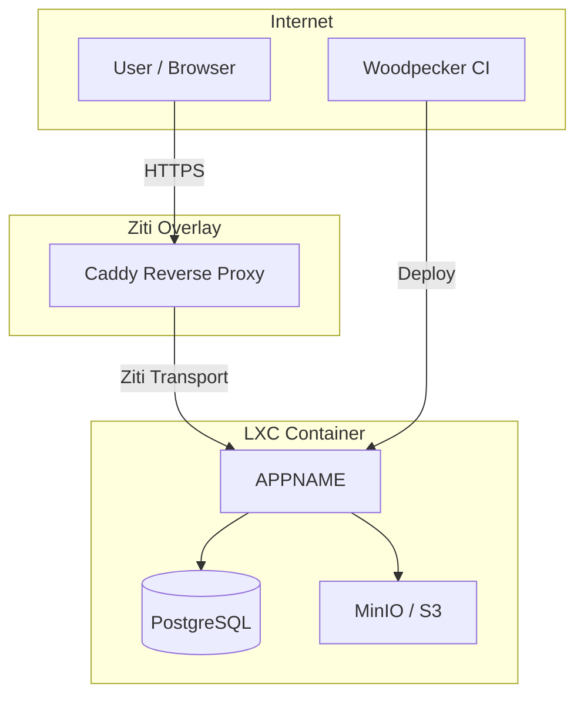
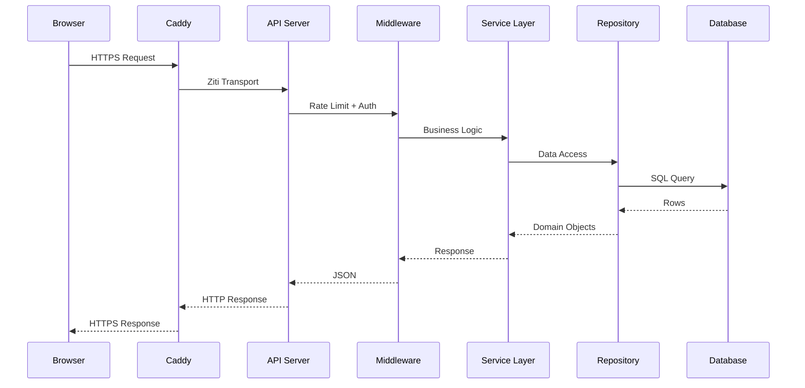
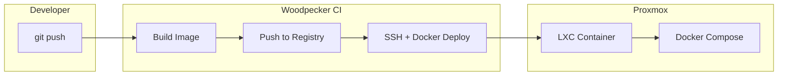

# Architecture

## System Overview



## Request Flow



## Component Breakdown

### API Server

The HTTP layer. Handles routing, request parsing, and response formatting.

| Responsibility | Not Responsible For |
|----------------|---------------------|
| Route registration | Business rules |
| Request validation | Data persistence |
| JSON serialization | External API calls |
| Error formatting | Authorization decisions |

### Service Layer

Where business logic lives. Services depend on repositories, never on HTTP concepts.

```
┌─────────────────────────────────────────┐
│              Handler (HTTP)              │
├─────────────────────────────────────────┤
│             Service (Logic)             │
├─────────────────────────────────────────┤
│           Repository (Data)             │
├─────────────────────────────────────────┤
│            Database (SQL)               │
└─────────────────────────────────────────┘
```

!!! tip "Rule of thumb"
    If a function needs `*http.Request` or `http.ResponseWriter`, it belongs in the handler layer.
    If it needs `*sql.DB`, it belongs in the repository layer.
    Everything else is a service.

### Repository Layer

Thin data access layer. Translates between SQL rows and Go structs.

- One repository per aggregate root
- No business logic — only CRUD + query building
- Uses `sqlx` for scanning and named parameters

### Database

PostgreSQL with schema managed via migration files.

```
migrations/
├── 001_initial.sql
├── 002_add_items.sql
└── 003_add_metadata.sql
```

## Deployment



### Environment Variables

| Variable | Required | Description |
|----------|----------|-------------|
| `DB_HOST` | yes | PostgreSQL host |
| `DB_PASSWORD` | yes | Database password |
| `JWT_SECRET` | yes | 32+ character secret for token signing |
| `S3_ENDPOINT` | no | MinIO/S3 endpoint for file storage |
| `S3_ACCESS_KEY` | no | S3 access key |
| `S3_SECRET_KEY` | no | S3 secret key |
| `PORT` | no | HTTP port (default: `8080`) |

!!! danger "Secrets"
    Never commit secrets to git. Use Phase or Vaultwarden for secret management.
    The CI pipeline fetches secrets at build time via the Phase plugin.
