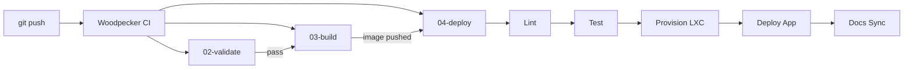

# Quick Start

Get APPNAME up and running.

## Prerequisites

- [x] Git access to `git.konoss.org`
- [x] Docker & Docker Compose

## 1. Clone and configure

```bash
git clone https://git.konoss.org/APPORG/APPNAME.git
cd APPNAME
cp config/.env.example config/.env
# Edit config/.env with your settings
```

## 2. Start the application

```bash
docker compose up -d
```

## 3. Verify

```bash
curl -s http://localhost:8080/api/v1/health | jq .
```

## What happens on `git push`



## Next Steps

- [ ] Add source code to `src/`
- [ ] Add `Dockerfile` to `build/container/`
- [ ] Add `swagger.json` and `openapi.yaml` to `docs/api/`
- [ ] Add architecture diagrams to `docs/guides/architecture.md`
- [ ] Configure `config/konfig.json` with Konfig UUID
- [ ] Override `make test` and `make lint` in the Makefile
